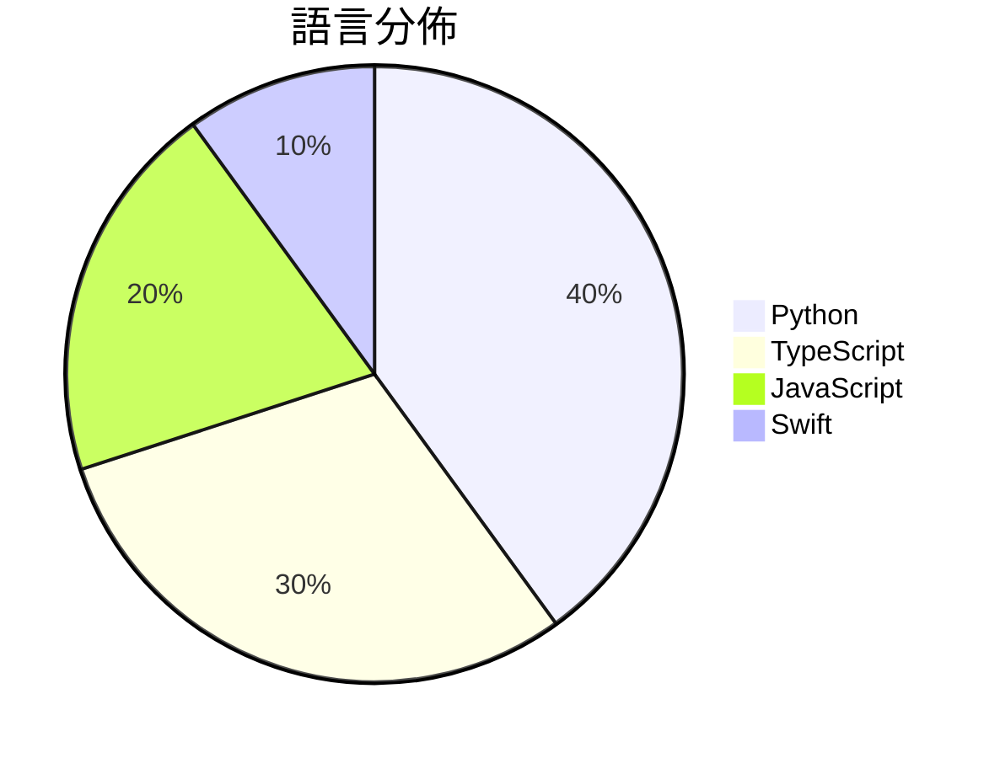

# GitHub Trending - 2026-07-27

> [!summary] 本日摘要
> 收錄 **10** 個新專案，合計 **15.1k** stars
> 語言分佈：Python (4) · TypeScript (3) · JavaScript (2) · Swift (1)

> [!tip] 本週焦點
> **[[andrewyng--openworker|andrewyng/openworker]]** — 7 天內累積 7.1k stars（1.0k stars/天）
> 提供一個開源的 AI 助手平台，能夠自動完成日常任務並生成實際的工作成果。



---

## 收錄列表

| # | 專案 | 分類 | Stars | 速度 | 安裝 | 語言 | 用途 |
| :--: | --- | --- | ---: | ---: | --- | --- | --- |
| 1 | [[andrewyng--openworker\|andrewyng/openworker]] | 生產力 | 7.1k | 1.0k/天 | `medium` | Python | 提供一個開源的 AI 助手平台，能夠自動完成日常任務並生成實際的工作成果。 |
| 2 | [[slvDev--esp32-ai\|slvDev/esp32-ai]] | AI/ML | 1.4k | 479/天 | `medium` | Python | 在 $8 的微控制器上運行 28.9M 參數的語言模型，實現本地生成文本。 |
| 3 | [[Jakubantalik--thinking-orbs\|Jakubantalik/thinking-orbs]] |  | 1.1k | 221/天 |  | TypeScript | Dotted thought-orb loading indicators fo |
| 4 | [[powerycy--goutoujunshi\|powerycy/goutoujunshi]] | AI/ML | 969 | 162/天 | `medium` | Python | 提供情感支持和关系分析的 AI 恋爱军师，帮助用户制定可执行的恋爱策略。 |
| 5 | [[Blaizzy--nativ\|Blaizzy/nativ]] | AI/ML | 925 | 154/天 | `medium` | Swift | 在你的 Mac 上本地運行 AI 模型，提供聊天、服務、監控和連接 MLX 模型 |
| 6 | [[mikiarlo3--ai-copywriter\|mikiarlo3/ai-copywriter]] | 開發工具 | 863 | 432/天 | `easy` | Python | 一個結合真實文案技巧與市場知識的 AI 文案工具，能夠生成自然的文案。 |
| 7 | [[pireel--pireel\|pireel/pireel]] | 開發工具 | 779 | 130/天 | `medium` | TypeScript | 提供一個無後端的 AI 影片編輯器，專為對話式影片設計，支持故事板、動態字幕及主 |
| 8 | [[mshumer--Claude-of-Duty\|mshumer/Claude-of-Duty]] | 遊戲 | 721 | 721/天 | `easy` | JavaScript | 在瀏覽器中構建的類 Call of Duty 的第一人稱射擊遊戲，完全依賴程序生 |
| 9 | [[gnipbao--story-to-handdrawn-video\|gnipbao/story-to-handdrawn-video]] | 其他 | 655 | 131/天 | `medium` | JavaScript | 將中文故事或有序圖片轉換為手繪日記漫畫動畫，無需手動操作。 |
| 10 | [[makecindy--cindy\|makecindy/cindy]] | AI/ML | 615 | 154/天 | `medium` | TypeScript | 開源的 AI 代理，開箱即用，能夠自動執行各種任務。 |

---

## 重點摘要

### 1. [[andrewyng--openworker|andrewyng/openworker]] `生產力`

> 提供一個開源的 AI 助手平台，能夠自動完成日常任務並生成實際的工作成果。

**7.1k** stars · **1.0k** stars/天 · Python · `medium`

_建立 7 天就累積 7051 stars（1007/天），forks 951（13.5%），顯示出強烈的社群興趣。這個專案的作者是 rohitprasad15 和 andrewyng，他們在開源社群中有一定的影響力。OpenWorker 解決了用戶在日常工作中面臨的自動化需求，特別是需要生成實際成果而不僅僅是回應的情境。之前的工具多數只提供聊天或簡單的任務管理，無法直接生成可用的文件。這個專案的推出正好填補了這一空白。社群的反饋和需求也促進了這個專案的快速發展，尤其是對於集成 API 的需求。這樣的增長率顯示出用戶對於這種工具的渴望，並且可能隨著更多功能的推出而持續增長。_

---

### 2. [[slvDev--esp32-ai|slvDev/esp32-ai]] `AI/ML`

> 在 $8 的微控制器上運行 28.9M 參數的語言模型，實現本地生成文本。

**1.4k** stars · **479** stars/天 · Python · `medium`

_建立 3 天就累積 1436 stars（479/天），forks 145（10.1%），顯示出強烈的社群興趣。作者 slvDev 在此領域有豐富經驗，之前的專案也涉及嵌入式 AI。這個專案解決了在微控制器上運行大型語言模型的挑戰，之前的解決方案通常只能處理小型模型，無法滿足更高的需求。近期在社交媒體上的討論和技術論壇的分享也促進了這個專案的曝光。隨著邊緣計算需求的增加，這樣的工具變得越來越重要，特別是在 IoT 和智能設備的應用中。forks/stars 比率 10.1% 表示有相當一部分使用者在進行實際修改，顯示出社群的活躍度。_

---

### 3. [[Jakubantalik--thinking-orbs|Jakubantalik/thinking-orbs]]

**1.1k** stars · **221** stars/天 · TypeScript

---

### 4. [[powerycy--goutoujunshi|powerycy/goutoujunshi]] `AI/ML`

> 提供情感支持和关系分析的 AI 恋爱军师，帮助用户制定可执行的恋爱策略。

**969** stars · **162** stars/天 · Python · `medium`

_建立 6 天就累積 969 stars（162/天），forks 106（10.9%），這是相對活躍的增長。作者 powerycy 具備相關背景，專注於情感和心理學領域，這使得該工具能夠針對性地解決用戶的情感需求。之前的工具往往缺乏針對性和深度，這個專案填補了這一空白。近期的推廣活動和社群反饋也促進了其知名度的提升。這個工具的出現正好契合了人們對情感支持的需求，特別是在多元性別和關係的背景下，讓更多人能夠找到合適的建議。forks/stars 比率在 10.9% 表示有相當一部分用戶對其功能感興趣，並可能進行修改或擴展。_

---

### 5. [[Blaizzy--nativ|Blaizzy/nativ]] `AI/ML`

> 在你的 Mac 上本地運行 AI 模型，提供聊天、服務、監控和連接 MLX 模型的功能。

**925** stars · **154** stars/天 · Swift · `medium`

_建立 6 天就累積 925 stars（154/天），forks 51（5.5%），顯示出不錯的增長潛力。這個專案的主要貢獻者有過去的開源經驗，並且針對本地 AI 模型的管理需求提供了一個整合解決方案。之前，開發者通常需要依賴雲端服務來運行 AI 模型，這樣不僅增加了延遲，也可能造成數據隱私的問題。Nativ 透過本地運行的方式，解決了這些痛點，並且在社群中引起了討論。這個工具的出現正好符合了對於本地 AI 解決方案日益增長的需求，尤其是在 Apple Silicon 環境下的優化。_

---

### 6. [[mikiarlo3--ai-copywriter|mikiarlo3/ai-copywriter]] `開發工具`

> 一個結合真實文案技巧與市場知識的 AI 文案工具，能夠生成自然的文案。

**863** stars · **432** stars/天 · Python · `easy`

_建立 2 天就累積 863 stars（432/天），forks 13（1.5%），這顯示出初期的關注度。作者 Mickey Haslavsky 具備文案和市場行銷的背景，這使得這個工具能夠針對市場需求進行優化。這個工具解決了傳統文案工具常常無法有效捕捉受眾情感的痛點，並且提供了一個更人性化的文案生成方式。社群的早期反饋顯示出對其實用性的期待，特別是在需要高轉換率的行銷活動中。技術上，這個工具的設計使得它能夠在多種環境中運行，這也增加了它的吸引力。_

---

### 7. [[pireel--pireel|pireel/pireel]] `開發工具`

> 提供一個無後端的 AI 影片編輯器，專為對話式影片設計，支持故事板、動態字幕及主題設計。

**779** stars · **130** stars/天 · TypeScript · `medium`

_建立 6 天內累積 779 stars（130/天），forks 65（8.3%），顯示出強勁的增長潛力。作者 tangjinzhou 之前在開源社區活躍，這個專案解決了傳統影片編輯工具需要伺服器支持的痛點，讓用戶能夠在本地環境中進行編輯。最近的推廣活動和社群討論也可能促進了這一增長。隨著 WebCodecs 的普及，這個工具的可行性和吸引力進一步提升。高達 8.3% 的 forks/stars 比率顯示出許多開發者對這個專案感興趣並計劃進行修改或擴展。_

---

### 8. [[mshumer--Claude-of-Duty|mshumer/Claude-of-Duty]] `遊戲`

> 在瀏覽器中構建的類 Call of Duty 的第一人稱射擊遊戲，完全依賴程序生成的資源。

**721** stars · **721** stars/天 · JavaScript · `easy`

_建立 1 天就累積 721 stars（721/天），forks 146（20.2%），這顯示出極高的興趣和參與度。作者 mshumer 以其創新的程序生成技術聞名，這個專案展示了他在遊戲開發領域的探索。這個專案解決了傳統遊戲開發中資源管理的痛點，提供了一種全新的方式來創建遊戲內容，這在現有的遊戲開發工具中並不常見。社群的反應也顯示出對於這種新技術的好奇和期待。_

---

### 9. [[gnipbao--story-to-handdrawn-video|gnipbao/story-to-handdrawn-video]] `其他`

> 將中文故事或有序圖片轉換為手繪日記漫畫動畫，無需手動操作。

**655** stars · **131** stars/天 · JavaScript · `medium`

_建立 5 天就累積 655 stars（131/天），forks 73（11.1%），顯示出穩定的增長潛力。作者 gnipbao 在開源社群中有一定的影響力，這個專案解決了將故事文本轉換為動畫的需求，尤其是在中文創作領域，之前的工具多數無法滿足此需求。該專案的出現正好填補了這一空白，並且其簡單的使用方式吸引了不少開發者的注意。技術上，Remotion 的使用使得這個工具在性能和靈活性上有了很大的提升，這也是其受歡迎的原因之一。_

---

### 10. [[makecindy--cindy|makecindy/cindy]] `AI/ML`

> 開源的 AI 代理，開箱即用，能夠自動執行各種任務。

**615** stars · **154** stars/天 · TypeScript · `medium`

_建立 4 天內累積 615 stars（154/天），forks 73（11.9%），顯示出不錯的增長潛力。作者 MagicLizi 及其團隊在開源領域有一定的經驗，這次專案解決了許多開發者在使用 AI 代理時的靈活性和成本問題。之前的解決方案往往需要重複付費或無法在本地運行，而 Cindy 則提供了本地運行的選項，並且能夠無縫接入現有的服務。社群的活躍度和開放的貢獻方式也是其受歡迎的原因之一。_

---

## 今日到期複習

> [!tip] 根據間隔複習排程，今天該回顧的專案

```dataview
TABLE
  stars_per_day AS "Stars/天",
  category AS "分類",
  engagement AS "參與度"
FROM "Repos"
WHERE next_review AND date(next_review) <= date("2026-07-27") AND status != "archived"
SORT priority DESC
```

## 待處理

```dataviewjs
const pending = dv.pages('"Repos"').where(p => p.status === "to-review").length;
const unrated = dv.pages('"Repos"').where(p => p.status !== "archived" && p.status !== "to-review" && (p.my_rating || 0) === 0).length;
const noVerdict = dv.pages('"Repos"').where(p => p.status !== "archived" && (p.my_rating || 0) > 0 && (!p.verdict || p.verdict === "")).length;
const items = [];
if (pending > 0) items.push(`**${pending}** 個待分流`);
if (unrated > 0) items.push(`**${unrated}** 個已讀但未評分`);
if (noVerdict > 0) items.push(`**${noVerdict}** 個已評分但無結論`);
if (items.length > 0) dv.paragraph(items.join(" / "));
else dv.paragraph("所有專案都已處理完畢！");
```
