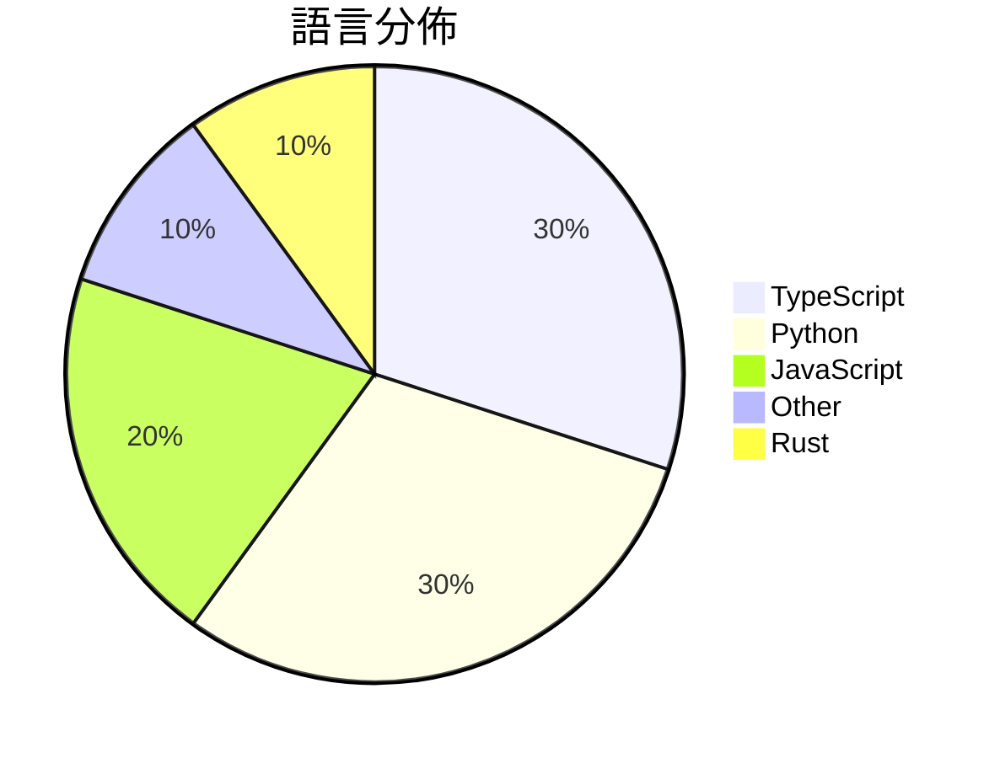

# GitHub Trending - 2026-07-28

> [!summary] 本日摘要
> 收錄 **10** 個新專案，合計 **11.9k** stars
> 語言分佈：TypeScript (3) · Python (3) · JavaScript (2) · Other (1) · Rust (1)

> [!tip] 本週焦點
> **[[MoonshotAI--Kimi-K3|MoonshotAI/Kimi-K3]]** — 1 天內累積 2.0k stars（2.0k stars/天）
> 提供開放的前沿智能模型，支持多模態和長上下文的推理。



---

## 收錄列表

| # | 專案 | 分類 | Stars | 速度 | 安裝 | 語言 | 用途 |
| :--: | --- | --- | ---: | ---: | --- | --- | --- |
| 1 | [[MoonshotAI--Kimi-K3\|MoonshotAI/Kimi-K3]] | AI/ML | 2.0k | 2.0k/天 | `easy` | N/A | 提供開放的前沿智能模型，支持多模態和長上下文的推理。 |
| 2 | [[vercel-labs--scriptc\|vercel-labs/scriptc]] | 開發工具 | 1.8k | 365/天 | `medium` | TypeScript | 將 TypeScript 編譯成小而快速的原生可執行檔，無需 Node 或 Ja |
| 3 | [[slvDev--esp32-ai\|slvDev/esp32-ai]] | AI/ML | 1.8k | 447/天 | `medium` | Python | 在 ESP32-S3 微控制器上運行 28.9M 參數的語言模型，實現本地生成文 |
| 4 | [[Jakubantalik--thinking-orbs\|Jakubantalik/thinking-orbs]] | 開發工具 | 1.2k | 195/天 | `easy` | TypeScript | 提供六種狀態的點狀思維球載入指示器，專為 AI 和代理 UI 設計。 |
| 5 | [[mshumer--Claude-of-Duty\|mshumer/Claude-of-Duty]] | 遊戲 | 1.1k | 526/天 | `easy` | JavaScript | 在瀏覽器中實現 Call of Duty 品質的 FPS，完全由程式生成資源。 |
| 6 | [[mikiarlo3--ai-copywriter\|mikiarlo3/ai-copywriter]] | 開發工具 | 941 | 314/天 | `easy` | Python | 一個結合真實文案技巧與行銷知識的 AI 文案工具，能生成自然流暢的文案。 |
| 7 | [[kvcache-ai--AgentENV\|kvcache-ai/AgentENV]] | 基礎設施 | 905 | 181/天 | `medium` | Rust | 提供一個可擴展的分散式平台來運行代理環境，專為強化學習訓練設計。 |
| 8 | [[makecindy--cindy\|makecindy/cindy]] | AI/ML | 888 | 178/天 | `medium` | TypeScript | 開源的 AI 助手，能夠即刻運作，幫助完成實際工作。 |
| 9 | [[gnipbao--story-to-handdrawn-video\|gnipbao/story-to-handdrawn-video]] | 其他 | 669 | 112/天 | `medium` | JavaScript | 將中文故事或有序圖片轉換為手繪日記漫畫動畫。 |
| 10 | [[VictorTaelin--OptMem\|VictorTaelin/OptMem]] | 開發工具 | 661 | 331/天 | `easy` | Python | 為 AI 代理提供永久記憶，讓每次會話都能持續學習。 |

---

## 重點摘要

### 1. [[MoonshotAI--Kimi-K3|MoonshotAI/Kimi-K3]] `AI/ML`

> 提供開放的前沿智能模型，支持多模態和長上下文的推理。

**2.0k** stars · **2.0k** stars/天 · N/A · `easy`

_建立 1 天就累積 1993 stars（1993/天），forks 150（7.5%），這顯示出強烈的初期興趣。作者 bigeagle 在開源社群中有一定的影響力，這個模型解決了多模態推理和長上下文處理的需求，特別是在開放權重的背景下，讓研究者能夠自由探索。近期的社群討論集中在中文支持和硬體兼容性上，顯示出用戶對於這些功能的期待。技術上，隨著多模態模型的興起，Kimi K3 的設計理念符合當前的技術趨勢，並且其開放性使得它在學術界和業界都具備潛在的應用價值。_

---

### 2. [[vercel-labs--scriptc|vercel-labs/scriptc]] `開發工具`

> 將 TypeScript 編譯成小而快速的原生可執行檔，無需 Node 或 JavaScript 引擎。

**1.8k** stars · **365** stars/天 · TypeScript · `medium`

_建立 5 天內累積 1825 stars（365/天），forks 33（1.8%），顯示出一定的社群關注度。作者 ctate 和 simonw 具備豐富的開發經驗，之前在 Vercel 的其他專案中也有不錯的表現。這個工具解決了將 TypeScript 轉換為原生可執行檔的需求，這在現有的 JavaScript 生態中並不常見，特別是對於需要高效能的應用。近期的推廣活動和社群討論也可能促進了其曝光度。這個工具的出現正值 TypeScript 和原生應用需求上升的時期，讓開發者能夠更方便地將 TypeScript 應用於各種環境中。forks/stars 比率較低，顯示目前多數用戶仍在觀望階段。_

---

### 3. [[slvDev--esp32-ai|slvDev/esp32-ai]] `AI/ML`

> 在 ESP32-S3 微控制器上運行 28.9M 參數的語言模型，實現本地生成文本。

**1.8k** stars · **447** stars/天 · Python · `medium`

_建立 4 天就累積 1788 stars（447/天），forks 189（10.6%），這顯示出強烈的興趣和實驗性。作者 slvDev 之前在微控制器和機器學習領域有過相關經驗，這個專案解決了在資源受限的環境中運行大型模型的需求。過去，類似的微控制器模型通常只能處理小型模型，這個專案的出現填補了這一空白。社群對於能否在這樣的硬體上運行大型模型的討論也引發了關注，特別是在 Twitter 和開發者論壇上。技術上，這個專案的實現依賴於新的記憶體管理技術，這在微控制器領域是相對創新的。forks/stars 比率為 10.6%，顯示出許多開發者對於修改和擴展該專案的興趣。_

---

### 4. [[Jakubantalik--thinking-orbs|Jakubantalik/thinking-orbs]] `開發工具`

> 提供六種狀態的點狀思維球載入指示器，專為 AI 和代理 UI 設計。

**1.2k** stars · **195** stars/天 · TypeScript · `easy`

_建立 6 天就累積 1172 stars（195/天），forks 85（7.3%），這顯示出強勁的初期增長。作者 Jakub Antalik 之前有其他開源專案經驗，這次專案解決了載入指示器在不同主題下顯示不一致的問題，提供了一個簡單易用的解決方案。雖然沒有明確的觸發事件，但其獨特的設計吸引了開發者的注意。這個工具的成功也反映了對於簡單而高效的 UI 元件需求的增加。forks/stars 比率為 7.3%，顯示出有相當比例的用戶在實際修改和使用這個專案。_

---

### 5. [[mshumer--Claude-of-Duty|mshumer/Claude-of-Duty]] `遊戲`

> 在瀏覽器中實現 Call of Duty 品質的 FPS，完全由程式生成資源。

**1.1k** stars · **526** stars/天 · JavaScript · `easy`

_建立 2 天內累積 1052 stars（526/天），forks 207（19.7%），這顯示出強烈的社群興趣。專案的作者 mshumer 以其在 AI 和遊戲開發領域的經驗而聞名，這個專案解決了傳統遊戲開發中資源管理的痛點，讓開發者能夠在無需藝術資產的情況下創建遊戲。這樣的創新吸引了許多對程序生成內容感興趣的開發者。社群的反應也顯示出對這種新方法的好奇，特別是在遊戲開發的技術挑戰上。_

---

### 6. [[mikiarlo3--ai-copywriter|mikiarlo3/ai-copywriter]] `開發工具`

> 一個結合真實文案技巧與行銷知識的 AI 文案工具，能生成自然流暢的文案。

**941** stars · **314** stars/天 · Python · `easy`

_建立 3 天內累積 941 stars（314/天），forks 18（1.9%），這顯示出一定的關注度。作者 Mickey Haslavsky 擁有相關的背景，並且這個工具解決了文案生成中常見的 AI 痕跡問題，這在市場上是相對少見的。隨著對高品質文案需求的增加，這個工具的出現正好填補了市場的空白。社群的反應也顯示出對於這種結合情感和數據的文案生成方式的興趣，這可能是它快速增長的原因之一。_

---

### 7. [[kvcache-ai--AgentENV|kvcache-ai/AgentENV]] `基礎設施`

> 提供一個可擴展的分散式平台來運行代理環境，專為強化學習訓練設計。

**905** stars · **181** stars/天 · Rust · `medium`

_建立 5 天內累積 905 stars（181/天），forks 77（8.5%），顯示出強烈的社群興趣。主要貢獻者來自 LSX-s-Software 團隊，這個團隊在開源社群中有一定的影響力。AgentENV 解決了在多環境中運行代理的高成本和低效率問題，之前的方案多依賴於手動管理和資源浪費。這個專案的推出正值強化學習和自動化需求上升的時期，社群對於高效能的解決方案需求迫切。forks/stars 比率 8.5% 顯示出許多用戶對於修改和擴展的興趣，這可能意味著該工具在實際應用中有良好的可擴展性。_

---

### 8. [[makecindy--cindy|makecindy/cindy]] `AI/ML`

> 開源的 AI 助手，能夠即刻運作，幫助完成實際工作。

**888** stars · **178** stars/天 · TypeScript · `medium`

_建立 5 天內累積 888 stars（177.6/天），forks 110（12.4%），顯示出相對活躍的社群參與。這個專案由 XD Inc. 開發，旨在解決開源 AI 助手的需求，特別是對於需要本地運行和靈活配置的用戶。之前的解決方案往往需要雲端服務，這限制了用戶的自由度。最近的推廣活動和社群討論也促進了其曝光度。高達 12.4% 的 forks/stars 比率顯示出許多開發者對此專案有實際的修改和使用意圖。_

---

### 9. [[gnipbao--story-to-handdrawn-video|gnipbao/story-to-handdrawn-video]] `其他`

> 將中文故事或有序圖片轉換為手繪日記漫畫動畫。

**669** stars · **112** stars/天 · JavaScript · `medium`

_建立 6 天就累積 669 stars（111.5/天），forks 77（11.5%），這顯示出相對高的使用者參與度。作者 gnipbao 之前的專案有助於建立其在動畫和 AI 工具領域的信譽。這個專案解決了將故事文本轉換為動畫的需求，特別是針對中文內容的自動化處理，這在目前的市場上缺乏有效的解決方案。社群的反饋和需求可能促成了這個專案的快速成長。技術上，Remotion 的使用讓這個工具能夠在前端環境中高效運行，這是其成功的一個重要因素。forks/stars 比率為 11.5%，顯示出有相當比例的使用者在實際修改和使用這個工具。_

---

### 10. [[VictorTaelin--OptMem|VictorTaelin/OptMem]] `開發工具`

> 為 AI 代理提供永久記憶，讓每次會話都能持續學習。

**661** stars · **331** stars/天 · Python · `easy`

_建立 2 天就累積 661 stars（330.5/天），forks 35（5.3%），顯示出一定的社群關注度。作者 VictorTaelin 是一位專注於 AI 工具開發的開發者，這個專案解決了 AI 代理記憶管理的痛點，之前的方案往往需要複雜的配置或背景運行。這個工具的簡單性和高效性使其在短時間內獲得了使用者的青睞。社群的反應也表明，對於簡化 AI 記憶管理的需求是存在的，這可能是促使其快速增長的原因之一。_

---

## 今日到期複習

> [!tip] 根據間隔複習排程，今天該回顧的專案

```dataview
TABLE
  stars_per_day AS "Stars/天",
  category AS "分類",
  engagement AS "參與度"
FROM "Repos"
WHERE next_review AND date(next_review) <= date("2026-07-28") AND status != "archived"
SORT priority DESC
```

## 待處理

```dataviewjs
const pending = dv.pages('"Repos"').where(p => p.status === "to-review").length;
const unrated = dv.pages('"Repos"').where(p => p.status !== "archived" && p.status !== "to-review" && (p.my_rating || 0) === 0).length;
const noVerdict = dv.pages('"Repos"').where(p => p.status !== "archived" && (p.my_rating || 0) > 0 && (!p.verdict || p.verdict === "")).length;
const items = [];
if (pending > 0) items.push(`**${pending}** 個待分流`);
if (unrated > 0) items.push(`**${unrated}** 個已讀但未評分`);
if (noVerdict > 0) items.push(`**${noVerdict}** 個已評分但無結論`);
if (items.length > 0) dv.paragraph(items.join(" / "));
else dv.paragraph("所有專案都已處理完畢！");
```
