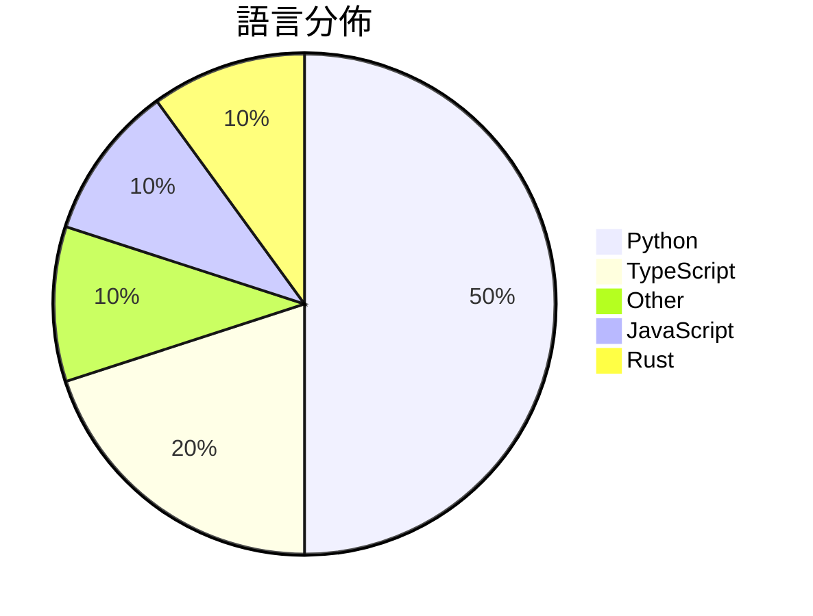

# GitHub Trending - 2026-07-29

> [!summary] 本日摘要
> 收錄 **10** 個新專案，合計 **15.5k** stars
> 語言分佈：Python (5) · TypeScript (2) · Other (1) · JavaScript (1) · Rust (1)

> [!tip] 本週焦點
> **[[MoonshotAI--Kimi-K3|MoonshotAI/Kimi-K3]]** — 1 天內累積 3.6k stars（3.6k stars/天）
> 提供開放的多模態智能模型，支援長期編碼和知識工作。



---

## 收錄列表

| # | 專案 | 分類 | Stars | 速度 | 安裝 | 語言 | 用途 |
| :--: | --- | --- | ---: | ---: | --- | --- | --- |
| 1 | [[MoonshotAI--Kimi-K3\|MoonshotAI/Kimi-K3]] | AI/ML | 3.6k | 3.6k/天 | `medium` | N/A | 提供開放的多模態智能模型，支援長期編碼和知識工作。 |
| 2 | [[vercel-labs--scriptc\|vercel-labs/scriptc]] | 開發工具 | 2.2k | 359/天 | `medium` | TypeScript | 將 TypeScript 編譯成小型、快速的原生可執行檔，無需 Node 或 J |
| 3 | [[slvDev--esp32-ai\|slvDev/esp32-ai]] | AI/ML | 2.1k | 421/天 | `medium` | Python | 在 $8 的 ESP32 微控制器上運行 28.9M 參數的語言模型，無需伺服器 |
| 4 | [[mshumer--Claude-of-Duty\|mshumer/Claude-of-Duty]] | 遊戲 | 1.8k | 606/天 | `easy` | JavaScript | 在瀏覽器中實現 Call of Duty 水準的 FPS 遊戲，完全由程式生成資 |
| 5 | [[kvcache-ai--AgentENV\|kvcache-ai/AgentENV]] | 基礎設施 | 1.5k | 247/天 | `medium` | Rust | 提供一個可擴展的代理環境平台，適合大規模運行代理強化學習訓練。 |
| 6 | [[makecindy--cindy\|makecindy/cindy]] | AI/ML | 1.0k | 170/天 | `medium` | TypeScript | 一個開源的 AI 代理，能夠即刻運作，整合多種模型和工具，幫助完成實際工作。 |
| 7 | [[mikiarlo3--ai-copywriter\|mikiarlo3/ai-copywriter]] | 開發工具 | 995 | 249/天 | `easy` | Python | 一個結合真實文案技巧與行銷知識的 AI 文案工具，能以人性化語氣撰寫吸引人的文案 |
| 8 | [[VictorTaelin--OptMem\|VictorTaelin/OptMem]] | 開發工具 | 816 | 272/天 | `easy` | Python | 為 AI 代理提供永久記憶，簡單易用的記錄工具。 |
| 9 | [[MoonshotAI--MoonEP\|MoonshotAI/MoonEP]] | AI/ML | 806 | 202/天 | `medium` | Python | 提供動態冗餘專家的專家並行通信庫，實現完美的負載平衡。 |
| 10 | [[fuadmefleh--Shared-Claude-Chats\|fuadmefleh/Shared-Claude-Chats]] | 開發工具 | 721 | 240/天 | `easy` | Python | 匯總公共 Claude 和 Grok 對話的存檔，方便查閱和分享。 |

---

## 重點摘要

### 1. [[MoonshotAI--Kimi-K3|MoonshotAI/Kimi-K3]] `AI/ML`

> 提供開放的多模態智能模型，支援長期編碼和知識工作。

**3.6k** stars · **3.6k** stars/天 · N/A · `medium`

_建立 1 天就累積 3586 stars（3586/天），forks 294（8.2%），顯示出極高的興趣和參與度。作者 bigeagle 在開源社群中有一定的影響力，過去也參與過多個相關項目。Kimi K3 解決了長期編碼和知識工作的痛點，之前的模型在這方面的表現不佳，無法有效處理複雜的上下文和多模態輸入。這個專案的推出引起了社群的廣泛討論，尤其是對於其中文 README 的需求。技術上，開放的 3T 級模型在當前的 AI 生態中是相對少見的，這使得它在市場上具備競爭力。forks/stars 比率為 8.2%，顯示出許多人對其進行實際修改和使用。_

---

### 2. [[vercel-labs--scriptc|vercel-labs/scriptc]] `開發工具`

> 將 TypeScript 編譯成小型、快速的原生可執行檔，無需 Node 或 JavaScript 引擎。

**2.2k** stars · **359** stars/天 · TypeScript · `medium`

_建立 6 天就累積 2156 stars（359/天），forks 41（1.9%），這顯示出其快速增長的潛力。作者 ctate 和 simonw 在開源社群中有良好的聲譽，過去參與過多個成功的專案。這個專案解決了 TypeScript 開發者在生成高效能原生應用時的痛點，之前的解決方案往往依賴於 Node.js，導致性能瓶頸。最近的推文和討論也引起了開發者的注意，特別是在 Vercel 的支持下，這使得專案更具吸引力。forks/stars 比率相對較低，顯示出目前大多數用戶仍在觀望階段，尚未深入修改或擴展此工具。_

---

### 3. [[slvDev--esp32-ai|slvDev/esp32-ai]] `AI/ML`

> 在 $8 的 ESP32 微控制器上運行 28.9M 參數的語言模型，無需伺服器連接。

**2.1k** stars · **421** stars/天 · Python · `medium`

_建立 5 天內累積 2103 stars（421/天），forks 228（10.8%），這顯示出強烈的興趣和潛在的實用性。作者 slvDev 在嵌入式系統和 AI 領域有一定的經驗，這個專案解決了在資源有限的微控制器上運行大型語言模型的痛點，之前的解決方案通常只能處理小型模型。社群對於模型的實用性和應用潛力表現出高度關注，尤其是在嵌入式開發者中。這個專案的成功也反映了對於低成本 AI 解決方案的需求上升，尤其是在 IoT 領域。forks/stars 比率 10.8% 表示有相當一部分開發者對此專案進行了實際的修改和應用，顯示出其潛在的實用性。_

---

### 4. [[mshumer--Claude-of-Duty|mshumer/Claude-of-Duty]] `遊戲`

> 在瀏覽器中實現 Call of Duty 水準的 FPS 遊戲，完全由程式生成資源。

**1.8k** stars · **606** stars/天 · JavaScript · `easy`

_建立 3 天內累積 1818 stars（606/天），forks 272（15.0%），顯示出強烈的社群關注。作者 mshumer 以其在 AI 和遊戲開發領域的經驗，成功地將一個複雜的 FPS 遊戲概念實現為一個可運行的原型。這個專案解決了傳統遊戲開發中資源管理的痛點，透過程序生成的方式，降低了對藝術資源的依賴。近期的社群討論和反饋也促進了專案的快速發展，顯示出對於這種創新開發方式的興趣。這樣的技術進步使得在瀏覽器中實現高品質遊戲成為可能，並吸引了大量開發者的實驗和探索。_

---

### 5. [[kvcache-ai--AgentENV|kvcache-ai/AgentENV]] `基礎設施`

> 提供一個可擴展的代理環境平台，適合大規模運行代理強化學習訓練。

**1.5k** stars · **247** stars/天 · Rust · `medium`

_建立 6 天內累積 1482 stars（247/天），forks 130（8.8%），顯示出強烈的社群興趣。主要貢獻者來自 LSX-s-Software 團隊，這個團隊在開源社群中有一定的影響力。AgentENV 解決了在大規模運行代理環境時的資源管理問題，之前的方案往往無法有效處理多環境的啟動和資源釋放。技術上，AgentENV 的快照和分叉功能是其核心創新，這在現有的代理環境工具中並不常見。社群的反應和活躍度顯示出這個工具的潛力和需求。_

---

### 6. [[makecindy--cindy|makecindy/cindy]] `AI/ML`

> 一個開源的 AI 代理，能夠即刻運作，整合多種模型和工具，幫助完成實際工作。

**1.0k** stars · **170** stars/天 · TypeScript · `medium`

_建立 6 天就累積 1022 stars（170/天），forks 125（12.2%），顯示出強勁的增長潛力。這個專案的作者團隊背景強大，擁有多位貢獻者，且專案的開源性質吸引了許多開發者。Cindy 解決了許多 AI 代理在使用上的不便，特別是在多任務處理和模型切換方面，這在市場上是相對少見的。社群的反饋也顯示出使用者對於其功能的需求。這個專案的發展方向可能會受到 AI 技術進步的影響，未來可能會整合更多的模型和功能。_

---

### 7. [[mikiarlo3--ai-copywriter|mikiarlo3/ai-copywriter]] `開發工具`

> 一個結合真實文案技巧與行銷知識的 AI 文案工具，能以人性化語氣撰寫吸引人的文案。

**995** stars · **249** stars/天 · Python · `easy`

_建立 4 天就累積 995 stars（249/天），forks 19（1.9%），顯示出不錯的增長潛力。作者 Mickey Haslavsky 在文案和行銷領域有豐富經驗，這個工具解決了市場上許多文案工具只專注於生成而忽略人性化的痛點。這個工具的出現正好填補了這個空白，並且其設計理念與實用性吸引了許多使用者的注意。由於目前的文案工具多數無法有效結合情感與行銷策略，這使得 ai-copywriter 成為一個有吸引力的選擇。隨著行銷需求的多樣化，這個工具的潛力將會持續增長。_

---

### 8. [[VictorTaelin--OptMem|VictorTaelin/OptMem]] `開發工具`

> 為 AI 代理提供永久記憶，簡單易用的記錄工具。

**816** stars · **272** stars/天 · Python · `easy`

_建立 3 天就累積 816 stars（272/天），forks 48（5.9%），顯示出穩定的增長潛力。作者 VictorTaelin 是一位專注於 AI 工具開發的開發者，這個專案解決了 AI 代理在記憶管理上的痛點，提供了一個簡單易用的解決方案。之前的解決方案往往需要複雜的配置或依賴，這使得使用者在實際應用中感到困擾。這個專案的推出引起了社群的注意，尤其是在 AI 代理的應用場景中，對於記憶的管理需求越來越高。forks/stars 比率為 5.9%，顯示出有一定數量的用戶在積極修改和使用這個工具。_

---

### 9. [[MoonshotAI--MoonEP|MoonshotAI/MoonEP]] `AI/ML`

> 提供動態冗餘專家的專家並行通信庫，實現完美的負載平衡。

**806** stars · **202** stars/天 · Python · `medium`

_建立 4 天內累積 806 stars（202/天），forks 80（9.9%），這顯示出使用者對其功能的高度興趣。作者 weixiao-huang 和 esp0r 具備相關的背景，並且這個專案解決了在多 GPU 環境下專家模型負載不均的問題，這在過去的實現中常常導致性能下降。隨著深度學習模型的複雜度增加，對於高效的並行計算需求也隨之上升，MoonEP 的出現正好滿足了這一需求。社群的反應也顯示出對於其文檔和 API 的改進需求，這可能會進一步推動其發展。_

---

### 10. [[fuadmefleh--Shared-Claude-Chats|fuadmefleh/Shared-Claude-Chats]] `開發工具`

> 匯總公共 Claude 和 Grok 對話的存檔，方便查閱和分享。

**721** stars · **240** stars/天 · Python · `easy`

_建立 3 天就累積 721 stars（240/天），forks 118（16.4%），這顯示出相對穩定的增長。作者 fuadmefleh 和 DragonflyerHD 在這個領域有一定的經驗，解決了以往對話資料整理的繁瑣問題。之前的解決方案往往需要手動整理或缺乏多來源的支持，而這個專案提供了一個自動化的解決方案。社群的反應也表明了對這個工具的需求，特別是在 AI 對話資料日益增多的背景下。forks/stars 比率在 16.4%，顯示出不少人對這個工具有實際的修改和使用需求。_

---

## 今日到期複習

> [!tip] 根據間隔複習排程，今天該回顧的專案

```dataview
TABLE
  stars_per_day AS "Stars/天",
  category AS "分類",
  engagement AS "參與度"
FROM "Repos"
WHERE next_review AND date(next_review) <= date("2026-07-29") AND status != "archived"
SORT priority DESC
```

## 待處理

```dataviewjs
const pending = dv.pages('"Repos"').where(p => p.status === "to-review").length;
const unrated = dv.pages('"Repos"').where(p => p.status !== "archived" && p.status !== "to-review" && (p.my_rating || 0) === 0).length;
const noVerdict = dv.pages('"Repos"').where(p => p.status !== "archived" && (p.my_rating || 0) > 0 && (!p.verdict || p.verdict === "")).length;
const items = [];
if (pending > 0) items.push(`**${pending}** 個待分流`);
if (unrated > 0) items.push(`**${unrated}** 個已讀但未評分`);
if (noVerdict > 0) items.push(`**${noVerdict}** 個已評分但無結論`);
if (items.length > 0) dv.paragraph(items.join(" / "));
else dv.paragraph("所有專案都已處理完畢！");
```
