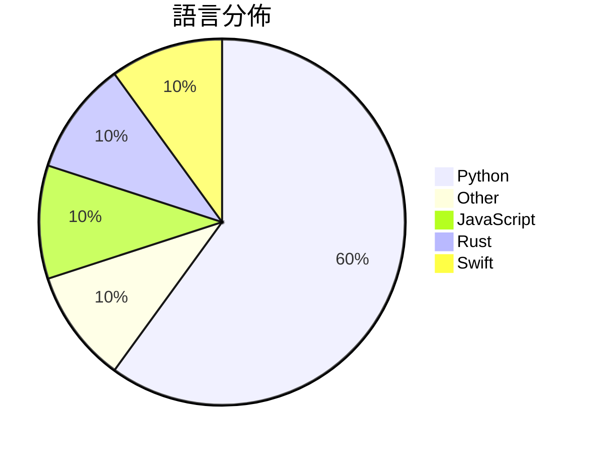

# GitHub Trending - 2026-07-30

> [!summary] 本日摘要
> 收錄 **10** 個新專案，合計 **19.0k** stars
> 語言分佈：Python (6) · Other (1) · JavaScript (1) · Rust (1) · Swift (1)

> [!tip] 本週焦點
> **[[MoonshotAI--Kimi-K3|MoonshotAI/Kimi-K3]]** — 2 天內累積 6.2k stars（3.1k stars/天）
> 提供開放的前沿智能模型，支持多模態和長期推理。



---

## 收錄列表

| # | 專案 | 分類 | Stars | 速度 | 安裝 | 語言 | 用途 |
| :--: | --- | --- | ---: | ---: | --- | --- | --- |
| 1 | [[MoonshotAI--Kimi-K3\|MoonshotAI/Kimi-K3]] | AI/ML | 6.2k | 3.1k/天 | `medium` | N/A | 提供開放的前沿智能模型，支持多模態和長期推理。 |
| 2 | [[slvDev--esp32-ai\|slvDev/esp32-ai]] | AI/ML | 2.4k | 392/天 | `medium` | Python | 在 $8 的微控制器上運行 2890 萬參數的語言模型。 |
| 3 | [[mshumer--Claude-of-Duty\|mshumer/Claude-of-Duty]] | 遊戲 | 2.3k | 568/天 | `medium` | JavaScript | 在瀏覽器中實現 Call of Duty 品質的 FPS，完全由 AI 生成藝術 |
| 4 | [[kvcache-ai--AgentENV\|kvcache-ai/AgentENV]] | 基礎設施 | 2.2k | 320/天 | `medium` | Rust | 提供一個可擴展的代理環境平台，專為大規模運行代理強化學習訓練而設計。 |
| 5 | [[digimata--quill\|digimata/quill]] | 其他 | 1.6k | 319/天 | `medium` | Swift | 提供一個超簡約的 macOS 錄音與轉錄工具，讓使用者能夠輕鬆記錄會議內容。 |
| 6 | [[mikiarlo3--ai-copywriter\|mikiarlo3/ai-copywriter]] | 其他 | 1.0k | 210/天 | `easy` | Python | 一個能夠生成引人注目的文案，並消除 AI 生成痕跡的 AI 文案工具。 |
| 7 | [[fuadmefleh--Shared-Claude-Chats\|fuadmefleh/Shared-Claude-Chats]] | 開發工具 | 936 | 234/天 | `easy` | Python | 匯集公眾的Claude和Grok對話，並提供導出腳本，方便存檔和查閱。 |
| 8 | [[VictorTaelin--OptMem\|VictorTaelin/OptMem]] | AI/ML | 884 | 221/天 | `easy` | Python | 為 AI 代理提供永久記憶，讓它們能夠持續學習和記錄重要資訊。 |
| 9 | [[MoonshotAI--MoonEP\|MoonshotAI/MoonEP]] | AI/ML | 868 | 174/天 | `medium` | Python | 提供動態冗餘專家的專家並行通信庫，確保令牌負載在各個計算單元間完美平衡。 |
| 10 | [[XYZ-AI-Lab--axrl\|XYZ-AI-Lab/axrl]] | AI/ML | 636 | 106/天 | `medium` | Python | 提供一個高效的強化學習後訓練框架，專為多回合代理工作流設計。 |

---

## 重點摘要

### 1. [[MoonshotAI--Kimi-K3|MoonshotAI/Kimi-K3]] `AI/ML`

> 提供開放的前沿智能模型，支持多模態和長期推理。

**6.2k** stars · **3.1k** stars/天 · N/A · `medium`

_建立 2 天就累積 6201 stars（3101/天），forks 436（7.0%），顯示出強烈的社群興趣。這個專案的主要貢獻者 bigeagle 之前有過成功的開源經歷，這使得社群對其信任度高。Kimi K3 解決了多模態推理的需求，之前的模型在這方面的支持不足，限制了應用範圍。社群對於中文文檔的需求也反映了其潛在的使用者基礎。這個模型的開放性和高性能使其在當前 AI 生態中具備競爭力，尤其是在長期推理和知識工作方面。_

---

### 2. [[slvDev--esp32-ai|slvDev/esp32-ai]] `AI/ML`

> 在 $8 的微控制器上運行 2890 萬參數的語言模型。

**2.4k** stars · **392** stars/天 · Python · `medium`

_建立 6 天內累積 2354 stars（392/天），forks 269（11.4%），顯示出強勁的增長潛力。作者 slvDev 以其對嵌入式系統的專業知識而聞名，這個專案解決了在微控制器上運行大型語言模型的技術挑戰，之前的解決方案無法在如此小的設備上運行如此大的模型。這個專案的出現引起了社群的廣泛關注，特別是在 AI 和嵌入式系統交集的領域。高比例的 forks 表示許多人對這個專案進行了實際的修改和使用，顯示出其實用性和潛在的應用價值。_

---

### 3. [[mshumer--Claude-of-Duty|mshumer/Claude-of-Duty]] `遊戲`

> 在瀏覽器中實現 Call of Duty 品質的 FPS，完全由 AI 生成藝術資產。

**2.3k** stars · **568** stars/天 · JavaScript · `medium`

_建立 4 天內累積 2272 stars（568/天），forks 327（14.4%），顯示出強烈的社群關注。作者 mshumer 以其創新的 AI 生成技術著稱，這個專案解決了傳統遊戲開發中對藝術資產的依賴，讓開發者能夠專注於程式碼。這樣的創新在遊戲開發領域是相對少見的，特別是在完全程序化生成的上下文中。社群對於這種新型態的遊戲開發方式表現出濃厚的興趣，並且有許多討論和反饋，顯示出這個專案的潛力。_

---

### 4. [[kvcache-ai--AgentENV|kvcache-ai/AgentENV]] `基礎設施`

> 提供一個可擴展的代理環境平台，專為大規模運行代理強化學習訓練而設計。

**2.2k** stars · **320** stars/天 · Rust · `medium`

_建立 7 天內累積 2243 stars（320/天），forks 176（7.8%），顯示出強烈的社群興趣。這個專案的主要貢獻者來自於 LSX-s-Software 團隊，之前有開發過多個相關的開源項目。AgentENV 解決了在大規模強化學習中，環境啟動慢和資源浪費的痛點，之前的解決方案往往無法有效管理資源或支持多環境運行。最近的推廣活動和社群討論可能也促進了它的曝光率。隨著對高效能計算需求的增加，這個工具的可行性和必要性愈加凸顯。forks/stars 比率為 7.8%，顯示出有相當比例的用戶在實際修改和使用這個專案。_

---

### 5. [[digimata--quill|digimata/quill]] `其他`

> 提供一個超簡約的 macOS 錄音與轉錄工具，讓使用者能夠輕鬆記錄會議內容。

**1.6k** stars · **319** stars/天 · Swift · `medium`

_建立 5 天內累積 1593 stars（319/天），forks 101（6.3%），這顯示出相對穩定的關注度。開發者 dremnik 和 rachelbaker 之前在開源社群中有過其他專案的貢獻，這使得他們的專案更容易獲得信任。Quill 解決了會議錄音後的轉錄需求，特別是在隱私和本地處理方面，這是許多現有工具無法提供的。社群中對於 Whisper 引擎的需求也反映了使用者對於多語言支持的期待。這些因素共同促進了 Quill 的快速增長。_

---

### 6. [[mikiarlo3--ai-copywriter|mikiarlo3/ai-copywriter]] `其他`

> 一個能夠生成引人注目的文案，並消除 AI 生成痕跡的 AI 文案工具。

**1.0k** stars · **210** stars/天 · Python · `easy`

_建立 5 天就累積 1048 stars（209.6/天），forks 23（2.2%），這顯示出一定的關注度。作者 Mickey Haslavsky 之前的工作經驗和對文案的深入理解使得這個工具能夠解決傳統文案生成工具無法有效捕捉受眾情感的痛點。這個工具的出現正好填補了市場上對於能夠生成高質量且具人性化文案的需求。社群的反應也顯示出對於這種創新的文案生成方式的興趣，尤其是在行銷和創意寫作領域。_

---

### 7. [[fuadmefleh--Shared-Claude-Chats|fuadmefleh/Shared-Claude-Chats]] `開發工具`

> 匯集公眾的Claude和Grok對話，並提供導出腳本，方便存檔和查閱。

**936** stars · **234** stars/天 · Python · `easy`

_建立 4 天就累積 936 stars（234/天），forks 154（16.5%），這顯示出用戶對於多平台AI對話整理的需求。作者fuadmefleh在開源社群中活躍，過去也有相關的專案經驗。這個專案解決了用戶在多個AI平台上查找和整理對話的痛點，之前的解決方案往往只能針對單一平台，無法滿足跨平台的需求。社群的熱烈反應顯示出對於這種整合工具的需求，特別是在AI對話日益普及的背景下。_

---

### 8. [[VictorTaelin--OptMem|VictorTaelin/OptMem]] `AI/ML`

> 為 AI 代理提供永久記憶，讓它們能夠持續學習和記錄重要資訊。

**884** stars · **221** stars/天 · Python · `easy`

_建立 4 天就累積 884 stars（221/天），forks 53（6.0%），顯示出相對穩定的增長。作者 VictorTaelin 之前的專案經驗可能為這個工具的開發奠定了基礎。OptMem 解決了 AI 代理在不同會話間無法持久記憶的痛點，之前的方案往往依賴於短期記憶或無法有效整合。這個工具的出現正好填補了這一空白，提供了一個簡單的記憶管理解決方案。社群的反應也顯示出對這種記憶持久化的需求，特別是在 AI 代理的應用場景中。Forks/stars 比率為 6.0%，顯示出有一定比例的使用者在實際修改和使用這個工具。_

---

### 9. [[MoonshotAI--MoonEP|MoonshotAI/MoonEP]] `AI/ML`

> 提供動態冗餘專家的專家並行通信庫，確保令牌負載在各個計算單元間完美平衡。

**868** stars · **174** stars/天 · Python · `medium`

_建立 5 天內累積 868 stars（174/天），forks 89（10.3%），顯示出相對穩定的增長。主要貢獻者 weixiao-huang 和 esp0r 之前在並行計算和深度學習領域有豐富經驗。這個專案解決了在專家並行計算中令牌負載不均的問題，過去的解決方案如 DeepEP 在不均衡情況下性能下降明顯。最近的推特討論和社群反饋也促進了這個專案的關注。隨著 GPU 計算的普及，對高效並行計算的需求日益增加，MoonEP 的出現恰好滿足了這一需求。forks/stars 比率為 10.3%，顯示出有相當比例的使用者在進行實際修改和使用。_

---

### 10. [[XYZ-AI-Lab--axrl|XYZ-AI-Lab/axrl]] `AI/ML`

> 提供一個高效的強化學習後訓練框架，專為多回合代理工作流設計。

**636** stars · **106** stars/天 · Python · `medium`

_建立 6 天內累積 636 stars（106/天），forks 21（3.3%），顯示出穩定的增長趨勢。主要貢獻者包括 lee-junjie 和 Jinyu-W，他們在強化學習和大規模訓練領域有豐富經驗。AxisRL 解決了傳統強化學習框架在多回合代理工作流中的不足，特別是在獎勵收集和樣本構建方面。這一點在當前 AI 研究中越來越受到重視，尤其是需要長期互動的應用場景。社群活躍度高，開發者持續更新文檔和安裝指導，顯示出良好的支持和維護。_

---

## 今日到期複習

> [!tip] 根據間隔複習排程，今天該回顧的專案

```dataview
TABLE
  stars_per_day AS "Stars/天",
  category AS "分類",
  engagement AS "參與度"
FROM "Repos"
WHERE next_review AND date(next_review) <= date("2026-07-30") AND status != "archived"
SORT priority DESC
```

## 待處理

```dataviewjs
const pending = dv.pages('"Repos"').where(p => p.status === "to-review").length;
const unrated = dv.pages('"Repos"').where(p => p.status !== "archived" && p.status !== "to-review" && (p.my_rating || 0) === 0).length;
const noVerdict = dv.pages('"Repos"').where(p => p.status !== "archived" && (p.my_rating || 0) > 0 && (!p.verdict || p.verdict === "")).length;
const items = [];
if (pending > 0) items.push(`**${pending}** 個待分流`);
if (unrated > 0) items.push(`**${unrated}** 個已讀但未評分`);
if (noVerdict > 0) items.push(`**${noVerdict}** 個已評分但無結論`);
if (items.length > 0) dv.paragraph(items.join(" / "));
else dv.paragraph("所有專案都已處理完畢！");
```
