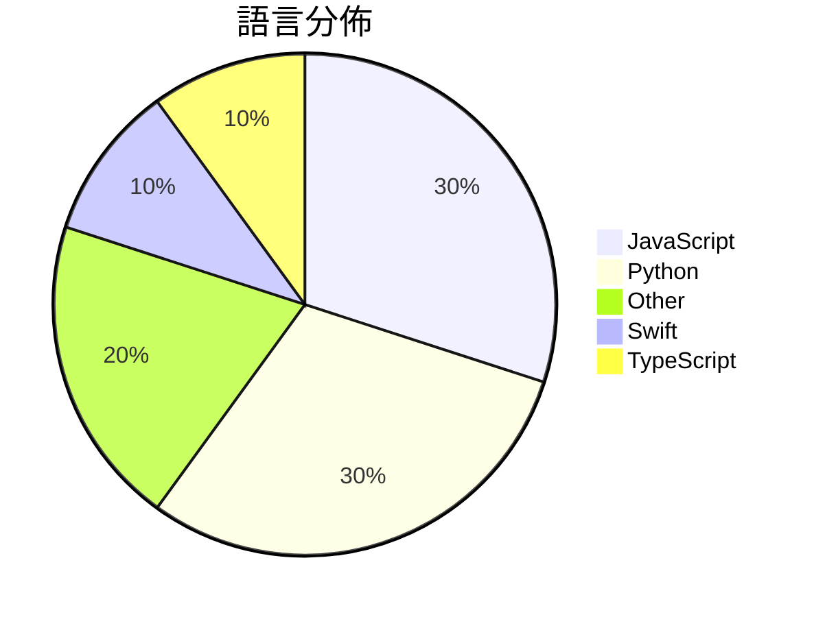

# GitHub Trending - 2026-07-31

> [!summary] 本日摘要
> 收錄 **10** 個新專案，合計 **17.8k** stars
> 語言分佈：JavaScript (3) · Python (3) · Other (2) · Swift (1) · TypeScript (1)

> [!tip] 本週焦點
> **[[MoonshotAI--Kimi-K3|MoonshotAI/Kimi-K3]]** — 3 天內累積 7.6k stars（2.5k stars/天）
> Open Frontier Intelligence



---

## 收錄列表

| # | 專案 | 分類 | Stars | 速度 | 安裝 | 語言 | 用途 |
| :--: | --- | --- | ---: | ---: | --- | --- | --- |
| 1 | [[MoonshotAI--Kimi-K3\|MoonshotAI/Kimi-K3]] |  | 7.6k | 2.5k/天 |  | N/A | Open Frontier Intelligence |
| 2 | [[digimata--quill\|digimata/quill]] |  | 2.5k | 421/天 |  | Swift | Ultra-minimalist macOS recording + trans |
| 3 | [[mshumer--Claude-of-Duty\|mshumer/Claude-of-Duty]] |  | 2.4k | 483/天 |  | JavaScript | A Call of Duty-quality FPS in Three.js,  |
| 4 | [[mikiarlo3--ai-copywriter\|mikiarlo3/ai-copywriter]] |  | 989 | 165/天 |  | Python | An AI copywriter that uses real copywrit |
| 5 | [[MoonshotAI--MoonEP\|MoonshotAI/MoonEP]] |  | 936 | 156/天 |  | Python | MoonEP: A Perfectly Balanced Expert Para |
| 6 | [[VictorTaelin--OptMem\|VictorTaelin/OptMem]] |  | 935 | 187/天 |  | Python | Permanent memory for AI agents. A 426-to |
| 7 | [[xikhar--persona\|xikhar/persona]] |  | 679 | 340/天 |  | JavaScript | Bringing real-time voice to life. |
| 8 | [[WilonityXYZ--Wilonity\|WilonityXYZ/Wilonity]] |  | 651 | 651/天 |  | N/A | Wilonity Loader – cheat lib w/ spoofer,  |
| 9 | [[0xwilliamortiz--ponytail-improved\|0xwilliamortiz/ponytail-improved]] |  | 564 | 282/天 |  | JavaScript | Makes your AI agent think like the lazie |
| 10 | [[0xwilliamortiz--openclaude-improved\|0xwilliamortiz/openclaude-improved]] |  | 562 | 141/天 |  | TypeScript | runs anywhere. uses anything |

---

## 重點摘要

### 1. [[MoonshotAI--Kimi-K3|MoonshotAI/Kimi-K3]]

**7.6k** stars · **2.5k** stars/天 · N/A

---

### 2. [[digimata--quill|digimata/quill]]

**2.5k** stars · **421** stars/天 · Swift

---

### 3. [[mshumer--Claude-of-Duty|mshumer/Claude-of-Duty]]

**2.4k** stars · **483** stars/天 · JavaScript

---

### 4. [[mikiarlo3--ai-copywriter|mikiarlo3/ai-copywriter]]

**989** stars · **165** stars/天 · Python

---

### 5. [[MoonshotAI--MoonEP|MoonshotAI/MoonEP]]

**936** stars · **156** stars/天 · Python

---

### 6. [[VictorTaelin--OptMem|VictorTaelin/OptMem]]

**935** stars · **187** stars/天 · Python

---

### 7. [[xikhar--persona|xikhar/persona]]

**679** stars · **340** stars/天 · JavaScript

---

### 8. [[WilonityXYZ--Wilonity|WilonityXYZ/Wilonity]]

**651** stars · **651** stars/天 · N/A

---

### 9. [[0xwilliamortiz--ponytail-improved|0xwilliamortiz/ponytail-improved]]

**564** stars · **282** stars/天 · JavaScript

---

### 10. [[0xwilliamortiz--openclaude-improved|0xwilliamortiz/openclaude-improved]]

**562** stars · **141** stars/天 · TypeScript

---

## 今日到期複習

> [!tip] 根據間隔複習排程，今天該回顧的專案

```dataview
TABLE
  stars_per_day AS "Stars/天",
  category AS "分類",
  engagement AS "參與度"
FROM "Repos"
WHERE next_review AND date(next_review) <= date("2026-07-31") AND status != "archived"
SORT priority DESC
```

## 待處理

```dataviewjs
const pending = dv.pages('"Repos"').where(p => p.status === "to-review").length;
const unrated = dv.pages('"Repos"').where(p => p.status !== "archived" && p.status !== "to-review" && (p.my_rating || 0) === 0).length;
const noVerdict = dv.pages('"Repos"').where(p => p.status !== "archived" && (p.my_rating || 0) > 0 && (!p.verdict || p.verdict === "")).length;
const items = [];
if (pending > 0) items.push(`**${pending}** 個待分流`);
if (unrated > 0) items.push(`**${unrated}** 個已讀但未評分`);
if (noVerdict > 0) items.push(`**${noVerdict}** 個已評分但無結論`);
if (items.length > 0) dv.paragraph(items.join(" / "));
else dv.paragraph("所有專案都已處理完畢！");
```
