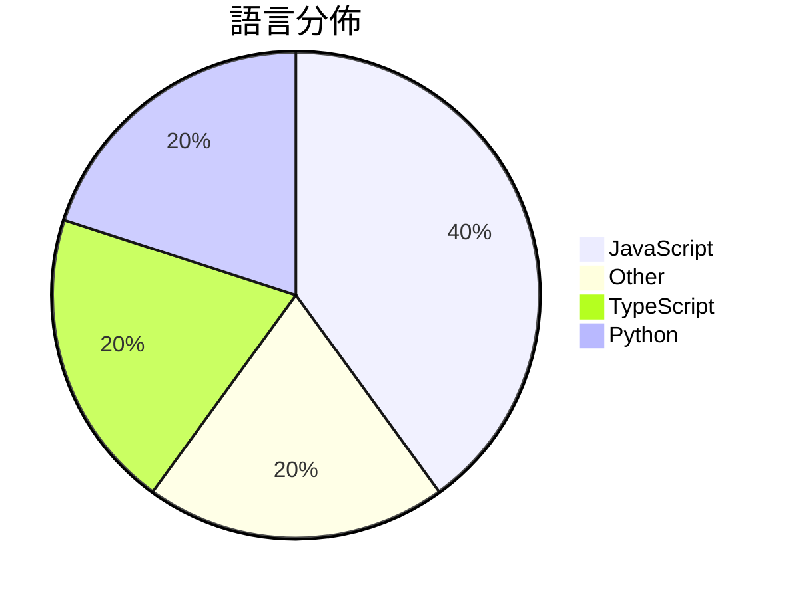

# GitHub Trending - 2026-08-01

> [!summary] 本日摘要
> 收錄 **10** 個新專案，合計 **19.0k** stars
> 語言分佈：JavaScript (4) · Other (2) · TypeScript (2) · Python (2)

> [!tip] 本週焦點
> **[[MoonshotAI--Kimi-K3|MoonshotAI/Kimi-K3]]** — 4 天內累積 7.7k stars（1.9k stars/天）
> Open Frontier Intelligence



---

## 收錄列表

| # | 專案 | 分類 | Stars | 速度 | 安裝 | 語言 | 用途 |
| :--: | --- | --- | ---: | ---: | --- | --- | --- |
| 1 | [[MoonshotAI--Kimi-K3\|MoonshotAI/Kimi-K3]] |  | 7.7k | 1.9k/天 |  | N/A | Open Frontier Intelligence |
| 2 | [[mshumer--Claude-of-Duty\|mshumer/Claude-of-Duty]] |  | 2.5k | 422/天 |  | JavaScript | A Call of Duty-quality FPS in Three.js,  |
| 3 | [[yc-software--qm\|yc-software/qm]] |  | 2.4k | 1.2k/天 |  | TypeScript | Multiplayer agent harness for work |
| 4 | [[bashalarmistalt--decimen-optical-transfer\|bashalarmistalt/decimen-optical-transfer]] |  | 2.2k | 2.2k/天 |  | TypeScript |  |
| 5 | [[VictorTaelin--OptMem\|VictorTaelin/OptMem]] |  | 1.0k | 174/天 |  | Python | Permanent memory for AI agents. A 426-to |
| 6 | [[xikhar--persona\|xikhar/persona]] |  | 720 | 240/天 |  | JavaScript | Bringing real-time voice to life. |
| 7 | [[QwenAudio--qwen-audio-agent\|QwenAudio/qwen-audio-agent]] |  | 622 | 156/天 |  | JavaScript | A realtime voice runtime that keeps Agen |
| 8 | [[xdash--FDE-the-Guidance-Book-of-Forward-Deployed-Engineer\|xdash/FDE-the-Guidance-Book-of-Forward-Deployed-Engineer]] |  | 594 | 594/天 |  | N/A | FDE（前沿部署工程师）从零入门指南（基于范冰《增长黑客》原书框架） |
| 9 | [[0xwilliamortiz--ponytail-improved\|0xwilliamortiz/ponytail-improved]] |  | 570 | 190/天 |  | JavaScript | Makes your AI agent think like the lazie |
| 10 | [[gavamedia--deltafin\|gavamedia/deltafin]] |  | 567 | 142/天 |  | Python | Run full Kimi K3 on a single device. And |

---

## 重點摘要

### 1. [[MoonshotAI--Kimi-K3|MoonshotAI/Kimi-K3]]

**7.7k** stars · **1.9k** stars/天 · N/A

---

### 2. [[mshumer--Claude-of-Duty|mshumer/Claude-of-Duty]]

**2.5k** stars · **422** stars/天 · JavaScript

---

### 3. [[yc-software--qm|yc-software/qm]]

**2.4k** stars · **1.2k** stars/天 · TypeScript

---

### 4. [[bashalarmistalt--decimen-optical-transfer|bashalarmistalt/decimen-optical-transfer]]

**2.2k** stars · **2.2k** stars/天 · TypeScript

---

### 5. [[VictorTaelin--OptMem|VictorTaelin/OptMem]]

**1.0k** stars · **174** stars/天 · Python

---

### 6. [[xikhar--persona|xikhar/persona]]

**720** stars · **240** stars/天 · JavaScript

---

### 7. [[QwenAudio--qwen-audio-agent|QwenAudio/qwen-audio-agent]]

**622** stars · **156** stars/天 · JavaScript

---

### 8. [[xdash--FDE-the-Guidance-Book-of-Forward-Deployed-Engineer|xdash/FDE-the-Guidance-Book-of-Forward-Deployed-Engineer]]

**594** stars · **594** stars/天 · N/A

---

### 9. [[0xwilliamortiz--ponytail-improved|0xwilliamortiz/ponytail-improved]]

**570** stars · **190** stars/天 · JavaScript

---

### 10. [[gavamedia--deltafin|gavamedia/deltafin]]

**567** stars · **142** stars/天 · Python

---

## 今日到期複習

> [!tip] 根據間隔複習排程，今天該回顧的專案

```dataview
TABLE
  stars_per_day AS "Stars/天",
  category AS "分類",
  engagement AS "參與度"
FROM "Repos"
WHERE next_review AND date(next_review) <= date("2026-08-01") AND status != "archived"
SORT priority DESC
```

## 待處理

```dataviewjs
const pending = dv.pages('"Repos"').where(p => p.status === "to-review").length;
const unrated = dv.pages('"Repos"').where(p => p.status !== "archived" && p.status !== "to-review" && (p.my_rating || 0) === 0).length;
const noVerdict = dv.pages('"Repos"').where(p => p.status !== "archived" && (p.my_rating || 0) > 0 && (!p.verdict || p.verdict === "")).length;
const items = [];
if (pending > 0) items.push(`**${pending}** 個待分流`);
if (unrated > 0) items.push(`**${unrated}** 個已讀但未評分`);
if (noVerdict > 0) items.push(`**${noVerdict}** 個已評分但無結論`);
if (items.length > 0) dv.paragraph(items.join(" / "));
else dv.paragraph("所有專案都已處理完畢！");
```
