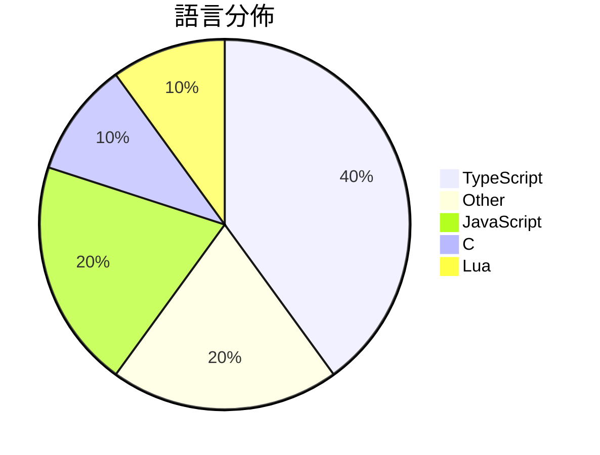

# GitHub Trending - 2026-08-02

> [!summary] 本日摘要
> 收錄 **10** 個新專案，合計 **22.2k** stars
> 語言分佈：TypeScript (4) · Other (2) · JavaScript (2) · C (1) · Lua (1)

> [!tip] 本週焦點
> **[[MoonshotAI--Kimi-K3|MoonshotAI/Kimi-K3]]** — 5 天內累積 7.8k stars（1.6k stars/天）
> Open Frontier Intelligence



---

## 收錄列表

| # | 專案 | 分類 | Stars | 速度 | 安裝 | 語言 | 用途 |
| :--: | --- | --- | ---: | ---: | --- | --- | --- |
| 1 | [[MoonshotAI--Kimi-K3\|MoonshotAI/Kimi-K3]] |  | 7.8k | 1.6k/天 |  | N/A | Open Frontier Intelligence |
| 2 | [[yc-software--qm\|yc-software/qm]] |  | 5.2k | 1.7k/天 |  | TypeScript | Multiplayer agent harness for work |
| 3 | [[bashalarmistalt--decimen-optical-transfer\|bashalarmistalt/decimen-optical-transfer]] |  | 3.1k | 1.6k/天 |  | TypeScript |  |
| 4 | [[QwenAudio--qwen-audio-agent\|QwenAudio/qwen-audio-agent]] |  | 1.4k | 279/天 |  | JavaScript | A realtime voice runtime that keeps Agen |
| 5 | [[xdash--FDE-the-Guidance-Book-of-Forward-Deployed-Engineer\|xdash/FDE-the-Guidance-Book-of-Forward-Deployed-Engineer]] |  | 1.1k | 561/天 |  | N/A | FDE（前沿部署工程师）从零入门指南（基于范冰《增长黑客》原书框架） |
| 6 | [[trycompai--crm\|trycompai/crm]] |  | 832 | 832/天 |  | TypeScript |  |
| 7 | [[xikhar--persona\|xikhar/persona]] |  | 770 | 193/天 |  | JavaScript | Bringing real-time voice to life. |
| 8 | [[sqliteai--waste\|sqliteai/waste]] |  | 705 | 176/天 |  | C | Run the full 2.78-trillion-parameter Kim |
| 9 | [[DramaticShape--DramaticShapeVoxelMod\|DramaticShape/DramaticShapeVoxelMod]] |  | 641 | 107/天 |  | Lua |  |
| 10 | [[talivia-group--talivia\|talivia-group/talivia]] |  | 599 | 200/天 |  | TypeScript | Open-source, self-hosted revenue-first a |

---

## 重點摘要

### 1. [[MoonshotAI--Kimi-K3|MoonshotAI/Kimi-K3]]

**7.8k** stars · **1.6k** stars/天 · N/A

---

### 2. [[yc-software--qm|yc-software/qm]]

**5.2k** stars · **1.7k** stars/天 · TypeScript

---

### 3. [[bashalarmistalt--decimen-optical-transfer|bashalarmistalt/decimen-optical-transfer]]

**3.1k** stars · **1.6k** stars/天 · TypeScript

---

### 4. [[QwenAudio--qwen-audio-agent|QwenAudio/qwen-audio-agent]]

**1.4k** stars · **279** stars/天 · JavaScript

---

### 5. [[xdash--FDE-the-Guidance-Book-of-Forward-Deployed-Engineer|xdash/FDE-the-Guidance-Book-of-Forward-Deployed-Engineer]]

**1.1k** stars · **561** stars/天 · N/A

---

### 6. [[trycompai--crm|trycompai/crm]]

**832** stars · **832** stars/天 · TypeScript

---

### 7. [[xikhar--persona|xikhar/persona]]

**770** stars · **193** stars/天 · JavaScript

---

### 8. [[sqliteai--waste|sqliteai/waste]]

**705** stars · **176** stars/天 · C

---

### 9. [[DramaticShape--DramaticShapeVoxelMod|DramaticShape/DramaticShapeVoxelMod]]

**641** stars · **107** stars/天 · Lua

---

### 10. [[talivia-group--talivia|talivia-group/talivia]]

**599** stars · **200** stars/天 · TypeScript

---

## 今日到期複習

> [!tip] 根據間隔複習排程，今天該回顧的專案

```dataview
TABLE
  stars_per_day AS "Stars/天",
  category AS "分類",
  engagement AS "參與度"
FROM "Repos"
WHERE next_review AND date(next_review) <= date("2026-08-02") AND status != "archived"
SORT priority DESC
```

## 待處理

```dataviewjs
const pending = dv.pages('"Repos"').where(p => p.status === "to-review").length;
const unrated = dv.pages('"Repos"').where(p => p.status !== "archived" && p.status !== "to-review" && (p.my_rating || 0) === 0).length;
const noVerdict = dv.pages('"Repos"').where(p => p.status !== "archived" && (p.my_rating || 0) > 0 && (!p.verdict || p.verdict === "")).length;
const items = [];
if (pending > 0) items.push(`**${pending}** 個待分流`);
if (unrated > 0) items.push(`**${unrated}** 個已讀但未評分`);
if (noVerdict > 0) items.push(`**${noVerdict}** 個已評分但無結論`);
if (items.length > 0) dv.paragraph(items.join(" / "));
else dv.paragraph("所有專案都已處理完畢！");
```
