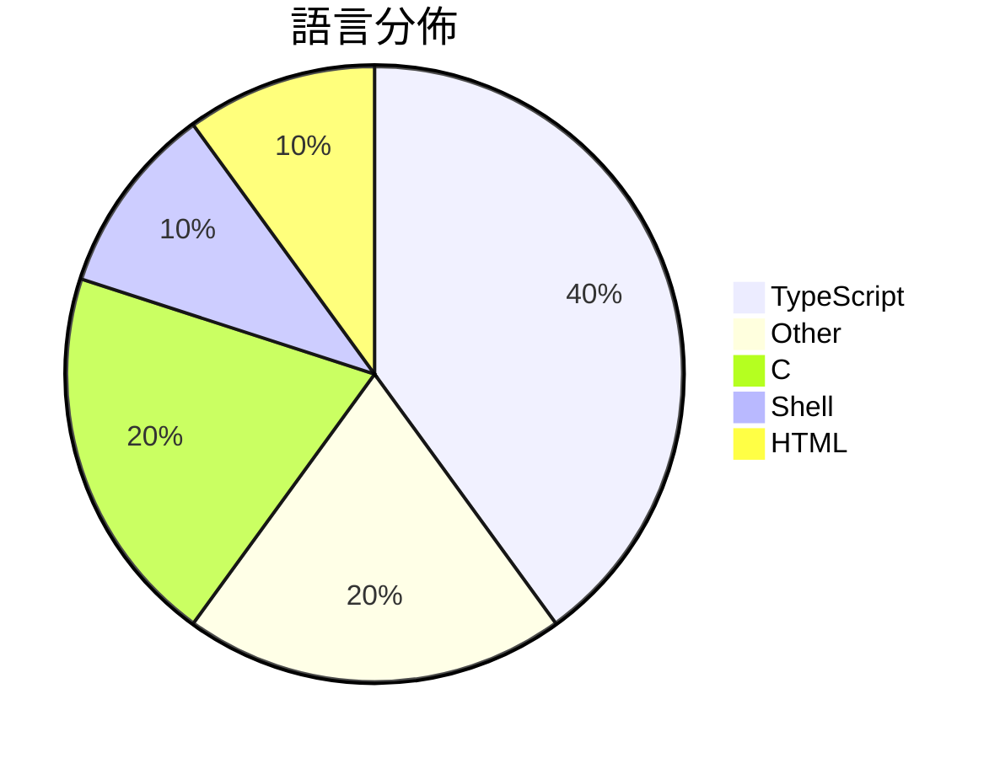

# GitHub Trending - 2026-08-04

> [!summary] 本日摘要
> 收錄 **10** 個新專案，合計 **27.2k** stars
> 語言分佈：TypeScript (4) · Other (2) · C (2) · Shell (1) · HTML (1)

> [!tip] 本週焦點
> **[[yc-software--qm|yc-software/qm]]** — 5 天內累積 10.0k stars（2.0k stars/天）
> Multiplayer agent harness for work



---

## 收錄列表

| # | 專案 | 分類 | Stars | 速度 | 安裝 | 語言 | 用途 |
| :--: | --- | --- | ---: | ---: | --- | --- | --- |
| 1 | [[yc-software--qm\|yc-software/qm]] |  | 10.0k | 2.0k/天 |  | TypeScript | Multiplayer agent harness for work |
| 2 | [[bashalarmistalt--decimen-optical-transfer\|bashalarmistalt/decimen-optical-transfer]] |  | 4.3k | 1.1k/天 |  | TypeScript |  |
| 3 | [[trycompai--crm\|trycompai/crm]] |  | 3.4k | 1.1k/天 |  | TypeScript | An open-source, agentic-first CRM. |
| 4 | [[xdash--FDE-the-Guidance-Book-of-Forward-Deployed-Engineer\|xdash/FDE-the-Guidance-Book-of-Forward-Deployed-Engineer]] |  | 2.2k | 554/天 |  | N/A | FDE（前沿部署工程师）从零入门指南（基于范冰《增长黑客》原书框架） |
| 5 | [[sqliteai--waste\|sqliteai/waste]] |  | 1.6k | 260/天 |  | C | Run the full 2.78-trillion-parameter Kim |
| 6 | [[microsoft--skill-recorder\|microsoft/skill-recorder]] |  | 1.5k | 296/天 |  | TypeScript | Desktop app that records your on-screen  |
| 7 | [[FareedKhan-dev--kimi-k3-in-c\|FareedKhan-dev/kimi-k3-in-c]] |  | 1.3k | 660/天 |  | C | A 2.78-trillion-parameter Kimi K3 runnin |
| 8 | [[DannyMac180--sol-advisor\|DannyMac180/sol-advisor]] |  | 1.1k | 532/天 |  | Shell | Codex-native architect orchestration wit |
| 9 | [[imsai-sh--zhuzhiliao\|imsai-sh/zhuzhiliao]] |  | 946 | 473/天 |  | HTML | 竹知了 —— 一转就哇哇叫的传统玩具，Web 模拟版。零依赖单文件，真实录音采样 |
| 10 | [[WilonityDev--WilonityLoader\|WilonityDev/WilonityLoader]] |  | 899 | 300/天 |  | N/A | Wilonity Loader – cheat lib w/ spoofer,  |

---

## 重點摘要

### 1. [[yc-software--qm|yc-software/qm]]

**10.0k** stars · **2.0k** stars/天 · TypeScript

---

### 2. [[bashalarmistalt--decimen-optical-transfer|bashalarmistalt/decimen-optical-transfer]]

**4.3k** stars · **1.1k** stars/天 · TypeScript

---

### 3. [[trycompai--crm|trycompai/crm]]

**3.4k** stars · **1.1k** stars/天 · TypeScript

---

### 4. [[xdash--FDE-the-Guidance-Book-of-Forward-Deployed-Engineer|xdash/FDE-the-Guidance-Book-of-Forward-Deployed-Engineer]]

**2.2k** stars · **554** stars/天 · N/A

---

### 5. [[sqliteai--waste|sqliteai/waste]]

**1.6k** stars · **260** stars/天 · C

---

### 6. [[microsoft--skill-recorder|microsoft/skill-recorder]]

**1.5k** stars · **296** stars/天 · TypeScript

---

### 7. [[FareedKhan-dev--kimi-k3-in-c|FareedKhan-dev/kimi-k3-in-c]]

**1.3k** stars · **660** stars/天 · C

---

### 8. [[DannyMac180--sol-advisor|DannyMac180/sol-advisor]]

**1.1k** stars · **532** stars/天 · Shell

---

### 9. [[imsai-sh--zhuzhiliao|imsai-sh/zhuzhiliao]]

**946** stars · **473** stars/天 · HTML

---

### 10. [[WilonityDev--WilonityLoader|WilonityDev/WilonityLoader]]

**899** stars · **300** stars/天 · N/A

---

## 今日到期複習

> [!tip] 根據間隔複習排程，今天該回顧的專案

```dataview
TABLE
  stars_per_day AS "Stars/天",
  category AS "分類",
  engagement AS "參與度"
FROM "Repos"
WHERE next_review AND date(next_review) <= date("2026-08-04") AND status != "archived"
SORT priority DESC
```

## 待處理

```dataviewjs
const pending = dv.pages('"Repos"').where(p => p.status === "to-review").length;
const unrated = dv.pages('"Repos"').where(p => p.status !== "archived" && p.status !== "to-review" && (p.my_rating || 0) === 0).length;
const noVerdict = dv.pages('"Repos"').where(p => p.status !== "archived" && (p.my_rating || 0) > 0 && (!p.verdict || p.verdict === "")).length;
const items = [];
if (pending > 0) items.push(`**${pending}** 個待分流`);
if (unrated > 0) items.push(`**${unrated}** 個已讀但未評分`);
if (noVerdict > 0) items.push(`**${noVerdict}** 個已評分但無結論`);
if (items.length > 0) dv.paragraph(items.join(" / "));
else dv.paragraph("所有專案都已處理完畢！");
```
