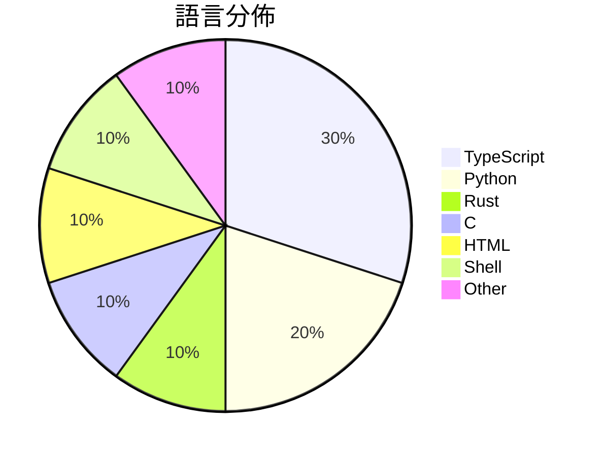

# GitHub Trending - 2026-08-07

> [!summary] 本日摘要
> 收錄 **10** 個新專案，合計 **31.2k** stars
> 語言分佈：TypeScript (3) · Python (2) · Rust (1) · C (1) · HTML (1) · Shell (1) · Other (1)

> [!tip] 本週焦點
> **[[firecrawl--anydoc|firecrawl/anydoc]]** — 3 天內累積 8.8k stars（2.9k stars/天）
> Convert Word, PowerPoint, Excel, OpenDocument, RTF, EPUB, CSV, and PDF to clean Markdown. Built in Rust, with Node.js and Python bindings.



---

## 收錄列表

| # | 專案 | 分類 | Stars | 速度 | 安裝 | 語言 | 用途 |
| :--: | --- | --- | ---: | ---: | --- | --- | --- |
| 1 | [[firecrawl--anydoc\|firecrawl/anydoc]] |  | 8.8k | 2.9k/天 |  | Rust | Convert Word, PowerPoint, Excel, OpenDoc |
| 2 | [[trycompai--crm\|trycompai/crm]] |  | 7.2k | 1.2k/天 |  | TypeScript | Comp AI CRM is an open source, CRM desig |
| 3 | [[FareedKhan-dev--kimi-k3-in-c\|FareedKhan-dev/kimi-k3-in-c]] |  | 2.9k | 578/天 |  | C | A 2.78-trillion-parameter Kimi K3 runnin |
| 4 | [[imsai-sh--zhuzhiliao\|imsai-sh/zhuzhiliao]] |  | 2.3k | 463/天 |  | HTML | 竹知了 —— 一转就哇哇叫的传统玩具，Web 模拟版。零依赖单文件，真实录音采样 |
| 5 | [[genspark-ai--genoffice\|genspark-ai/genoffice]] |  | 2.1k | 345/天 |  | TypeScript | An AI-native office suite for macOS and  |
| 6 | [[thebuggeddev--anatomy\|thebuggeddev/anatomy]] |  | 1.9k | 470/天 |  | TypeScript | An interactive 3D human anatomy explorer |
| 7 | [[DannyMac180--sol-advisor\|DannyMac180/sol-advisor]] |  | 1.7k | 344/天 |  | Shell | Codex-native architect orchestration wit |
| 8 | [[KKKKhazix--human-writing\|KKKKhazix/human-writing]] |  | 1.7k | 832/天 |  | Python | 让 AI 写的中文读起来像一个具体的人在说话。通用创作与改稿 Skill，开箱即 |
| 9 | [[Binaryify--open-kimi-ppt-skill\|Binaryify/open-kimi-ppt-skill]] |  | 1.5k | 1.5k/天 |  | Python | 非官方 Kimi Slides Skill：让 AI Agent 生成可编辑 P |
| 10 | [[ZzzLc0405--photo-abstract-editorial\|ZzzLc0405/photo-abstract-editorial]] |  | 1.1k | 546/天 |  | N/A |  |

---

## 重點摘要

### 1. [[firecrawl--anydoc|firecrawl/anydoc]]

**8.8k** stars · **2.9k** stars/天 · Rust

---

### 2. [[trycompai--crm|trycompai/crm]]

**7.2k** stars · **1.2k** stars/天 · TypeScript

---

### 3. [[FareedKhan-dev--kimi-k3-in-c|FareedKhan-dev/kimi-k3-in-c]]

**2.9k** stars · **578** stars/天 · C

---

### 4. [[imsai-sh--zhuzhiliao|imsai-sh/zhuzhiliao]]

**2.3k** stars · **463** stars/天 · HTML

---

### 5. [[genspark-ai--genoffice|genspark-ai/genoffice]]

**2.1k** stars · **345** stars/天 · TypeScript

---

### 6. [[thebuggeddev--anatomy|thebuggeddev/anatomy]]

**1.9k** stars · **470** stars/天 · TypeScript

---

### 7. [[DannyMac180--sol-advisor|DannyMac180/sol-advisor]]

**1.7k** stars · **344** stars/天 · Shell

---

### 8. [[KKKKhazix--human-writing|KKKKhazix/human-writing]]

**1.7k** stars · **832** stars/天 · Python

---

### 9. [[Binaryify--open-kimi-ppt-skill|Binaryify/open-kimi-ppt-skill]]

**1.5k** stars · **1.5k** stars/天 · Python

---

### 10. [[ZzzLc0405--photo-abstract-editorial|ZzzLc0405/photo-abstract-editorial]]

**1.1k** stars · **546** stars/天 · N/A

---

## 今日到期複習

> [!tip] 根據間隔複習排程，今天該回顧的專案

```dataview
TABLE
  stars_per_day AS "Stars/天",
  category AS "分類",
  engagement AS "參與度"
FROM "Repos"
WHERE next_review AND date(next_review) <= date("2026-08-07") AND status != "archived"
SORT priority DESC
```

## 待處理

```dataviewjs
const pending = dv.pages('"Repos"').where(p => p.status === "to-review").length;
const unrated = dv.pages('"Repos"').where(p => p.status !== "archived" && p.status !== "to-review" && (p.my_rating || 0) === 0).length;
const noVerdict = dv.pages('"Repos"').where(p => p.status !== "archived" && (p.my_rating || 0) > 0 && (!p.verdict || p.verdict === "")).length;
const items = [];
if (pending > 0) items.push(`**${pending}** 個待分流`);
if (unrated > 0) items.push(`**${unrated}** 個已讀但未評分`);
if (noVerdict > 0) items.push(`**${noVerdict}** 個已評分但無結論`);
if (items.length > 0) dv.paragraph(items.join(" / "));
else dv.paragraph("所有專案都已處理完畢！");
```
