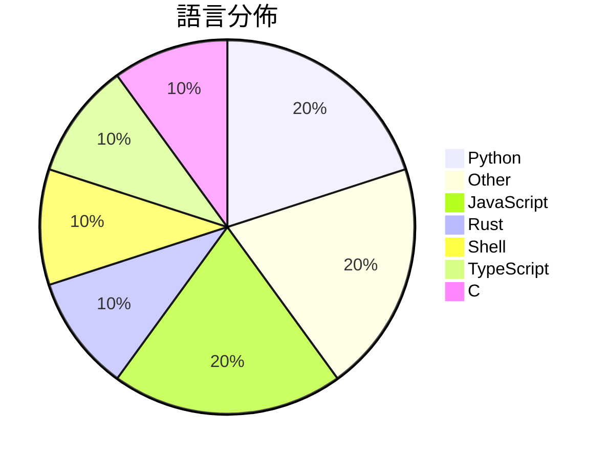

# GitHub Trending - 2026-08-10

> [!summary] 本日摘要
> 收錄 **10** 個新專案，合計 **23.0k** stars
> 語言分佈：Python (2) · Other (2) · JavaScript (2) · Rust (1) · Shell (1) · TypeScript (1) · C (1)

> [!tip] 本週焦點
> **[[firecrawl--anydoc|firecrawl/anydoc]]** — 6 天內累積 12.8k stars（2.1k stars/天）
> Convert Word, PowerPoint, Excel, OpenDocument, RTF, EPUB, CSV, and PDF to clean Markdown. Built in Rust, with Node.js and Python bindings.



---

## 收錄列表

| # | 專案 | 分類 | Stars | 速度 | 安裝 | 語言 | 用途 |
| :--: | --- | --- | ---: | ---: | --- | --- | --- |
| 1 | [[firecrawl--anydoc\|firecrawl/anydoc]] |  | 12.8k | 2.1k/天 |  | Rust | Convert Word, PowerPoint, Excel, OpenDoc |
| 2 | [[KKKKhazix--human-writing\|KKKKhazix/human-writing]] |  | 2.1k | 424/天 |  | Python | 让 AI 写的中文读起来像一个具体的人在说话。通用创作与改稿 Skill，开箱即 |
| 3 | [[ZzzLc0405--photo-abstract-editorial\|ZzzLc0405/photo-abstract-editorial]] |  | 2.0k | 398/天 |  | N/A |  |
| 4 | [[Binaryify--open-kimi-ppt-skill\|Binaryify/open-kimi-ppt-skill]] |  | 1.6k | 402/天 |  | N/A | 非官方 Kimi Slides Skill：让 AI Agent 生成可编辑 P |
| 5 | [[ShawnPana--phone-harness\|ShawnPana/phone-harness]] |  | 929 | 465/天 |  | Python | let your agent control your phone |
| 6 | [[mikiarlo3--awesome-growth-hacking-skills\|mikiarlo3/awesome-growth-hacking-skills]] |  | 798 | 160/天 |  | Shell | Find agentic growth hacking skills for C |
| 7 | [[0xwilliamortiz--claude-red\|0xwilliamortiz/claude-red]] |  | 711 | 178/天 |  | JavaScript | claude-red is a curated library of offen |
| 8 | [[wumingqi60--lingxi\|wumingqi60/lingxi]] |  | 709 | 118/天 |  | TypeScript | 灵犀跨境-开源共建版 |
| 9 | [[google-gemma--gemma-translator\|google-gemma/gemma-translator]] |  | 701 | 117/天 |  | JavaScript |  |
| 10 | [[xoreaxeaxeax--asm-hall-of-shame\|xoreaxeaxeax/asm-hall-of-shame]] |  | 669 | 167/天 |  | C | Racing to the bottom of CPU performance |

---

## 重點摘要

### 1. [[firecrawl--anydoc|firecrawl/anydoc]]

**12.8k** stars · **2.1k** stars/天 · Rust

---

### 2. [[KKKKhazix--human-writing|KKKKhazix/human-writing]]

**2.1k** stars · **424** stars/天 · Python

---

### 3. [[ZzzLc0405--photo-abstract-editorial|ZzzLc0405/photo-abstract-editorial]]

**2.0k** stars · **398** stars/天 · N/A

---

### 4. [[Binaryify--open-kimi-ppt-skill|Binaryify/open-kimi-ppt-skill]]

**1.6k** stars · **402** stars/天 · N/A

---

### 5. [[ShawnPana--phone-harness|ShawnPana/phone-harness]]

**929** stars · **465** stars/天 · Python

---

### 6. [[mikiarlo3--awesome-growth-hacking-skills|mikiarlo3/awesome-growth-hacking-skills]]

**798** stars · **160** stars/天 · Shell

---

### 7. [[0xwilliamortiz--claude-red|0xwilliamortiz/claude-red]]

**711** stars · **178** stars/天 · JavaScript

---

### 8. [[wumingqi60--lingxi|wumingqi60/lingxi]]

**709** stars · **118** stars/天 · TypeScript

---

### 9. [[google-gemma--gemma-translator|google-gemma/gemma-translator]]

**701** stars · **117** stars/天 · JavaScript

---

### 10. [[xoreaxeaxeax--asm-hall-of-shame|xoreaxeaxeax/asm-hall-of-shame]]

**669** stars · **167** stars/天 · C

---

## 今日到期複習

> [!tip] 根據間隔複習排程，今天該回顧的專案

```dataview
TABLE
  stars_per_day AS "Stars/天",
  category AS "分類",
  engagement AS "參與度"
FROM "Repos"
WHERE next_review AND date(next_review) <= date("2026-08-10") AND status != "archived"
SORT priority DESC
```

## 待處理

```dataviewjs
const pending = dv.pages('"Repos"').where(p => p.status === "to-review").length;
const unrated = dv.pages('"Repos"').where(p => p.status !== "archived" && p.status !== "to-review" && (p.my_rating || 0) === 0).length;
const noVerdict = dv.pages('"Repos"').where(p => p.status !== "archived" && (p.my_rating || 0) > 0 && (!p.verdict || p.verdict === "")).length;
const items = [];
if (pending > 0) items.push(`**${pending}** 個待分流`);
if (unrated > 0) items.push(`**${unrated}** 個已讀但未評分`);
if (noVerdict > 0) items.push(`**${noVerdict}** 個已評分但無結論`);
if (items.length > 0) dv.paragraph(items.join(" / "));
else dv.paragraph("所有專案都已處理完畢！");
```
