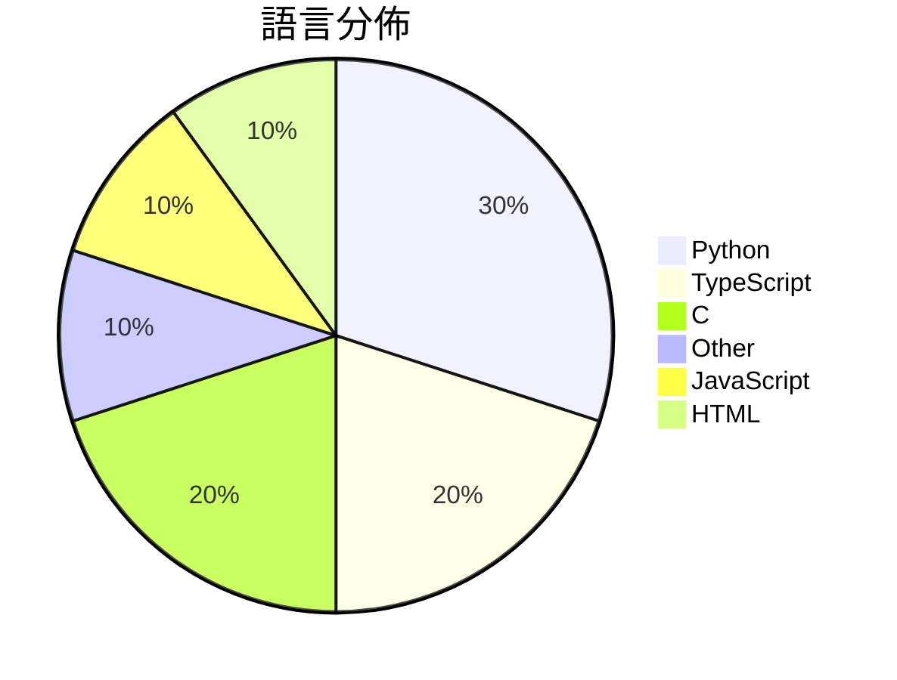

# GitHub Trending - 2026-08-12

> [!summary] 本日摘要
> 收錄 **10** 個新專案，合計 **13.2k** stars
> 語言分佈：Python (3) · TypeScript (2) · C (2) · Other (1) · JavaScript (1) · HTML (1)

> [!tip] 本週焦點
> **[[KKKKhazix--human-writing|KKKKhazix/human-writing]]** — 7 天內累積 2.4k stars（349 stars/天）
> 让 AI 写的中文读起来像一个具体的人在说话。通用创作与改稿 Skill，开箱即用。



---

## 收錄列表

| # | 專案 | 分類 | Stars | 速度 | 安裝 | 語言 | 用途 |
| :--: | --- | --- | ---: | ---: | --- | --- | --- |
| 1 | [[KKKKhazix--human-writing\|KKKKhazix/human-writing]] |  | 2.4k | 349/天 |  | Python | 让 AI 写的中文读起来像一个具体的人在说话。通用创作与改稿 Skill，开箱即 |
| 2 | [[Binaryify--open-kimi-ppt-skill\|Binaryify/open-kimi-ppt-skill]] |  | 1.6k | 267/天 |  | N/A | 非官方 Kimi Slides Skill：让 AI Agent 生成可编辑 P |
| 3 | [[ShawnPana--phone-harness\|ShawnPana/phone-harness]] |  | 1.5k | 381/天 |  | Python | let your agent control your phone |
| 4 | [[oil-oil--oil-motion\|oil-oil/oil-motion]] |  | 1.5k | 372/天 |  | Python | Create smooth, responsive interactive we |
| 5 | [[SMNETSTUDIO--WeChat-AI\|SMNETSTUDIO/WeChat-AI]] |  | 1.4k | 1.4k/天 |  | TypeScript |  |
| 6 | [[antirez--h3.c\|antirez/h3.c]] |  | 1.3k | 652/天 |  | C | MiniMax H3 inference engine for Mac comp |
| 7 | [[eternityspring--shuohao-skills\|eternityspring/shuohao-skills]] |  | 948 | 190/天 |  | JavaScript | AI 短剧制作的 skill 集合：拆角色、出设定图、排大纲 | Agent s |
| 8 | [[sohaibdevv--youtube-music\|sohaibdevv/youtube-music]] |  | 836 | 836/天 |  | TypeScript | A lightweight, ad‑free client for stream |
| 9 | [[MengTo--kage\|MengTo/kage]] |  | 822 | 274/天 |  | HTML | An interactive five-chapter night walk t |
| 10 | [[xoreaxeaxeax--asm-hall-of-shame\|xoreaxeaxeax/asm-hall-of-shame]] |  | 771 | 129/天 |  | C | Racing to the bottom of CPU performance |

---

## 重點摘要

### 1. [[KKKKhazix--human-writing|KKKKhazix/human-writing]]

**2.4k** stars · **349** stars/天 · Python

---

### 2. [[Binaryify--open-kimi-ppt-skill|Binaryify/open-kimi-ppt-skill]]

**1.6k** stars · **267** stars/天 · N/A

---

### 3. [[ShawnPana--phone-harness|ShawnPana/phone-harness]]

**1.5k** stars · **381** stars/天 · Python

---

### 4. [[oil-oil--oil-motion|oil-oil/oil-motion]]

**1.5k** stars · **372** stars/天 · Python

---

### 5. [[SMNETSTUDIO--WeChat-AI|SMNETSTUDIO/WeChat-AI]]

**1.4k** stars · **1.4k** stars/天 · TypeScript

---

### 6. [[antirez--h3.c|antirez/h3.c]]

**1.3k** stars · **652** stars/天 · C

---

### 7. [[eternityspring--shuohao-skills|eternityspring/shuohao-skills]]

**948** stars · **190** stars/天 · JavaScript

---

### 8. [[sohaibdevv--youtube-music|sohaibdevv/youtube-music]]

**836** stars · **836** stars/天 · TypeScript

---

### 9. [[MengTo--kage|MengTo/kage]]

**822** stars · **274** stars/天 · HTML

---

### 10. [[xoreaxeaxeax--asm-hall-of-shame|xoreaxeaxeax/asm-hall-of-shame]]

**771** stars · **129** stars/天 · C

---

## 今日到期複習

> [!tip] 根據間隔複習排程，今天該回顧的專案

```dataview
TABLE
  stars_per_day AS "Stars/天",
  category AS "分類",
  engagement AS "參與度"
FROM "Repos"
WHERE next_review AND date(next_review) <= date("2026-08-12") AND status != "archived"
SORT priority DESC
```

## 待處理

```dataviewjs
const pending = dv.pages('"Repos"').where(p => p.status === "to-review").length;
const unrated = dv.pages('"Repos"').where(p => p.status !== "archived" && p.status !== "to-review" && (p.my_rating || 0) === 0).length;
const noVerdict = dv.pages('"Repos"').where(p => p.status !== "archived" && (p.my_rating || 0) > 0 && (!p.verdict || p.verdict === "")).length;
const items = [];
if (pending > 0) items.push(`**${pending}** 個待分流`);
if (unrated > 0) items.push(`**${unrated}** 個已讀但未評分`);
if (noVerdict > 0) items.push(`**${noVerdict}** 個已評分但無結論`);
if (items.length > 0) dv.paragraph(items.join(" / "));
else dv.paragraph("所有專案都已處理完畢！");
```
