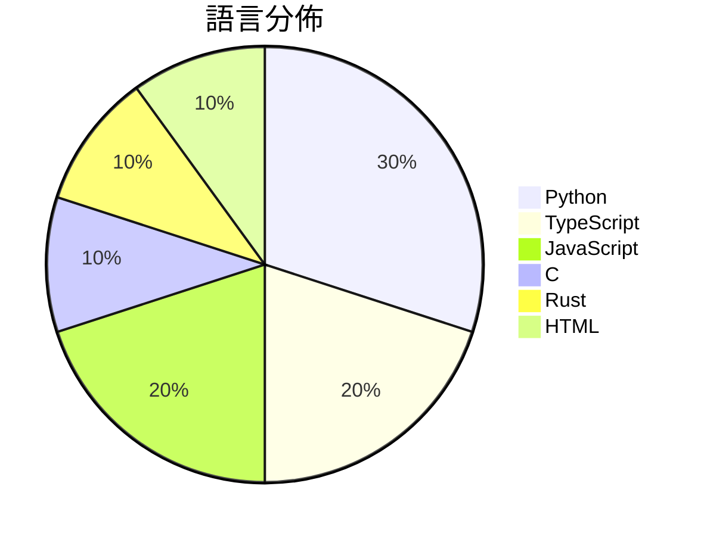

# GitHub Trending - 2026-08-13

> [!summary] 本日摘要
> 收錄 **10** 個新專案，合計 **14.3k** stars
> 語言分佈：Python (3) · TypeScript (2) · JavaScript (2) · C (1) · Rust (1) · HTML (1)

> [!tip] 本週焦點
> **[[guillaumemeyer--watermarks-remover|guillaumemeyer/watermarks-remover]]** — 1 天內累積 2.7k stars（2.7k stars/天）
> Strip multi-vendor AI provenance marks: Unicode text hygiene, statistical rewrite hooks, and C2PA/metadata from PNG/JPEG/SVG/PDF/DOCX/HTML/MD



---

## 收錄列表

| # | 專案 | 分類 | Stars | 速度 | 安裝 | 語言 | 用途 |
| :--: | --- | --- | ---: | ---: | --- | --- | --- |
| 1 | [[guillaumemeyer--watermarks-remover\|guillaumemeyer/watermarks-remover]] |  | 2.7k | 2.7k/天 |  | Python | Strip multi-vendor AI provenance marks:  |
| 2 | [[ShawnPana--phone-harness\|ShawnPana/phone-harness]] |  | 1.7k | 330/天 |  | Python | let your agent control your phone |
| 3 | [[oil-oil--oil-motion\|oil-oil/oil-motion]] |  | 1.6k | 326/天 |  | Python | Create smooth, responsive interactive we |
| 4 | [[antirez--h3.c\|antirez/h3.c]] |  | 1.6k | 540/天 |  | C | MiniMax H3 inference engine for Mac comp |
| 5 | [[SMNETSTUDIO--WeChat-AI\|SMNETSTUDIO/WeChat-AI]] |  | 1.6k | 786/天 |  | TypeScript |  |
| 6 | [[LaoFeng-mouse--flyingmouse-format\|LaoFeng-mouse/flyingmouse-format]] |  | 1.3k | 222/天 |  | JavaScript | 飞鼠格式 FlyingMouse Format - Windows 万能文件格式 |
| 7 | [[eternityspring--shuohao-skills\|eternityspring/shuohao-skills]] |  | 1.2k | 201/天 |  | JavaScript | AI 短剧制作的 skill 集合：拆角色、排大纲、出场景与道具设定、写剧本、切 |
| 8 | [[Flaminis--Dalaran\|Flaminis/Dalaran]] |  | 891 | 178/天 |  | Rust | Dalaran — Apache-2.0, robotics-first vis |
| 9 | [[MengTo--kage\|MengTo/kage]] |  | 861 | 215/天 |  | HTML | An interactive five-chapter night walk t |
| 10 | [[sohaibdevv--youtube-music\|sohaibdevv/youtube-music]] |  | 851 | 851/天 |  | TypeScript | A lightweight, ad‑free client for stream |

---

## 重點摘要

### 1. [[guillaumemeyer--watermarks-remover|guillaumemeyer/watermarks-remover]]

**2.7k** stars · **2.7k** stars/天 · Python

---

### 2. [[ShawnPana--phone-harness|ShawnPana/phone-harness]]

**1.7k** stars · **330** stars/天 · Python

---

### 3. [[oil-oil--oil-motion|oil-oil/oil-motion]]

**1.6k** stars · **326** stars/天 · Python

---

### 4. [[antirez--h3.c|antirez/h3.c]]

**1.6k** stars · **540** stars/天 · C

---

### 5. [[SMNETSTUDIO--WeChat-AI|SMNETSTUDIO/WeChat-AI]]

**1.6k** stars · **786** stars/天 · TypeScript

---

### 6. [[LaoFeng-mouse--flyingmouse-format|LaoFeng-mouse/flyingmouse-format]]

**1.3k** stars · **222** stars/天 · JavaScript

---

### 7. [[eternityspring--shuohao-skills|eternityspring/shuohao-skills]]

**1.2k** stars · **201** stars/天 · JavaScript

---

### 8. [[Flaminis--Dalaran|Flaminis/Dalaran]]

**891** stars · **178** stars/天 · Rust

---

### 9. [[MengTo--kage|MengTo/kage]]

**861** stars · **215** stars/天 · HTML

---

### 10. [[sohaibdevv--youtube-music|sohaibdevv/youtube-music]]

**851** stars · **851** stars/天 · TypeScript

---

## 今日到期複習

> [!tip] 根據間隔複習排程，今天該回顧的專案

```dataview
TABLE
  stars_per_day AS "Stars/天",
  category AS "分類",
  engagement AS "參與度"
FROM "Repos"
WHERE next_review AND date(next_review) <= date("2026-08-13") AND status != "archived"
SORT priority DESC
```

## 待處理

```dataviewjs
const pending = dv.pages('"Repos"').where(p => p.status === "to-review").length;
const unrated = dv.pages('"Repos"').where(p => p.status !== "archived" && p.status !== "to-review" && (p.my_rating || 0) === 0).length;
const noVerdict = dv.pages('"Repos"').where(p => p.status !== "archived" && (p.my_rating || 0) > 0 && (!p.verdict || p.verdict === "")).length;
const items = [];
if (pending > 0) items.push(`**${pending}** 個待分流`);
if (unrated > 0) items.push(`**${unrated}** 個已讀但未評分`);
if (noVerdict > 0) items.push(`**${noVerdict}** 個已評分但無結論`);
if (items.length > 0) dv.paragraph(items.join(" / "));
else dv.paragraph("所有專案都已處理完畢！");
```
