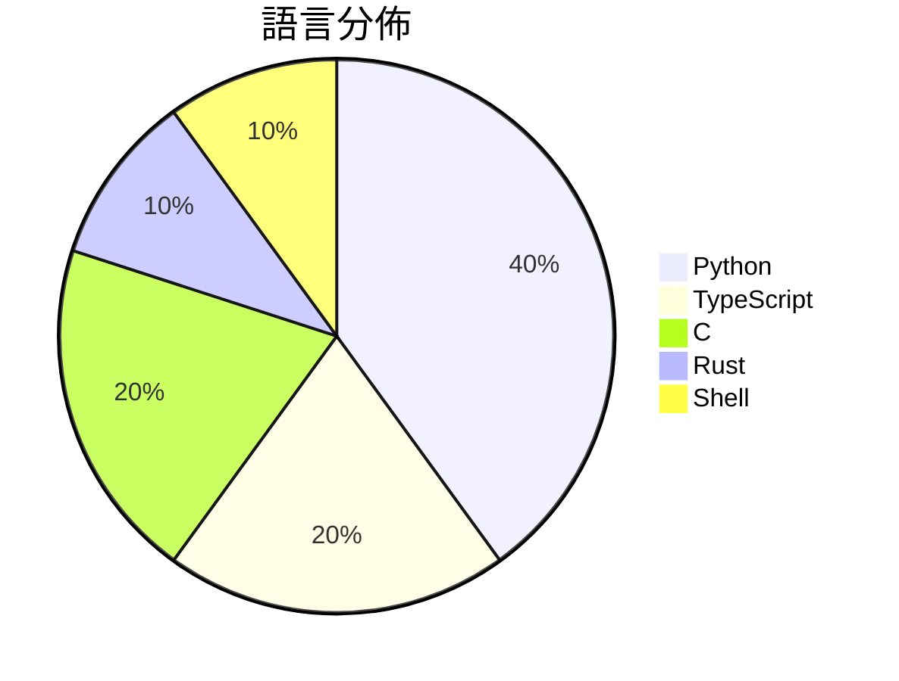

# GitHub Trending - 2026-08-14

> [!summary] 本日摘要
> 收錄 **10** 個新專案，合計 **80.1k** stars
> 語言分佈：Python (4) · TypeScript (2) · C (2) · Rust (1) · Shell (1)

> [!tip] 本週焦點
> **[[deepseek-ai--deepseek-harness|deepseek-ai/deepseek-harness]]** — 1 天內累積 63.7k stars（63.7k stars/天）
> DeepSeek Harness: Everything is a Plugin.



---

## 收錄列表

| # | 專案 | 分類 | Stars | 速度 | 安裝 | 語言 | 用途 |
| :--: | --- | --- | ---: | ---: | --- | --- | --- |
| 1 | [[deepseek-ai--deepseek-harness\|deepseek-ai/deepseek-harness]] |  | 63.7k | 63.7k/天 |  | TypeScript | DeepSeek Harness: Everything is a Plugin |
| 2 | [[guillaumemeyer--watermarks-remover\|guillaumemeyer/watermarks-remover]] |  | 5.6k | 2.8k/天 |  | Python | Strip multi-vendor AI provenance marks:  |
| 3 | [[antirez--h3.c\|antirez/h3.c]] |  | 1.8k | 449/天 |  | C | MiniMax H3 inference engine for Mac comp |
| 4 | [[ShawnPana--phone-harness\|ShawnPana/phone-harness]] |  | 1.7k | 287/天 |  | Python | let your agent control your phone |
| 5 | [[oil-oil--oil-motion\|oil-oil/oil-motion]] |  | 1.7k | 282/天 |  | Python | Create smooth, responsive interactive we |
| 6 | [[SMNETSTUDIO--WeChat-AI\|SMNETSTUDIO/WeChat-AI]] |  | 1.7k | 563/天 |  | TypeScript |  |
| 7 | [[xoreaxeaxeax--skitter-creek-bath-salts\|xoreaxeaxeax/skitter-creek-bath-salts]] |  | 1.1k | 1.1k/天 |  | C | Unlocking _everything_ on the CPU with D |
| 8 | [[Leutenegger--book-to-skill\|Leutenegger/book-to-skill]] |  | 1.0k | 1.0k/天 |  | Python | Turn any technical book PDF into a Claud |
| 9 | [[Flaminis--Dalaran\|Flaminis/Dalaran]] |  | 938 | 156/天 |  | Rust | Dalaran — Apache-2.0, robotics-first vis |
| 10 | [[gvzdv--claudish-to-english\|gvzdv/claudish-to-english]] |  | 936 | 312/天 |  | Shell |  |

---

## 重點摘要

### 1. [[deepseek-ai--deepseek-harness|deepseek-ai/deepseek-harness]]

**63.7k** stars · **63.7k** stars/天 · TypeScript

---

### 2. [[guillaumemeyer--watermarks-remover|guillaumemeyer/watermarks-remover]]

**5.6k** stars · **2.8k** stars/天 · Python

---

### 3. [[antirez--h3.c|antirez/h3.c]]

**1.8k** stars · **449** stars/天 · C

---

### 4. [[ShawnPana--phone-harness|ShawnPana/phone-harness]]

**1.7k** stars · **287** stars/天 · Python

---

### 5. [[oil-oil--oil-motion|oil-oil/oil-motion]]

**1.7k** stars · **282** stars/天 · Python

---

### 6. [[SMNETSTUDIO--WeChat-AI|SMNETSTUDIO/WeChat-AI]]

**1.7k** stars · **563** stars/天 · TypeScript

---

### 7. [[xoreaxeaxeax--skitter-creek-bath-salts|xoreaxeaxeax/skitter-creek-bath-salts]]

**1.1k** stars · **1.1k** stars/天 · C

---

### 8. [[Leutenegger--book-to-skill|Leutenegger/book-to-skill]]

**1.0k** stars · **1.0k** stars/天 · Python

---

### 9. [[Flaminis--Dalaran|Flaminis/Dalaran]]

**938** stars · **156** stars/天 · Rust

---

### 10. [[gvzdv--claudish-to-english|gvzdv/claudish-to-english]]

**936** stars · **312** stars/天 · Shell

---

## 今日到期複習

> [!tip] 根據間隔複習排程，今天該回顧的專案

```dataview
TABLE
  stars_per_day AS "Stars/天",
  category AS "分類",
  engagement AS "參與度"
FROM "Repos"
WHERE next_review AND date(next_review) <= date("2026-08-14") AND status != "archived"
SORT priority DESC
```

## 待處理

```dataviewjs
const pending = dv.pages('"Repos"').where(p => p.status === "to-review").length;
const unrated = dv.pages('"Repos"').where(p => p.status !== "archived" && p.status !== "to-review" && (p.my_rating || 0) === 0).length;
const noVerdict = dv.pages('"Repos"').where(p => p.status !== "archived" && (p.my_rating || 0) > 0 && (!p.verdict || p.verdict === "")).length;
const items = [];
if (pending > 0) items.push(`**${pending}** 個待分流`);
if (unrated > 0) items.push(`**${unrated}** 個已讀但未評分`);
if (noVerdict > 0) items.push(`**${noVerdict}** 個已評分但無結論`);
if (items.length > 0) dv.paragraph(items.join(" / "));
else dv.paragraph("所有專案都已處理完畢！");
```
