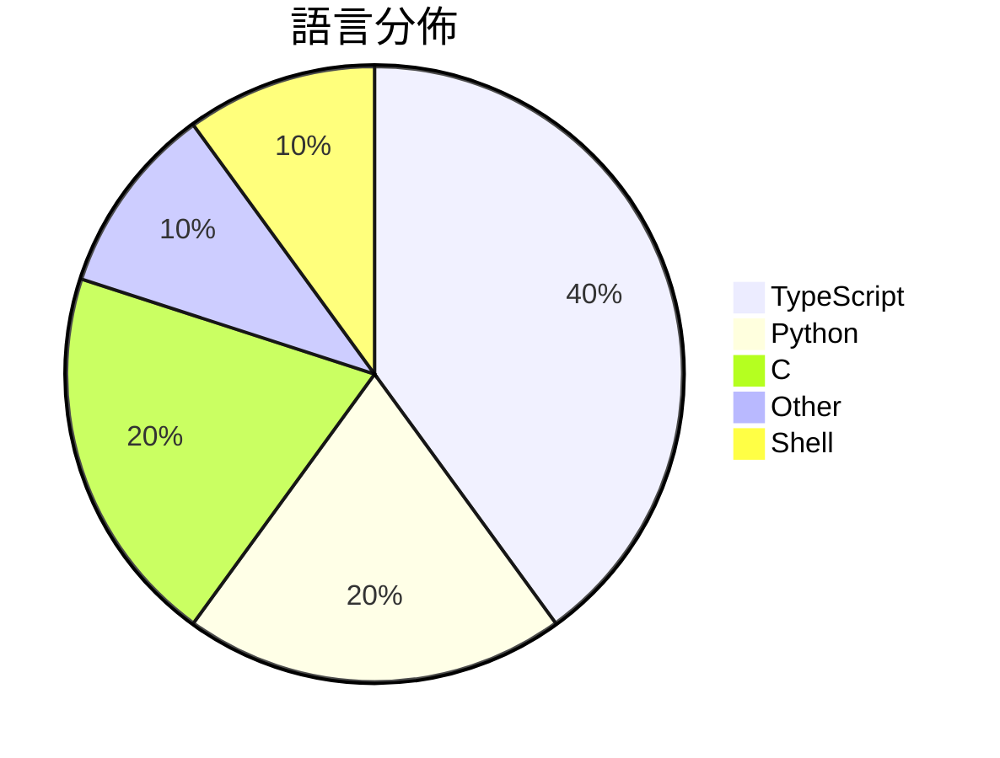

# GitHub Trending - 2026-08-15

> [!summary] 本日摘要
> 收錄 **10** 個新專案，合計 **118.4k** stars
> 語言分佈：TypeScript (4) · Python (2) · C (2) · Other (1) · Shell (1)

> [!tip] 本週焦點
> **[[deepseek-ai--deepseek-harness|deepseek-ai/deepseek-harness]]** — 1 天內累積 97.2k stars（97.2k stars/天）
> DeepSeek Harness: Everything is a Plugin.



---

## 收錄列表

| # | 專案 | 分類 | Stars | 速度 | 安裝 | 語言 | 用途 |
| :--: | --- | --- | ---: | ---: | --- | --- | --- |
| 1 | [[deepseek-ai--deepseek-harness\|deepseek-ai/deepseek-harness]] |  | 97.2k | 97.2k/天 |  | TypeScript | DeepSeek Harness: Everything is a Plugin |
| 2 | [[guillaumemeyer--watermarks-remover\|guillaumemeyer/watermarks-remover]] |  | 8.3k | 2.8k/天 |  | Python | Strip multi-vendor AI provenance marks:  |
| 3 | [[anywhere-labs--deepseek-harness-desktop\|anywhere-labs/deepseek-harness-desktop]] |  | 2.1k | 2.1k/天 |  | TypeScript | 为 DeepSeek Harness (DSH) 生态打造的现代化桌面端体验 |
| 4 | [[zhu1090093659--dsh-web-ui\|zhu1090093659/dsh-web-ui]] |  | 2.0k | 993/天 |  | TypeScript | Plugin and skin collection for DeepSeek  |
| 5 | [[antirez--h3.c\|antirez/h3.c]] |  | 1.9k | 371/天 |  | C | MiniMax H3 inference engine for Mac comp |
| 6 | [[SMNETSTUDIO--WeChat-AI\|SMNETSTUDIO/WeChat-AI]] |  | 1.7k | 428/天 |  | TypeScript |  |
| 7 | [[xoreaxeaxeax--skitter-creek-bath-salts\|xoreaxeaxeax/skitter-creek-bath-salts]] |  | 1.6k | 1.6k/天 |  | C | Unlocking _everything_ on the CPU with D |
| 8 | [[cordiverse--paper\|cordiverse/paper]] |  | 1.3k | 1.3k/天 |  | N/A | A Programming Paradigm for Spatiotempora |
| 9 | [[awesome-dsh-plugin--awesome-dsh-plugin\|awesome-dsh-plugin/awesome-dsh-plugin]] |  | 1.2k | 1.2k/天 |  | Python | A curated list of plugins for DeepSeek H |
| 10 | [[gvzdv--claudish-to-english\|gvzdv/claudish-to-english]] |  | 1.1k | 277/天 |  | Shell |  |

---

## 重點摘要

### 1. [[deepseek-ai--deepseek-harness|deepseek-ai/deepseek-harness]]

**97.2k** stars · **97.2k** stars/天 · TypeScript

---

### 2. [[guillaumemeyer--watermarks-remover|guillaumemeyer/watermarks-remover]]

**8.3k** stars · **2.8k** stars/天 · Python

---

### 3. [[anywhere-labs--deepseek-harness-desktop|anywhere-labs/deepseek-harness-desktop]]

**2.1k** stars · **2.1k** stars/天 · TypeScript

---

### 4. [[zhu1090093659--dsh-web-ui|zhu1090093659/dsh-web-ui]]

**2.0k** stars · **993** stars/天 · TypeScript

---

### 5. [[antirez--h3.c|antirez/h3.c]]

**1.9k** stars · **371** stars/天 · C

---

### 6. [[SMNETSTUDIO--WeChat-AI|SMNETSTUDIO/WeChat-AI]]

**1.7k** stars · **428** stars/天 · TypeScript

---

### 7. [[xoreaxeaxeax--skitter-creek-bath-salts|xoreaxeaxeax/skitter-creek-bath-salts]]

**1.6k** stars · **1.6k** stars/天 · C

---

### 8. [[cordiverse--paper|cordiverse/paper]]

**1.3k** stars · **1.3k** stars/天 · N/A

---

### 9. [[awesome-dsh-plugin--awesome-dsh-plugin|awesome-dsh-plugin/awesome-dsh-plugin]]

**1.2k** stars · **1.2k** stars/天 · Python

---

### 10. [[gvzdv--claudish-to-english|gvzdv/claudish-to-english]]

**1.1k** stars · **277** stars/天 · Shell

---

## 今日到期複習

> [!tip] 根據間隔複習排程，今天該回顧的專案

```dataview
TABLE
  stars_per_day AS "Stars/天",
  category AS "分類",
  engagement AS "參與度"
FROM "Repos"
WHERE next_review AND date(next_review) <= date("2026-08-15") AND status != "archived"
SORT priority DESC
```

## 待處理

```dataviewjs
const pending = dv.pages('"Repos"').where(p => p.status === "to-review").length;
const unrated = dv.pages('"Repos"').where(p => p.status !== "archived" && p.status !== "to-review" && (p.my_rating || 0) === 0).length;
const noVerdict = dv.pages('"Repos"').where(p => p.status !== "archived" && (p.my_rating || 0) > 0 && (!p.verdict || p.verdict === "")).length;
const items = [];
if (pending > 0) items.push(`**${pending}** 個待分流`);
if (unrated > 0) items.push(`**${unrated}** 個已讀但未評分`);
if (noVerdict > 0) items.push(`**${noVerdict}** 個已評分但無結論`);
if (items.length > 0) dv.paragraph(items.join(" / "));
else dv.paragraph("所有專案都已處理完畢！");
```
