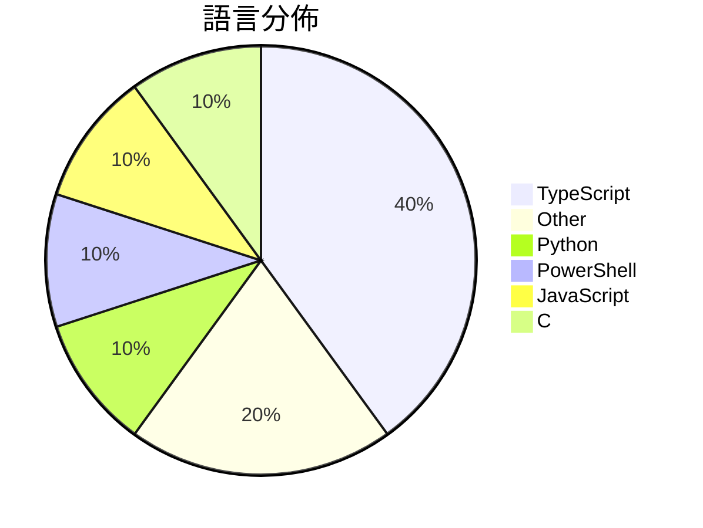

# GitHub Trending - 2026-08-20

> [!summary] 本日摘要
> 收錄 **10** 個新專案，合計 **214.6k** stars
> 語言分佈：TypeScript (4) · Other (2) · Python (1) · PowerShell (1) · JavaScript (1) · C (1)

> [!tip] 本週焦點
> **[[deepseek-ai--deepseek-harness|deepseek-ai/deepseek-harness]]** — 6 天內累積 168.0k stars（28.0k stars/天）
> DeepSeek Harness: Everything is a Plugin.



---

## 收錄列表

| # | 專案 | 分類 | Stars | 速度 | 安裝 | 語言 | 用途 |
| :--: | --- | --- | ---: | ---: | --- | --- | --- |
| 1 | [[deepseek-ai--deepseek-harness\|deepseek-ai/deepseek-harness]] |  | 168.0k | 28.0k/天 |  | TypeScript | DeepSeek Harness: Everything is a Plugin |
| 2 | [[anywhere-labs--deepseek-harness-desktop\|anywhere-labs/deepseek-harness-desktop]] |  | 15.3k | 2.6k/天 |  | TypeScript | 为 DeepSeek Harness (DSH) 插件生态打造的现代化桌面端解决 |
| 3 | [[awesome-dsh-plugin--awesome-dsh-plugin\|awesome-dsh-plugin/awesome-dsh-plugin]] |  | 10.1k | 1.7k/天 |  | Python | A curated list of plugins for DeepSeek H |
| 4 | [[yjh051108--dsh-routing-suite\|yjh051108/dsh-routing-suite]] |  | 6.3k | 1.3k/天 |  | PowerShell | dsh-routing-suite — injector + router-st |
| 5 | [[xiaobright--dsh-anchored-standard\|xiaobright/dsh-anchored-standard]] |  | 3.6k | 728/天 |  | JavaScript | Two-phase DeepSeek Harness preset: Minim |
| 6 | [[yetone--cumora\|yetone/cumora]] |  | 2.7k | 1.4k/天 |  | TypeScript | Where agent teams gather. Cross-platform |
| 7 | [[cordiverse--paper\|cordiverse/paper]] |  | 2.4k | 401/天 |  | N/A | A Programming Paradigm for Spatiotempora |
| 8 | [[s1dashu--ip-as-logo-skill\|s1dashu/ip-as-logo-skill]] |  | 2.1k | 2.1k/天 |  | N/A | A compact Agent Skill for highly simplif |
| 9 | [[ccch1mneyyy--dsh-TUI\|ccch1mneyyy/dsh-TUI]] |  | 2.1k | 348/天 |  | TypeScript | DSH 官方公众号收录的 TUI 补位插件：Claude Code 风，鲸鱼顶栏 |
| 10 | [[xoreaxeaxeax--skitter-creek-bath-salts\|xoreaxeaxeax/skitter-creek-bath-salts]] |  | 1.9k | 309/天 |  | C | Unlocking _everything_ on the CPU with D |

---

## 重點摘要

### 1. [[deepseek-ai--deepseek-harness|deepseek-ai/deepseek-harness]]

**168.0k** stars · **28.0k** stars/天 · TypeScript

---

### 2. [[anywhere-labs--deepseek-harness-desktop|anywhere-labs/deepseek-harness-desktop]]

**15.3k** stars · **2.6k** stars/天 · TypeScript

---

### 3. [[awesome-dsh-plugin--awesome-dsh-plugin|awesome-dsh-plugin/awesome-dsh-plugin]]

**10.1k** stars · **1.7k** stars/天 · Python

---

### 4. [[yjh051108--dsh-routing-suite|yjh051108/dsh-routing-suite]]

**6.3k** stars · **1.3k** stars/天 · PowerShell

---

### 5. [[xiaobright--dsh-anchored-standard|xiaobright/dsh-anchored-standard]]

**3.6k** stars · **728** stars/天 · JavaScript

---

### 6. [[yetone--cumora|yetone/cumora]]

**2.7k** stars · **1.4k** stars/天 · TypeScript

---

### 7. [[cordiverse--paper|cordiverse/paper]]

**2.4k** stars · **401** stars/天 · N/A

---

### 8. [[s1dashu--ip-as-logo-skill|s1dashu/ip-as-logo-skill]]

**2.1k** stars · **2.1k** stars/天 · N/A

---

### 9. [[ccch1mneyyy--dsh-TUI|ccch1mneyyy/dsh-TUI]]

**2.1k** stars · **348** stars/天 · TypeScript

---

### 10. [[xoreaxeaxeax--skitter-creek-bath-salts|xoreaxeaxeax/skitter-creek-bath-salts]]

**1.9k** stars · **309** stars/天 · C

---

## 今日到期複習

> [!tip] 根據間隔複習排程，今天該回顧的專案

```dataview
TABLE
  stars_per_day AS "Stars/天",
  category AS "分類",
  engagement AS "參與度"
FROM "Repos"
WHERE next_review AND date(next_review) <= date("2026-08-20") AND status != "archived"
SORT priority DESC
```

## 待處理

```dataviewjs
const pending = dv.pages('"Repos"').where(p => p.status === "to-review").length;
const unrated = dv.pages('"Repos"').where(p => p.status !== "archived" && p.status !== "to-review" && (p.my_rating || 0) === 0).length;
const noVerdict = dv.pages('"Repos"').where(p => p.status !== "archived" && (p.my_rating || 0) > 0 && (!p.verdict || p.verdict === "")).length;
const items = [];
if (pending > 0) items.push(`**${pending}** 個待分流`);
if (unrated > 0) items.push(`**${unrated}** 個已讀但未評分`);
if (noVerdict > 0) items.push(`**${noVerdict}** 個已評分但無結論`);
if (items.length > 0) dv.paragraph(items.join(" / "));
else dv.paragraph("所有專案都已處理完畢！");
```
