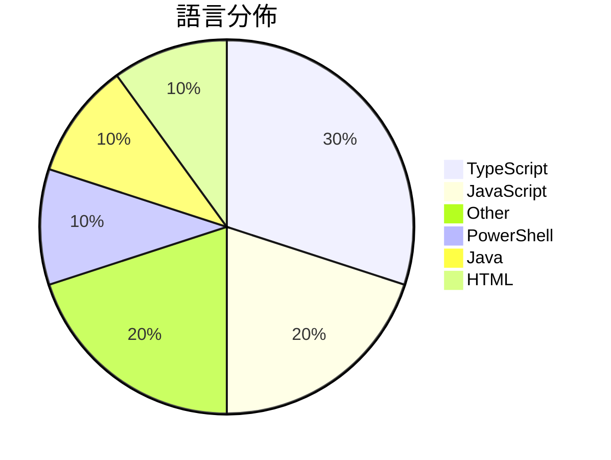

# GitHub Trending - 2026-08-21

> [!summary] 本日摘要
> 收錄 **10** 個新專案，合計 **23.7k** stars
> 語言分佈：TypeScript (3) · JavaScript (2) · Other (2) · PowerShell (1) · Java (1) · HTML (1)

> [!tip] 本週焦點
> **[[yjh051108--dsh-routing-suite|yjh051108/dsh-routing-suite]]** — 6 天內累積 6.5k stars（1.1k stars/天）
> dsh-routing-suite — injector + router-standard kit: install the runtime injector first, then the task-aware reasoning-mode router preset (measured P1-P23).



---

## 收錄列表

| # | 專案 | 分類 | Stars | 速度 | 安裝 | 語言 | 用途 |
| :--: | --- | --- | ---: | ---: | --- | --- | --- |
| 1 | [[yjh051108--dsh-routing-suite\|yjh051108/dsh-routing-suite]] |  | 6.5k | 1.1k/天 |  | PowerShell | dsh-routing-suite — injector + router-st |
| 2 | [[xiaobright--dsh-anchored-standard\|xiaobright/dsh-anchored-standard]] |  | 3.7k | 614/天 |  | JavaScript | Two-phase DeepSeek Harness preset: Minim |
| 3 | [[s1dashu--ip-as-logo-skill\|s1dashu/ip-as-logo-skill]] |  | 3.2k | 1.6k/天 |  | N/A | A compact Agent Skill for highly simplif |
| 4 | [[yetone--cumora\|yetone/cumora]] |  | 2.8k | 927/天 |  | TypeScript | Where agent teams gather. Cross-platform |
| 5 | [[CopilotKit--OpenBot\|CopilotKit/OpenBot]] |  | 1.7k | 420/天 |  | TypeScript | Open-source AI coworkers that each get a |
| 6 | [[dsh-market--dsh-market\|dsh-market/dsh-market]] |  | 1.5k | 244/天 |  | TypeScript | The plugin market inside DeepSeek Harnes |
| 7 | [[cinderline--northcinder\|cinderline/northcinder]] |  | 1.2k | 400/天 |  | JavaScript | Buyer-run, ad-neutral shopping-agent MCP |
| 8 | [[ZSvirt--zsvirt\|ZSvirt/zsvirt]] |  | 1.1k | 190/天 |  | Java | Core IaaS engine and cloud infrastructur |
| 9 | [[alchaincyf--deepseek-harness-orange-book\|alchaincyf/deepseek-harness-orange-book]] |  | 1.1k | 184/天 |  | HTML | DeepSeek Harness橙皮书《从开机到拆开》：完整系统提示词、129行 |
| 10 | [[Tiger3807861189--DeepSeek-V4-J-Space-Capability-Realization-Report\|Tiger3807861189/DeepSeek-V4-J-Space-Capability-Realization-Report]] |  | 1.0k | 259/天 |  | N/A | DeepSeek V4 × J-Space capability realiza |

---

## 重點摘要

### 1. [[yjh051108--dsh-routing-suite|yjh051108/dsh-routing-suite]]

**6.5k** stars · **1.1k** stars/天 · PowerShell

---

### 2. [[xiaobright--dsh-anchored-standard|xiaobright/dsh-anchored-standard]]

**3.7k** stars · **614** stars/天 · JavaScript

---

### 3. [[s1dashu--ip-as-logo-skill|s1dashu/ip-as-logo-skill]]

**3.2k** stars · **1.6k** stars/天 · N/A

---

### 4. [[yetone--cumora|yetone/cumora]]

**2.8k** stars · **927** stars/天 · TypeScript

---

### 5. [[CopilotKit--OpenBot|CopilotKit/OpenBot]]

**1.7k** stars · **420** stars/天 · TypeScript

---

### 6. [[dsh-market--dsh-market|dsh-market/dsh-market]]

**1.5k** stars · **244** stars/天 · TypeScript

---

### 7. [[cinderline--northcinder|cinderline/northcinder]]

**1.2k** stars · **400** stars/天 · JavaScript

---

### 8. [[ZSvirt--zsvirt|ZSvirt/zsvirt]]

**1.1k** stars · **190** stars/天 · Java

---

### 9. [[alchaincyf--deepseek-harness-orange-book|alchaincyf/deepseek-harness-orange-book]]

**1.1k** stars · **184** stars/天 · HTML

---

### 10. [[Tiger3807861189--DeepSeek-V4-J-Space-Capability-Realization-Report|Tiger3807861189/DeepSeek-V4-J-Space-Capability-Realization-Report]]

**1.0k** stars · **259** stars/天 · N/A

---

## 今日到期複習

> [!tip] 根據間隔複習排程，今天該回顧的專案

```dataview
TABLE
  stars_per_day AS "Stars/天",
  category AS "分類",
  engagement AS "參與度"
FROM "Repos"
WHERE next_review AND date(next_review) <= date("2026-08-21") AND status != "archived"
SORT priority DESC
```

## 待處理

```dataviewjs
const pending = dv.pages('"Repos"').where(p => p.status === "to-review").length;
const unrated = dv.pages('"Repos"').where(p => p.status !== "archived" && p.status !== "to-review" && (p.my_rating || 0) === 0).length;
const noVerdict = dv.pages('"Repos"').where(p => p.status !== "archived" && (p.my_rating || 0) > 0 && (!p.verdict || p.verdict === "")).length;
const items = [];
if (pending > 0) items.push(`**${pending}** 個待分流`);
if (unrated > 0) items.push(`**${unrated}** 個已讀但未評分`);
if (noVerdict > 0) items.push(`**${noVerdict}** 個已評分但無結論`);
if (items.length > 0) dv.paragraph(items.join(" / "));
else dv.paragraph("所有專案都已處理完畢！");
```
