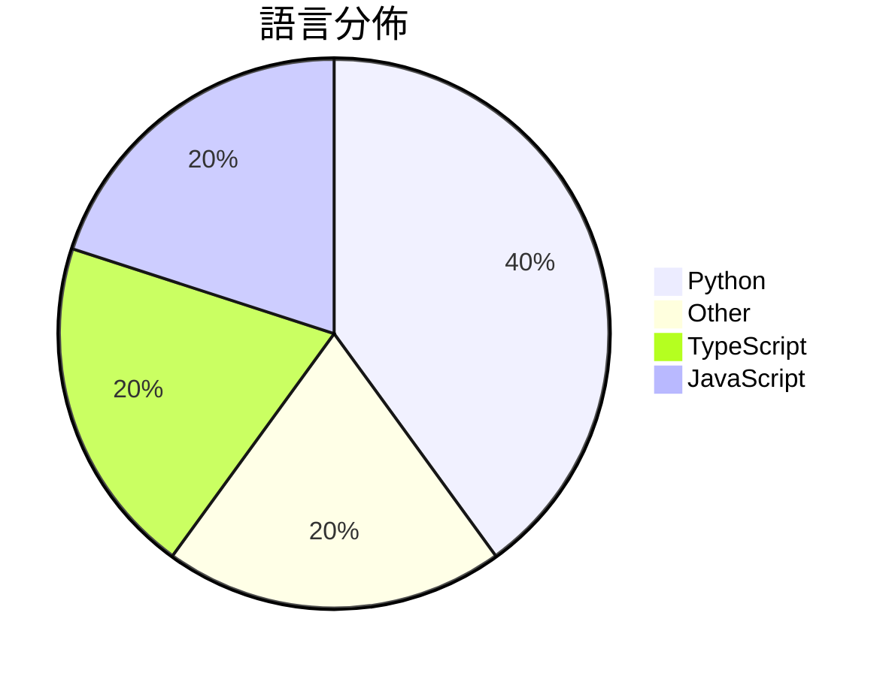

# GitHub Trending - 2026-08-22

> [!summary] 本日摘要
> 收錄 **10** 個新專案，合計 **15.2k** stars
> 語言分佈：Python (4) · Other (2) · TypeScript (2) · JavaScript (2)

> [!tip] 本週焦點
> **[[s1dashu--ip-as-logo-skill|s1dashu/ip-as-logo-skill]]** — 3 天內累積 3.5k stars（1.2k stars/天）
> A compact Agent Skill for highly simplified, rounded, subtly neo-skeuomorphic IP mascot logos.



---

## 收錄列表

| # | 專案 | 分類 | Stars | 速度 | 安裝 | 語言 | 用途 |
| :--: | --- | --- | ---: | ---: | --- | --- | --- |
| 1 | [[s1dashu--ip-as-logo-skill\|s1dashu/ip-as-logo-skill]] |  | 3.5k | 1.2k/天 |  | N/A | A compact Agent Skill for highly simplif |
| 2 | [[yetone--cumora\|yetone/cumora]] |  | 2.9k | 715/天 |  | TypeScript | Where agent teams gather. Cross-platform |
| 3 | [[CopilotKit--OpenBot\|CopilotKit/OpenBot]] |  | 2.1k | 427/天 |  | TypeScript | Open-source AI coworkers that each get a |
| 4 | [[cinderline--northcinder\|cinderline/northcinder]] |  | 1.2k | 301/天 |  | JavaScript | Buyer-run, ad-neutral shopping-agent MCP |
| 5 | [[Tiger3807861189--DeepSeek-V4-J-Space-Capability-Realization-Report\|Tiger3807861189/DeepSeek-V4-J-Space-Capability-Realization-Report]] |  | 1.0k | 207/天 |  | N/A | DeepSeek V4 × J-Space capability realiza |
| 6 | [[wang2122--sprix-sage-router\|wang2122/sprix-sage-router]] |  | 1.0k | 336/天 |  | Python | Sprix AI at 屿智同行 — state-aware SELF/COLL |
| 7 | [[vvxw--deploy-vercel\|vvxw/deploy-vercel]] |  | 993 | 331/天 |  | JavaScript | Install Command：npm install |
| 8 | [[Leutenegger--watermarks-remover\|Leutenegger/watermarks-remover]] |  | 929 | 465/天 |  | Python | Remove multi-vendor AI provenance traces |
| 9 | [[Leutenegger--vanity-eth\|Leutenegger/vanity-eth]] |  | 803 | 803/天 |  | Python | Offline vanity address generator for Bit |
| 10 | [[browser-use--macos-harness\|browser-use/macos-harness]] |  | 688 | 138/天 |  | Python | The simplest, thinnest harness that give |

---

## 重點摘要

### 1. [[s1dashu--ip-as-logo-skill|s1dashu/ip-as-logo-skill]]

**3.5k** stars · **1.2k** stars/天 · N/A

---

### 2. [[yetone--cumora|yetone/cumora]]

**2.9k** stars · **715** stars/天 · TypeScript

---

### 3. [[CopilotKit--OpenBot|CopilotKit/OpenBot]]

**2.1k** stars · **427** stars/天 · TypeScript

---

### 4. [[cinderline--northcinder|cinderline/northcinder]]

**1.2k** stars · **301** stars/天 · JavaScript

---

### 5. [[Tiger3807861189--DeepSeek-V4-J-Space-Capability-Realization-Report|Tiger3807861189/DeepSeek-V4-J-Space-Capability-Realization-Report]]

**1.0k** stars · **207** stars/天 · N/A

---

### 6. [[wang2122--sprix-sage-router|wang2122/sprix-sage-router]]

**1.0k** stars · **336** stars/天 · Python

---

### 7. [[vvxw--deploy-vercel|vvxw/deploy-vercel]]

**993** stars · **331** stars/天 · JavaScript

---

### 8. [[Leutenegger--watermarks-remover|Leutenegger/watermarks-remover]]

**929** stars · **465** stars/天 · Python

---

### 9. [[Leutenegger--vanity-eth|Leutenegger/vanity-eth]]

**803** stars · **803** stars/天 · Python

---

### 10. [[browser-use--macos-harness|browser-use/macos-harness]]

**688** stars · **138** stars/天 · Python

---

## 今日到期複習

> [!tip] 根據間隔複習排程，今天該回顧的專案

```dataview
TABLE
  stars_per_day AS "Stars/天",
  category AS "分類",
  engagement AS "參與度"
FROM "Repos"
WHERE next_review AND date(next_review) <= date("2026-08-22") AND status != "archived"
SORT priority DESC
```

## 待處理

```dataviewjs
const pending = dv.pages('"Repos"').where(p => p.status === "to-review").length;
const unrated = dv.pages('"Repos"').where(p => p.status !== "archived" && p.status !== "to-review" && (p.my_rating || 0) === 0).length;
const noVerdict = dv.pages('"Repos"').where(p => p.status !== "archived" && (p.my_rating || 0) > 0 && (!p.verdict || p.verdict === "")).length;
const items = [];
if (pending > 0) items.push(`**${pending}** 個待分流`);
if (unrated > 0) items.push(`**${unrated}** 個已讀但未評分`);
if (noVerdict > 0) items.push(`**${noVerdict}** 個已評分但無結論`);
if (items.length > 0) dv.paragraph(items.join(" / "));
else dv.paragraph("所有專案都已處理完畢！");
```
