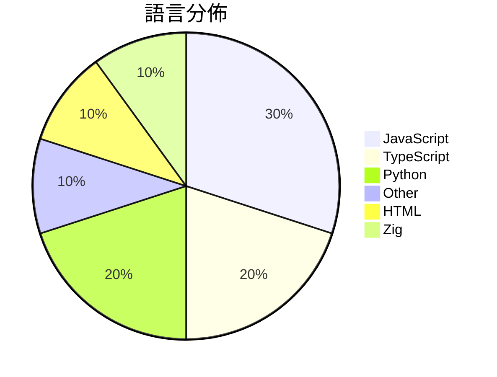

# GitHub Trending - 2026-08-24

> [!summary] 本日摘要
> 收錄 **10** 個新專案，合計 **18.7k** stars
> 語言分佈：JavaScript (3) · TypeScript (2) · Python (2) · Other (1) · HTML (1) · Zig (1)

> [!tip] 本週焦點
> **[[s1dashu--ip-as-logo-skill|s1dashu/ip-as-logo-skill]]** — 5 天內累積 3.9k stars（785 stars/天）
> A compact Agent Skill for highly simplified, rounded, subtly neo-skeuomorphic IP mascot logos.



---

## 收錄列表

| # | 專案 | 分類 | Stars | 速度 | 安裝 | 語言 | 用途 |
| :--: | --- | --- | ---: | ---: | --- | --- | --- |
| 1 | [[s1dashu--ip-as-logo-skill\|s1dashu/ip-as-logo-skill]] |  | 3.9k | 785/天 |  | N/A | A compact Agent Skill for highly simplif |
| 2 | [[MengTo--threeui\|MengTo/threeui]] |  | 3.0k | 1.5k/天 |  | HTML | Open-source ThreeUI Community catalog wi |
| 3 | [[yetone--cumora\|yetone/cumora]] |  | 3.0k | 494/天 |  | TypeScript | Where agent teams gather. Cross-platform |
| 4 | [[CopilotKit--OpenBot\|CopilotKit/OpenBot]] |  | 2.5k | 359/天 |  | TypeScript | Open-source AI coworkers that each get a |
| 5 | [[wang2122--sprix-sage-router\|wang2122/sprix-sage-router]] |  | 1.4k | 285/天 |  | Python | Sprix AI at 屿智同行 — state-aware SELF/COLL |
| 6 | [[vvxw--deploy-vercel\|vvxw/deploy-vercel]] |  | 1.2k | 244/天 |  | JavaScript | Install Command：npm install |
| 7 | [[cinderline--northcinder\|cinderline/northcinder]] |  | 1.2k | 201/天 |  | JavaScript | Open-source MCP server for comparing pro |
| 8 | [[duty1g--x64dbg-mcp-server\|duty1g/x64dbg-mcp-server]] |  | 921 | 921/天 |  | Zig | x64dbg-MCP Server is a native MCP (Model |
| 9 | [[Spielewoy--autoprompt-skill\|Spielewoy/autoprompt-skill]] |  | 770 | 128/天 |  | JavaScript | Autoprompt is a coding-agent skill that  |
| 10 | [[ShadowAqueduct--watermark-remover\|ShadowAqueduct/watermark-remover]] |  | 760 | 760/天 |  | Python | Purge multi-vendor AI watermarks: clean  |

---

## 重點摘要

### 1. [[s1dashu--ip-as-logo-skill|s1dashu/ip-as-logo-skill]]

**3.9k** stars · **785** stars/天 · N/A

---

### 2. [[MengTo--threeui|MengTo/threeui]]

**3.0k** stars · **1.5k** stars/天 · HTML

---

### 3. [[yetone--cumora|yetone/cumora]]

**3.0k** stars · **494** stars/天 · TypeScript

---

### 4. [[CopilotKit--OpenBot|CopilotKit/OpenBot]]

**2.5k** stars · **359** stars/天 · TypeScript

---

### 5. [[wang2122--sprix-sage-router|wang2122/sprix-sage-router]]

**1.4k** stars · **285** stars/天 · Python

---

### 6. [[vvxw--deploy-vercel|vvxw/deploy-vercel]]

**1.2k** stars · **244** stars/天 · JavaScript

---

### 7. [[cinderline--northcinder|cinderline/northcinder]]

**1.2k** stars · **201** stars/天 · JavaScript

---

### 8. [[duty1g--x64dbg-mcp-server|duty1g/x64dbg-mcp-server]]

**921** stars · **921** stars/天 · Zig

---

### 9. [[Spielewoy--autoprompt-skill|Spielewoy/autoprompt-skill]]

**770** stars · **128** stars/天 · JavaScript

---

### 10. [[ShadowAqueduct--watermark-remover|ShadowAqueduct/watermark-remover]]

**760** stars · **760** stars/天 · Python

---

## 今日到期複習

> [!tip] 根據間隔複習排程，今天該回顧的專案

```dataview
TABLE
  stars_per_day AS "Stars/天",
  category AS "分類",
  engagement AS "參與度"
FROM "Repos"
WHERE next_review AND date(next_review) <= date("2026-08-24") AND status != "archived"
SORT priority DESC
```

## 待處理

```dataviewjs
const pending = dv.pages('"Repos"').where(p => p.status === "to-review").length;
const unrated = dv.pages('"Repos"').where(p => p.status !== "archived" && p.status !== "to-review" && (p.my_rating || 0) === 0).length;
const noVerdict = dv.pages('"Repos"').where(p => p.status !== "archived" && (p.my_rating || 0) > 0 && (!p.verdict || p.verdict === "")).length;
const items = [];
if (pending > 0) items.push(`**${pending}** 個待分流`);
if (unrated > 0) items.push(`**${unrated}** 個已讀但未評分`);
if (noVerdict > 0) items.push(`**${noVerdict}** 個已評分但無結論`);
if (items.length > 0) dv.paragraph(items.join(" / "));
else dv.paragraph("所有專案都已處理完畢！");
```
