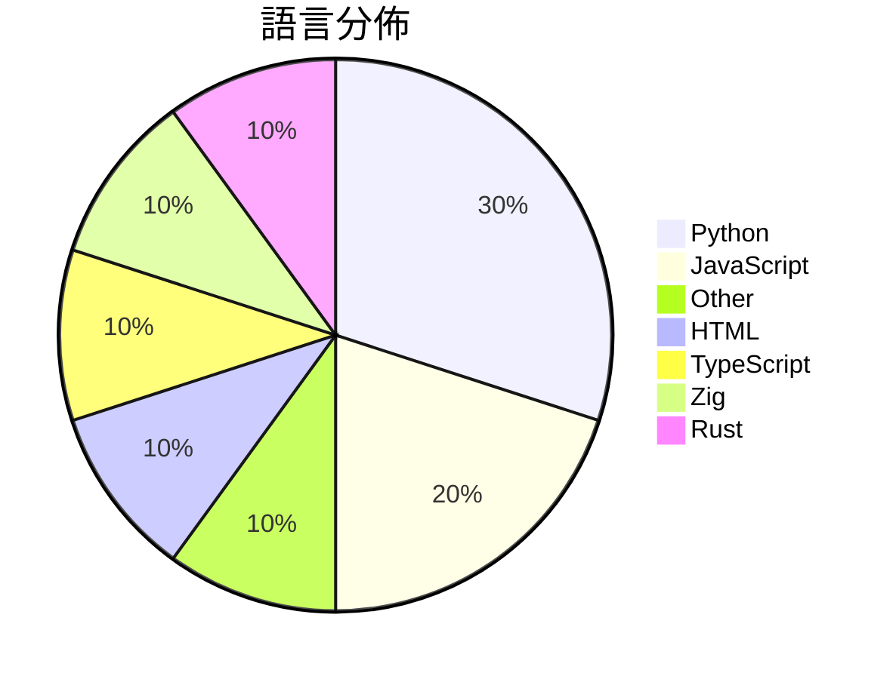

# GitHub Trending - 2026-08-25

> [!summary] 本日摘要
> 收錄 **10** 個新專案，合計 **17.4k** stars
> 語言分佈：Python (3) · JavaScript (2) · Other (1) · HTML (1) · TypeScript (1) · Zig (1) · Rust (1)

> [!tip] 本週焦點
> **[[s1dashu--ip-as-logo-skill|s1dashu/ip-as-logo-skill]]** — 6 天內累積 4.1k stars（691 stars/天）
> A compact Agent Skill for highly simplified, rounded, subtly neo-skeuomorphic IP mascot logos.



---

## 收錄列表

| # | 專案 | 分類 | Stars | 速度 | 安裝 | 語言 | 用途 |
| :--: | --- | --- | ---: | ---: | --- | --- | --- |
| 1 | [[s1dashu--ip-as-logo-skill\|s1dashu/ip-as-logo-skill]] |  | 4.1k | 691/天 |  | N/A | A compact Agent Skill for highly simplif |
| 2 | [[MengTo--threeui\|MengTo/threeui]] |  | 3.5k | 1.2k/天 |  | HTML | Open-source ThreeUI Community catalog wi |
| 3 | [[b-nnett--grok-bot-0.18-reconstructed\|b-nnett/grok-bot-0.18-reconstructed]] |  | 1.8k | 1.8k/天 |  | TypeScript | Unofficial source-oriented reconstructio |
| 4 | [[wang2122--sprix-sage-router\|wang2122/sprix-sage-router]] |  | 1.8k | 293/天 |  | Python | Sprix AI at 屿智同行 — state-aware SELF/COLL |
| 5 | [[vvxw--deploy-vercel\|vvxw/deploy-vercel]] |  | 1.3k | 218/天 |  | JavaScript | Install Command：npm install |
| 6 | [[duty1g--x64dbg-mcp-server\|duty1g/x64dbg-mcp-server]] |  | 1.2k | 621/天 |  | Zig | x64dbg-MCP Server is a native MCP (Model |
| 7 | [[tobi--walgit\|tobi/walgit]] |  | 1.1k | 1.1k/天 |  | Rust |  |
| 8 | [[MeteorNOX--DeepSeek-Balance-Whale-Widget\|MeteorNOX/DeepSeek-Balance-Whale-Widget]] |  | 876 | 146/天 |  | JavaScript | DeepSeek Harness（DSH）一只住在 DSH 界面右下角的小鲸鱼娘 |
| 9 | [[cclank--lanshu-create-ai-presenter-video\|cclank/lanshu-create-ai-presenter-video]] |  | 840 | 210/天 |  | Python | Provider-neutral Codex Skill for produci |
| 10 | [[ShadowAqueduct--watermark-remover\|ShadowAqueduct/watermark-remover]] |  | 773 | 773/天 |  | Python | Purge multi-vendor AI watermarks: clean  |

---

## 重點摘要

### 1. [[s1dashu--ip-as-logo-skill|s1dashu/ip-as-logo-skill]]

**4.1k** stars · **691** stars/天 · N/A

---

### 2. [[MengTo--threeui|MengTo/threeui]]

**3.5k** stars · **1.2k** stars/天 · HTML

---

### 3. [[b-nnett--grok-bot-0.18-reconstructed|b-nnett/grok-bot-0.18-reconstructed]]

**1.8k** stars · **1.8k** stars/天 · TypeScript

---

### 4. [[wang2122--sprix-sage-router|wang2122/sprix-sage-router]]

**1.8k** stars · **293** stars/天 · Python

---

### 5. [[vvxw--deploy-vercel|vvxw/deploy-vercel]]

**1.3k** stars · **218** stars/天 · JavaScript

---

### 6. [[duty1g--x64dbg-mcp-server|duty1g/x64dbg-mcp-server]]

**1.2k** stars · **621** stars/天 · Zig

---

### 7. [[tobi--walgit|tobi/walgit]]

**1.1k** stars · **1.1k** stars/天 · Rust

---

### 8. [[MeteorNOX--DeepSeek-Balance-Whale-Widget|MeteorNOX/DeepSeek-Balance-Whale-Widget]]

**876** stars · **146** stars/天 · JavaScript

---

### 9. [[cclank--lanshu-create-ai-presenter-video|cclank/lanshu-create-ai-presenter-video]]

**840** stars · **210** stars/天 · Python

---

### 10. [[ShadowAqueduct--watermark-remover|ShadowAqueduct/watermark-remover]]

**773** stars · **773** stars/天 · Python

---

## 今日到期複習

> [!tip] 根據間隔複習排程，今天該回顧的專案

```dataview
TABLE
  stars_per_day AS "Stars/天",
  category AS "分類",
  engagement AS "參與度"
FROM "Repos"
WHERE next_review AND date(next_review) <= date("2026-08-25") AND status != "archived"
SORT priority DESC
```

## 待處理

```dataviewjs
const pending = dv.pages('"Repos"').where(p => p.status === "to-review").length;
const unrated = dv.pages('"Repos"').where(p => p.status !== "archived" && p.status !== "to-review" && (p.my_rating || 0) === 0).length;
const noVerdict = dv.pages('"Repos"').where(p => p.status !== "archived" && (p.my_rating || 0) > 0 && (!p.verdict || p.verdict === "")).length;
const items = [];
if (pending > 0) items.push(`**${pending}** 個待分流`);
if (unrated > 0) items.push(`**${unrated}** 個已讀但未評分`);
if (noVerdict > 0) items.push(`**${noVerdict}** 個已評分但無結論`);
if (items.length > 0) dv.paragraph(items.join(" / "));
else dv.paragraph("所有專案都已處理完畢！");
```
