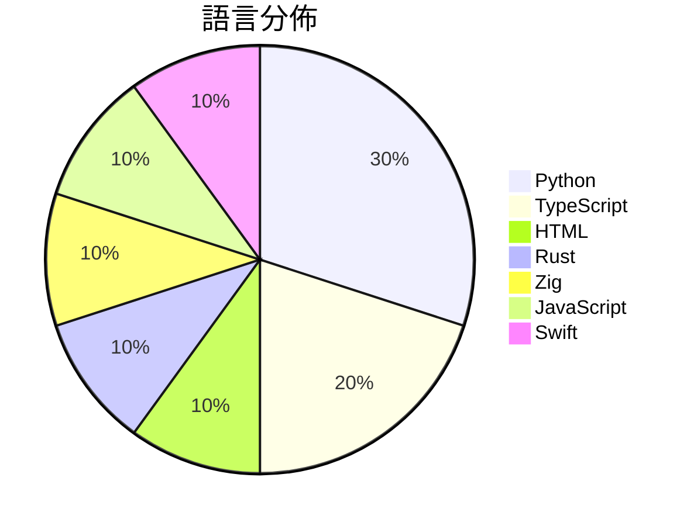

# GitHub Trending - 2026-08-26

> [!summary] 本日摘要
> 收錄 **10** 個新專案，合計 **13.9k** stars
> 語言分佈：Python (3) · TypeScript (2) · HTML (1) · Rust (1) · Zig (1) · JavaScript (1) · Swift (1)

> [!tip] 本週焦點
> **[[MengTo--threeui|MengTo/threeui]]** — 4 天內累積 3.9k stars（987 stars/天）
> Open-source ThreeUI Community catalog with live interactive components and complete Community source.



---

## 收錄列表

| # | 專案 | 分類 | Stars | 速度 | 安裝 | 語言 | 用途 |
| :--: | --- | --- | ---: | ---: | --- | --- | --- |
| 1 | [[MengTo--threeui\|MengTo/threeui]] |  | 3.9k | 987/天 |  | HTML | Open-source ThreeUI Community catalog wi |
| 2 | [[b-nnett--grok-bot-0.18-reconstructed\|b-nnett/grok-bot-0.18-reconstructed]] |  | 2.6k | 1.3k/天 |  | TypeScript | Unofficial source-oriented reconstructio |
| 3 | [[tobi--walgit\|tobi/walgit]] |  | 1.6k | 788/天 |  | Rust |  |
| 4 | [[duty1g--x64dbg-mcp-server\|duty1g/x64dbg-mcp-server]] |  | 1.4k | 462/天 |  | Zig | x64dbg-MCP Server is a native MCP (Model |
| 5 | [[cclank--lanshu-create-ai-presenter-video\|cclank/lanshu-create-ai-presenter-video]] |  | 924 | 185/天 |  | Python | Provider-neutral Codex Skill for produci |
| 6 | [[nateherkai--scroll-craft\|nateherkai/scroll-craft]] |  | 917 | 306/天 |  | JavaScript | Claude Code skill for premium scroll-dri |
| 7 | [[ShadowAqueduct--watermark-remover\|ShadowAqueduct/watermark-remover]] |  | 792 | 396/天 |  | Python | Purge multi-vendor AI watermarks: clean  |
| 8 | [[missuo--herdrm\|missuo/herdrm]] |  | 631 | 105/天 |  | Swift | Native macOS console for herdr — all you |
| 9 | [[ApodexAI--FrontierAgent\|ApodexAI/FrontierAgent]] |  | 614 | 205/天 |  | Python | 🧩 FrontierAgent, our agent framework, o |
| 10 | [[amagine-ai--Amagine3D\|amagine-ai/Amagine3D]] |  | 556 | 93/天 |  | TypeScript | Amagine3D: From hardware requirements to |

---

## 重點摘要

### 1. [[MengTo--threeui|MengTo/threeui]]

**3.9k** stars · **987** stars/天 · HTML

---

### 2. [[b-nnett--grok-bot-0.18-reconstructed|b-nnett/grok-bot-0.18-reconstructed]]

**2.6k** stars · **1.3k** stars/天 · TypeScript

---

### 3. [[tobi--walgit|tobi/walgit]]

**1.6k** stars · **788** stars/天 · Rust

---

### 4. [[duty1g--x64dbg-mcp-server|duty1g/x64dbg-mcp-server]]

**1.4k** stars · **462** stars/天 · Zig

---

### 5. [[cclank--lanshu-create-ai-presenter-video|cclank/lanshu-create-ai-presenter-video]]

**924** stars · **185** stars/天 · Python

---

### 6. [[nateherkai--scroll-craft|nateherkai/scroll-craft]]

**917** stars · **306** stars/天 · JavaScript

---

### 7. [[ShadowAqueduct--watermark-remover|ShadowAqueduct/watermark-remover]]

**792** stars · **396** stars/天 · Python

---

### 8. [[missuo--herdrm|missuo/herdrm]]

**631** stars · **105** stars/天 · Swift

---

### 9. [[ApodexAI--FrontierAgent|ApodexAI/FrontierAgent]]

**614** stars · **205** stars/天 · Python

---

### 10. [[amagine-ai--Amagine3D|amagine-ai/Amagine3D]]

**556** stars · **93** stars/天 · TypeScript

---

## 今日到期複習

> [!tip] 根據間隔複習排程，今天該回顧的專案

```dataview
TABLE
  stars_per_day AS "Stars/天",
  category AS "分類",
  engagement AS "參與度"
FROM "Repos"
WHERE next_review AND date(next_review) <= date("2026-08-26") AND status != "archived"
SORT priority DESC
```

## 待處理

```dataviewjs
const pending = dv.pages('"Repos"').where(p => p.status === "to-review").length;
const unrated = dv.pages('"Repos"').where(p => p.status !== "archived" && p.status !== "to-review" && (p.my_rating || 0) === 0).length;
const noVerdict = dv.pages('"Repos"').where(p => p.status !== "archived" && (p.my_rating || 0) > 0 && (!p.verdict || p.verdict === "")).length;
const items = [];
if (pending > 0) items.push(`**${pending}** 個待分流`);
if (unrated > 0) items.push(`**${unrated}** 個已讀但未評分`);
if (noVerdict > 0) items.push(`**${noVerdict}** 個已評分但無結論`);
if (items.length > 0) dv.paragraph(items.join(" / "));
else dv.paragraph("所有專案都已處理完畢！");
```
