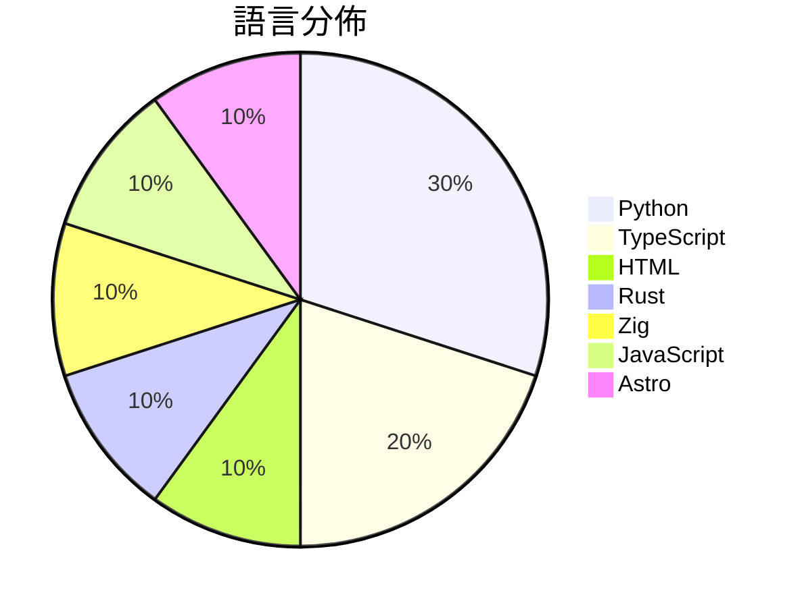

# GitHub Trending - 2026-08-27

> [!summary] 本日摘要
> 收錄 **10** 個新專案，合計 **16.7k** stars
> 語言分佈：Python (3) · TypeScript (2) · HTML (1) · Rust (1) · Zig (1) · JavaScript (1) · Astro (1)

> [!tip] 本週焦點
> **[[MengTo--threeui|MengTo/threeui]]** — 5 天內累積 4.3k stars（852 stars/天）
> Open-source ThreeUI Community catalog with live interactive components and complete Community source.



---

## 收錄列表

| # | 專案 | 分類 | Stars | 速度 | 安裝 | 語言 | 用途 |
| :--: | --- | --- | ---: | ---: | --- | --- | --- |
| 1 | [[MengTo--threeui\|MengTo/threeui]] |  | 4.3k | 852/天 |  | HTML | Open-source ThreeUI Community catalog wi |
| 2 | [[b-nnett--grok-bot-0.18-reconstructed\|b-nnett/grok-bot-0.18-reconstructed]] |  | 3.3k | 1.1k/天 |  | TypeScript | Unofficial source-oriented reconstructio |
| 3 | [[tobi--walgit\|tobi/walgit]] |  | 2.2k | 734/天 |  | Rust |  |
| 4 | [[duty1g--x64dbg-mcp-server\|duty1g/x64dbg-mcp-server]] |  | 1.5k | 372/天 |  | Zig | x64dbg-MCP Server is a native MCP (Model |
| 5 | [[ApodexAI--FrontierAgent\|ApodexAI/FrontierAgent]] |  | 1.1k | 213/天 |  | Python | 🧩 FrontierAgent, our agent framework, o |
| 6 | [[nateherkai--scroll-craft\|nateherkai/scroll-craft]] |  | 1.0k | 262/天 |  | JavaScript | Claude Code skill for premium scroll-dri |
| 7 | [[cclank--lanshu-create-ai-presenter-video\|cclank/lanshu-create-ai-presenter-video]] |  | 951 | 159/天 |  | Python | Provider-neutral Codex Skill for produci |
| 8 | [[bryllim--workout-guide\|bryllim/workout-guide]] |  | 884 | 295/天 |  | Astro | 302 open exercise illustrations and a fr |
| 9 | [[ShadowAqueduct--watermark-remover\|ShadowAqueduct/watermark-remover]] |  | 811 | 270/天 |  | Python | Purge multi-vendor AI watermarks: clean  |
| 10 | [[wide-trace--open-higgsfield\|wide-trace/open-higgsfield]] |  | 664 | 664/天 |  | TypeScript | A studio for image and video generation  |

---

## 重點摘要

### 1. [[MengTo--threeui|MengTo/threeui]]

**4.3k** stars · **852** stars/天 · HTML

---

### 2. [[b-nnett--grok-bot-0.18-reconstructed|b-nnett/grok-bot-0.18-reconstructed]]

**3.3k** stars · **1.1k** stars/天 · TypeScript

---

### 3. [[tobi--walgit|tobi/walgit]]

**2.2k** stars · **734** stars/天 · Rust

---

### 4. [[duty1g--x64dbg-mcp-server|duty1g/x64dbg-mcp-server]]

**1.5k** stars · **372** stars/天 · Zig

---

### 5. [[ApodexAI--FrontierAgent|ApodexAI/FrontierAgent]]

**1.1k** stars · **213** stars/天 · Python

---

### 6. [[nateherkai--scroll-craft|nateherkai/scroll-craft]]

**1.0k** stars · **262** stars/天 · JavaScript

---

### 7. [[cclank--lanshu-create-ai-presenter-video|cclank/lanshu-create-ai-presenter-video]]

**951** stars · **159** stars/天 · Python

---

### 8. [[bryllim--workout-guide|bryllim/workout-guide]]

**884** stars · **295** stars/天 · Astro

---

### 9. [[ShadowAqueduct--watermark-remover|ShadowAqueduct/watermark-remover]]

**811** stars · **270** stars/天 · Python

---

### 10. [[wide-trace--open-higgsfield|wide-trace/open-higgsfield]]

**664** stars · **664** stars/天 · TypeScript

---

## 今日到期複習

> [!tip] 根據間隔複習排程，今天該回顧的專案

```dataview
TABLE
  stars_per_day AS "Stars/天",
  category AS "分類",
  engagement AS "參與度"
FROM "Repos"
WHERE next_review AND date(next_review) <= date("2026-08-27") AND status != "archived"
SORT priority DESC
```

## 待處理

```dataviewjs
const pending = dv.pages('"Repos"').where(p => p.status === "to-review").length;
const unrated = dv.pages('"Repos"').where(p => p.status !== "archived" && p.status !== "to-review" && (p.my_rating || 0) === 0).length;
const noVerdict = dv.pages('"Repos"').where(p => p.status !== "archived" && (p.my_rating || 0) > 0 && (!p.verdict || p.verdict === "")).length;
const items = [];
if (pending > 0) items.push(`**${pending}** 個待分流`);
if (unrated > 0) items.push(`**${unrated}** 個已讀但未評分`);
if (noVerdict > 0) items.push(`**${noVerdict}** 個已評分但無結論`);
if (items.length > 0) dv.paragraph(items.join(" / "));
else dv.paragraph("所有專案都已處理完畢！");
```
