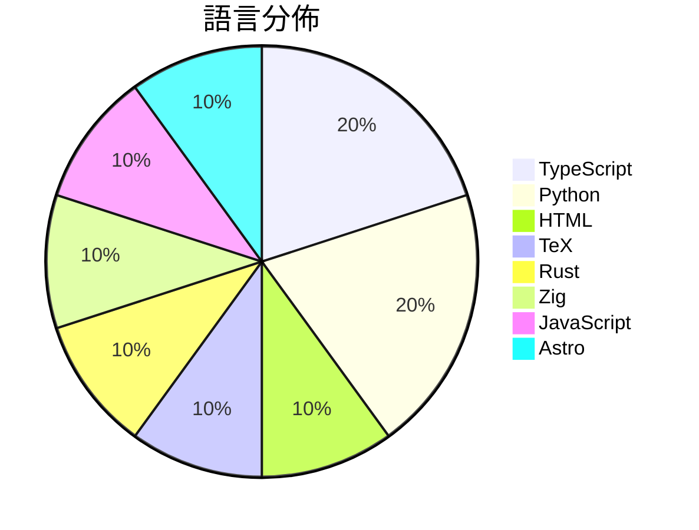

# GitHub Trending - 2026-08-28

> [!summary] 本日摘要
> 收錄 **10** 個新專案，合計 **20.4k** stars
> 語言分佈：TypeScript (2) · Python (2) · HTML (1) · TeX (1) · Rust (1) · Zig (1) · JavaScript (1) · Astro (1)

> [!tip] 本週焦點
> **[[MengTo--threeui|MengTo/threeui]]** — 7 天內累積 4.4k stars（627 stars/天）
> Open-source ThreeUI Community catalog with live interactive components and complete Community source.



---

## 收錄列表

| # | 專案 | 分類 | Stars | 速度 | 安裝 | 語言 | 用途 |
| :--: | --- | --- | ---: | ---: | --- | --- | --- |
| 1 | [[MengTo--threeui\|MengTo/threeui]] |  | 4.4k | 627/天 |  | HTML | Open-source ThreeUI Community catalog wi |
| 2 | [[b-nnett--grok-bot-0.18-reconstructed\|b-nnett/grok-bot-0.18-reconstructed]] |  | 3.4k | 849/天 |  | TypeScript | Unofficial source-oriented reconstructio |
| 3 | [[HEJustinSun--my-girlfriend-jingtian-latex\|HEJustinSun/my-girlfriend-jingtian-latex]] |  | 3.4k | 3.4k/天 |  | TeX |  |
| 4 | [[tobi--walgit\|tobi/walgit]] |  | 2.3k | 570/天 |  | Rust |  |
| 5 | [[duty1g--x64dbg-mcp-server\|duty1g/x64dbg-mcp-server]] |  | 1.6k | 325/天 |  | Zig | x64dbg-MCP Server is a native MCP (Model |
| 6 | [[ApodexAI--FrontierAgent\|ApodexAI/FrontierAgent]] |  | 1.2k | 199/天 |  | Python | 🧩 FrontierAgent, our agent framework, o |
| 7 | [[sapientinc--PRAXIST\|sapientinc/PRAXIST]] |  | 1.2k | 1.2k/天 |  | Python | Autonomous research system for measurabl |
| 8 | [[nateherkai--scroll-craft\|nateherkai/scroll-craft]] |  | 1.1k | 225/天 |  | JavaScript | Claude Code skill for premium scroll-dri |
| 9 | [[bryllim--workout-guide\|bryllim/workout-guide]] |  | 949 | 237/天 |  | Astro | 302 open exercise illustrations and a fr |
| 10 | [[wide-trace--open-higgsfield\|wide-trace/open-higgsfield]] |  | 918 | 459/天 |  | TypeScript | A studio for image and video generation  |

---

## 重點摘要

### 1. [[MengTo--threeui|MengTo/threeui]]

**4.4k** stars · **627** stars/天 · HTML

---

### 2. [[b-nnett--grok-bot-0.18-reconstructed|b-nnett/grok-bot-0.18-reconstructed]]

**3.4k** stars · **849** stars/天 · TypeScript

---

### 3. [[HEJustinSun--my-girlfriend-jingtian-latex|HEJustinSun/my-girlfriend-jingtian-latex]]

**3.4k** stars · **3.4k** stars/天 · TeX

---

### 4. [[tobi--walgit|tobi/walgit]]

**2.3k** stars · **570** stars/天 · Rust

---

### 5. [[duty1g--x64dbg-mcp-server|duty1g/x64dbg-mcp-server]]

**1.6k** stars · **325** stars/天 · Zig

---

### 6. [[ApodexAI--FrontierAgent|ApodexAI/FrontierAgent]]

**1.2k** stars · **199** stars/天 · Python

---

### 7. [[sapientinc--PRAXIST|sapientinc/PRAXIST]]

**1.2k** stars · **1.2k** stars/天 · Python

---

### 8. [[nateherkai--scroll-craft|nateherkai/scroll-craft]]

**1.1k** stars · **225** stars/天 · JavaScript

---

### 9. [[bryllim--workout-guide|bryllim/workout-guide]]

**949** stars · **237** stars/天 · Astro

---

### 10. [[wide-trace--open-higgsfield|wide-trace/open-higgsfield]]

**918** stars · **459** stars/天 · TypeScript

---

## 今日到期複習

> [!tip] 根據間隔複習排程，今天該回顧的專案

```dataview
TABLE
  stars_per_day AS "Stars/天",
  category AS "分類",
  engagement AS "參與度"
FROM "Repos"
WHERE next_review AND date(next_review) <= date("2026-08-28") AND status != "archived"
SORT priority DESC
```

## 待處理

```dataviewjs
const pending = dv.pages('"Repos"').where(p => p.status === "to-review").length;
const unrated = dv.pages('"Repos"').where(p => p.status !== "archived" && p.status !== "to-review" && (p.my_rating || 0) === 0).length;
const noVerdict = dv.pages('"Repos"').where(p => p.status !== "archived" && (p.my_rating || 0) > 0 && (!p.verdict || p.verdict === "")).length;
const items = [];
if (pending > 0) items.push(`**${pending}** 個待分流`);
if (unrated > 0) items.push(`**${unrated}** 個已讀但未評分`);
if (noVerdict > 0) items.push(`**${noVerdict}** 個已評分但無結論`);
if (items.length > 0) dv.paragraph(items.join(" / "));
else dv.paragraph("所有專案都已處理完畢！");
```
