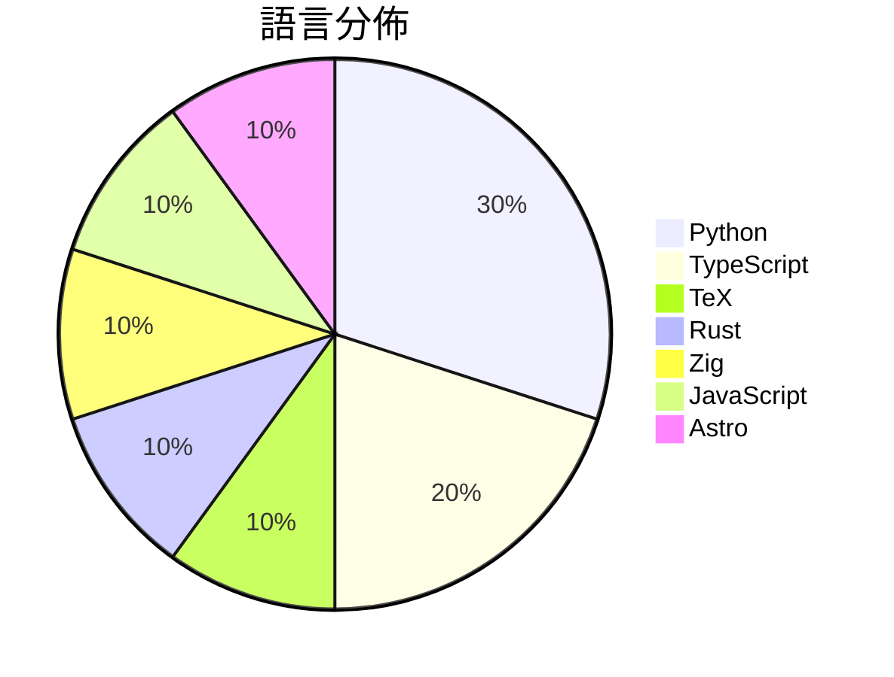

# GitHub Trending - 2026-08-29

> [!summary] 本日摘要
> 收錄 **10** 個新專案，合計 **18.5k** stars
> 語言分佈：Python (3) · TypeScript (2) · TeX (1) · Rust (1) · Zig (1) · JavaScript (1) · Astro (1)

> [!tip] 本週焦點
> **[[HEJustinSun--my-girlfriend-jingtian-latex|HEJustinSun/my-girlfriend-jingtian-latex]]** — 1 天內累積 3.8k stars（3.8k stars/天）
> 



---

## 收錄列表

| # | 專案 | 分類 | Stars | 速度 | 安裝 | 語言 | 用途 |
| :--: | --- | --- | ---: | ---: | --- | --- | --- |
| 1 | [[HEJustinSun--my-girlfriend-jingtian-latex\|HEJustinSun/my-girlfriend-jingtian-latex]] |  | 3.8k | 3.8k/天 |  | TeX |  |
| 2 | [[b-nnett--grok-bot-0.18-reconstructed\|b-nnett/grok-bot-0.18-reconstructed]] |  | 3.4k | 683/天 |  | TypeScript | Unofficial source-oriented reconstructio |
| 3 | [[tobi--walgit\|tobi/walgit]] |  | 2.3k | 462/天 |  | Rust |  |
| 4 | [[sapientinc--PRAXIST\|sapientinc/PRAXIST]] |  | 2.1k | 2.1k/天 |  | Python | Autonomous research system for measurabl |
| 5 | [[duty1g--x64dbg-mcp-server\|duty1g/x64dbg-mcp-server]] |  | 1.7k | 280/天 |  | Zig | x64dbg-MCP Server is a native MCP (Model |
| 6 | [[ApodexAI--FrontierAgent\|ApodexAI/FrontierAgent]] |  | 1.2k | 177/天 |  | Python | 🧩 FrontierAgent, our agent framework, o |
| 7 | [[nateherkai--scroll-craft\|nateherkai/scroll-craft]] |  | 1.2k | 196/天 |  | JavaScript | Claude Code skill for premium scroll-dri |
| 8 | [[wide-trace--open-higgsfield\|wide-trace/open-higgsfield]] |  | 994 | 331/天 |  | TypeScript | A studio for image and video generation  |
| 9 | [[bryllim--workout-guide\|bryllim/workout-guide]] |  | 984 | 197/天 |  | Astro | 302 open exercise illustrations and a fr |
| 10 | [[Tencent--WeMM-Embedding\|Tencent/WeMM-Embedding]] |  | 860 | 215/天 |  | Python | WeMM-Embedding is a family of universal  |

---

## 重點摘要

### 1. [[HEJustinSun--my-girlfriend-jingtian-latex|HEJustinSun/my-girlfriend-jingtian-latex]]

**3.8k** stars · **3.8k** stars/天 · TeX

---

### 2. [[b-nnett--grok-bot-0.18-reconstructed|b-nnett/grok-bot-0.18-reconstructed]]

**3.4k** stars · **683** stars/天 · TypeScript

---

### 3. [[tobi--walgit|tobi/walgit]]

**2.3k** stars · **462** stars/天 · Rust

---

### 4. [[sapientinc--PRAXIST|sapientinc/PRAXIST]]

**2.1k** stars · **2.1k** stars/天 · Python

---

### 5. [[duty1g--x64dbg-mcp-server|duty1g/x64dbg-mcp-server]]

**1.7k** stars · **280** stars/天 · Zig

---

### 6. [[ApodexAI--FrontierAgent|ApodexAI/FrontierAgent]]

**1.2k** stars · **177** stars/天 · Python

---

### 7. [[nateherkai--scroll-craft|nateherkai/scroll-craft]]

**1.2k** stars · **196** stars/天 · JavaScript

---

### 8. [[wide-trace--open-higgsfield|wide-trace/open-higgsfield]]

**994** stars · **331** stars/天 · TypeScript

---

### 9. [[bryllim--workout-guide|bryllim/workout-guide]]

**984** stars · **197** stars/天 · Astro

---

### 10. [[Tencent--WeMM-Embedding|Tencent/WeMM-Embedding]]

**860** stars · **215** stars/天 · Python

---

## 今日到期複習

> [!tip] 根據間隔複習排程，今天該回顧的專案

```dataview
TABLE
  stars_per_day AS "Stars/天",
  category AS "分類",
  engagement AS "參與度"
FROM "Repos"
WHERE next_review AND date(next_review) <= date("2026-08-29") AND status != "archived"
SORT priority DESC
```

## 待處理

```dataviewjs
const pending = dv.pages('"Repos"').where(p => p.status === "to-review").length;
const unrated = dv.pages('"Repos"').where(p => p.status !== "archived" && p.status !== "to-review" && (p.my_rating || 0) === 0).length;
const noVerdict = dv.pages('"Repos"').where(p => p.status !== "archived" && (p.my_rating || 0) > 0 && (!p.verdict || p.verdict === "")).length;
const items = [];
if (pending > 0) items.push(`**${pending}** 個待分流`);
if (unrated > 0) items.push(`**${unrated}** 個已讀但未評分`);
if (noVerdict > 0) items.push(`**${noVerdict}** 個已評分但無結論`);
if (items.length > 0) dv.paragraph(items.join(" / "));
else dv.paragraph("所有專案都已處理完畢！");
```
