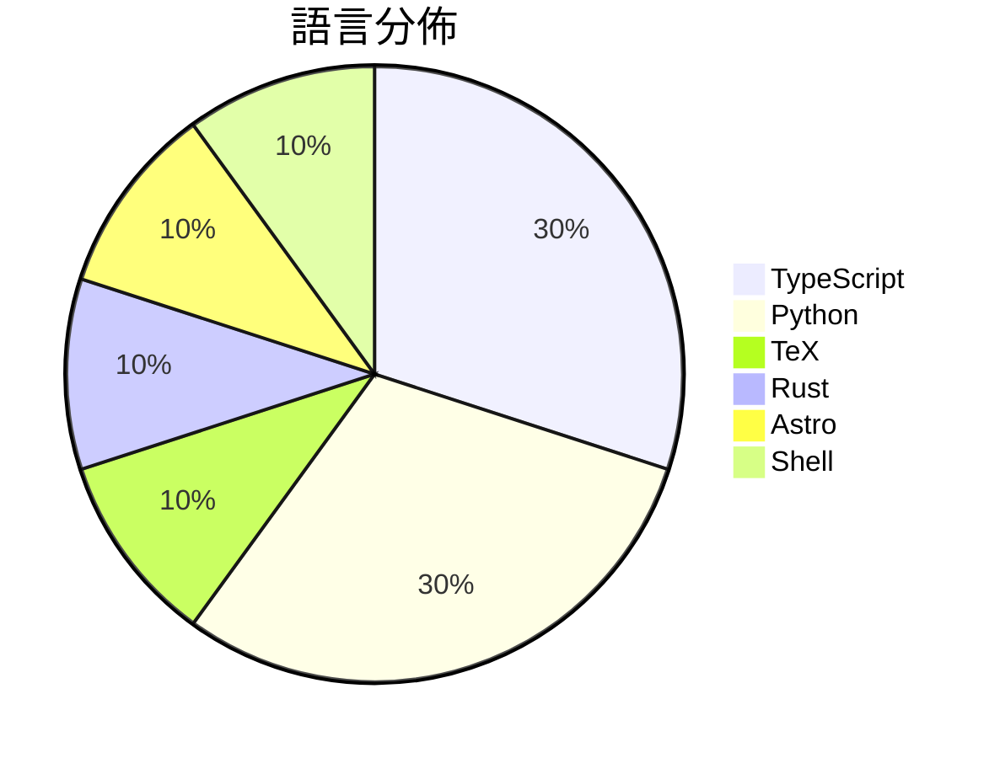

# GitHub Trending - 2026-08-30

> [!summary] 本日摘要
> 收錄 **10** 個新專案，合計 **18.7k** stars
> 語言分佈：TypeScript (3) · Python (3) · TeX (1) · Rust (1) · Astro (1) · Shell (1)

> [!tip] 本週焦點
> **[[HEJustinSun--my-girlfriend-jingtian-latex|HEJustinSun/my-girlfriend-jingtian-latex]]** — 2 天內累積 4.0k stars（2.0k stars/天）
> 



---

## 收錄列表

| # | 專案 | 分類 | Stars | 速度 | 安裝 | 語言 | 用途 |
| :--: | --- | --- | ---: | ---: | --- | --- | --- |
| 1 | [[HEJustinSun--my-girlfriend-jingtian-latex\|HEJustinSun/my-girlfriend-jingtian-latex]] |  | 4.0k | 2.0k/天 |  | TeX |  |
| 2 | [[b-nnett--grok-bot-0.18-reconstructed\|b-nnett/grok-bot-0.18-reconstructed]] |  | 3.4k | 573/天 |  | TypeScript | Unofficial source-oriented reconstructio |
| 3 | [[sapientinc--PRAXIST\|sapientinc/PRAXIST]] |  | 3.2k | 1.6k/天 |  | Python | Autonomous research system for measurabl |
| 4 | [[tobi--walgit\|tobi/walgit]] |  | 2.3k | 389/天 |  | Rust |  |
| 5 | [[wide-trace--open-higgsfield\|wide-trace/open-higgsfield]] |  | 1.1k | 360/天 |  | TypeScript | A studio for image and video generation  |
| 6 | [[bryllim--workout-guide\|bryllim/workout-guide]] |  | 1.0k | 168/天 |  | Astro | 302 open exercise illustrations and a fr |
| 7 | [[XiaoDuoYa--codex-with-chatgpt\|XiaoDuoYa/codex-with-chatgpt]] |  | 1.0k | 1.0k/天 |  | TypeScript | ChatGPT thinks. Codex works. Use ChatGPT |
| 8 | [[Tencent--WeMM-Embedding\|Tencent/WeMM-Embedding]] |  | 914 | 183/天 |  | Python | WeMM-Embedding is a family of universal  |
| 9 | [[themartiano--try-omarchy\|themartiano/try-omarchy]] |  | 901 | 150/天 |  | Shell | Run Omarchy on MacOS without any setup. |
| 10 | [[ShadowAqueduct--watermark-remover\|ShadowAqueduct/watermark-remover]] |  | 833 | 139/天 |  | Python | Purge multi-vendor AI watermarks: clean  |

---

## 重點摘要

### 1. [[HEJustinSun--my-girlfriend-jingtian-latex|HEJustinSun/my-girlfriend-jingtian-latex]]

**4.0k** stars · **2.0k** stars/天 · TeX

---

### 2. [[b-nnett--grok-bot-0.18-reconstructed|b-nnett/grok-bot-0.18-reconstructed]]

**3.4k** stars · **573** stars/天 · TypeScript

---

### 3. [[sapientinc--PRAXIST|sapientinc/PRAXIST]]

**3.2k** stars · **1.6k** stars/天 · Python

---

### 4. [[tobi--walgit|tobi/walgit]]

**2.3k** stars · **389** stars/天 · Rust

---

### 5. [[wide-trace--open-higgsfield|wide-trace/open-higgsfield]]

**1.1k** stars · **360** stars/天 · TypeScript

---

### 6. [[bryllim--workout-guide|bryllim/workout-guide]]

**1.0k** stars · **168** stars/天 · Astro

---

### 7. [[XiaoDuoYa--codex-with-chatgpt|XiaoDuoYa/codex-with-chatgpt]]

**1.0k** stars · **1.0k** stars/天 · TypeScript

---

### 8. [[Tencent--WeMM-Embedding|Tencent/WeMM-Embedding]]

**914** stars · **183** stars/天 · Python

---

### 9. [[themartiano--try-omarchy|themartiano/try-omarchy]]

**901** stars · **150** stars/天 · Shell

---

### 10. [[ShadowAqueduct--watermark-remover|ShadowAqueduct/watermark-remover]]

**833** stars · **139** stars/天 · Python

---

## 今日到期複習

> [!tip] 根據間隔複習排程，今天該回顧的專案

```dataview
TABLE
  stars_per_day AS "Stars/天",
  category AS "分類",
  engagement AS "參與度"
FROM "Repos"
WHERE next_review AND date(next_review) <= date("2026-08-30") AND status != "archived"
SORT priority DESC
```

## 待處理

```dataviewjs
const pending = dv.pages('"Repos"').where(p => p.status === "to-review").length;
const unrated = dv.pages('"Repos"').where(p => p.status !== "archived" && p.status !== "to-review" && (p.my_rating || 0) === 0).length;
const noVerdict = dv.pages('"Repos"').where(p => p.status !== "archived" && (p.my_rating || 0) > 0 && (!p.verdict || p.verdict === "")).length;
const items = [];
if (pending > 0) items.push(`**${pending}** 個待分流`);
if (unrated > 0) items.push(`**${unrated}** 個已讀但未評分`);
if (noVerdict > 0) items.push(`**${noVerdict}** 個已評分但無結論`);
if (items.length > 0) dv.paragraph(items.join(" / "));
else dv.paragraph("所有專案都已處理完畢！");
```
