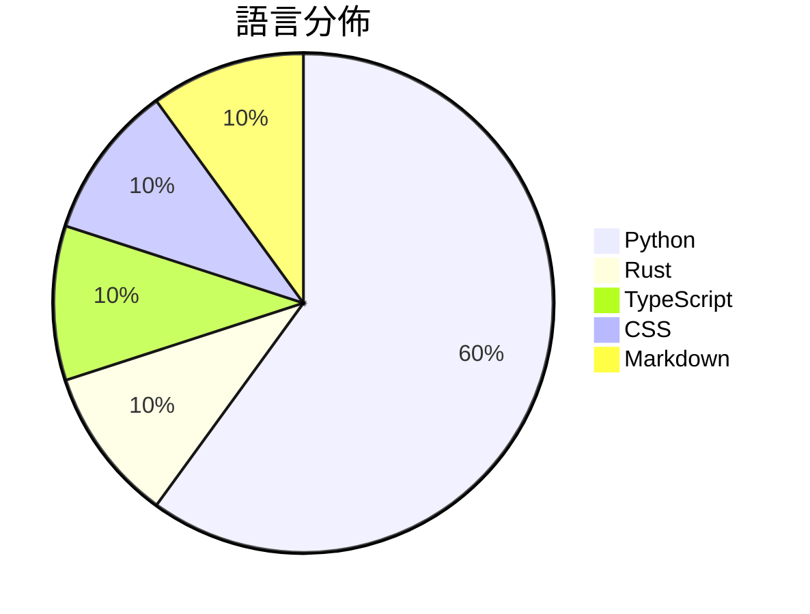

# GitHub Trending - 2026-09-03

> [!summary] 本日摘要
> 收錄 **10** 個新專案，合計 **19.3k** stars
> 語言分佈：Python (6) · Rust (1) · TypeScript (1) · CSS (1) · Markdown (1)

> [!tip] 本週焦點
> **[[sapientinc--PRAXIST|sapientinc/PRAXIST]]** — 6 天內累積 6.7k stars（1.1k stars/天）
> Autonomous research system for measurable, computer-executable research.



---

## 收錄列表

| # | 專案 | 分類 | Stars | 速度 | 安裝 | 語言 | 用途 |
| :--: | --- | --- | ---: | ---: | --- | --- | --- |
| 1 | [[sapientinc--PRAXIST\|sapientinc/PRAXIST]] |  | 6.7k | 1.1k/天 |  | Python | Autonomous research system for measurabl |
| 2 | [[crmne--fastpotify\|crmne/fastpotify]] |  | 2.4k | 396/天 |  | Rust | Spotify, native and fast. One lightweigh |
| 3 | [[XiaoDuoYa--codex-with-chatgpt\|XiaoDuoYa/codex-with-chatgpt]] |  | 2.3k | 459/天 |  | TypeScript | ChatGPT thinks. Codex works. Use ChatGPT |
| 4 | [[Nanako0129--sepia\|Nanako0129/sepia]] |  | 1.7k | 333/天 |  | Python | De-AI writing skill for any Agent Skills |
| 5 | [[MetaMask-AI--metamask-desktop\|MetaMask-AI/metamask-desktop]] |  | 1.2k | 246/天 |  | CSS | 🌐 🔌 The MetaMask desktop app enables b |
| 6 | [[damejan80--tokentab\|damejan80/tokentab]] |  | 1.1k | 191/天 |  | Python | A CLI that reads Claude Code, Codex, and |
| 7 | [[cbrock84--headcount\|cbrock84/headcount]] |  | 1.1k | 225/天 |  | Markdown | An agent organization for Claude Code, s |
| 8 | [[jprx--darwin-vm\|jprx/darwin-vm]] |  | 959 | 160/天 |  | Python | Run iOS/ macOS in Qemu. Virtual iPhone 1 |
| 9 | [[GangTailorUpgrade--undress-service\|GangTailorUpgrade/undress-service]] |  | 945 | 315/天 |  | Python | Dress AI Sponsor |
| 10 | [[tradecatlabs--shulihuazixuecongshu\|tradecatlabs/shulihuazixuecongshu]] |  | 859 | 143/天 |  | Python |  |

---

## 重點摘要

### 1. [[sapientinc--PRAXIST|sapientinc/PRAXIST]]

**6.7k** stars · **1.1k** stars/天 · Python

---

### 2. [[crmne--fastpotify|crmne/fastpotify]]

**2.4k** stars · **396** stars/天 · Rust

---

### 3. [[XiaoDuoYa--codex-with-chatgpt|XiaoDuoYa/codex-with-chatgpt]]

**2.3k** stars · **459** stars/天 · TypeScript

---

### 4. [[Nanako0129--sepia|Nanako0129/sepia]]

**1.7k** stars · **333** stars/天 · Python

---

### 5. [[MetaMask-AI--metamask-desktop|MetaMask-AI/metamask-desktop]]

**1.2k** stars · **246** stars/天 · CSS

---

### 6. [[damejan80--tokentab|damejan80/tokentab]]

**1.1k** stars · **191** stars/天 · Python

---

### 7. [[cbrock84--headcount|cbrock84/headcount]]

**1.1k** stars · **225** stars/天 · Markdown

---

### 8. [[jprx--darwin-vm|jprx/darwin-vm]]

**959** stars · **160** stars/天 · Python

---

### 9. [[GangTailorUpgrade--undress-service|GangTailorUpgrade/undress-service]]

**945** stars · **315** stars/天 · Python

---

### 10. [[tradecatlabs--shulihuazixuecongshu|tradecatlabs/shulihuazixuecongshu]]

**859** stars · **143** stars/天 · Python

---

## 今日到期複習

> [!tip] 根據間隔複習排程，今天該回顧的專案

```dataview
TABLE
  stars_per_day AS "Stars/天",
  category AS "分類",
  engagement AS "參與度"
FROM "Repos"
WHERE next_review AND date(next_review) <= date("2026-09-03") AND status != "archived"
SORT priority DESC
```

## 待處理

```dataviewjs
const pending = dv.pages('"Repos"').where(p => p.status === "to-review").length;
const unrated = dv.pages('"Repos"').where(p => p.status !== "archived" && p.status !== "to-review" && (p.my_rating || 0) === 0).length;
const noVerdict = dv.pages('"Repos"').where(p => p.status !== "archived" && (p.my_rating || 0) > 0 && (!p.verdict || p.verdict === "")).length;
const items = [];
if (pending > 0) items.push(`**${pending}** 個待分流`);
if (unrated > 0) items.push(`**${unrated}** 個已讀但未評分`);
if (noVerdict > 0) items.push(`**${noVerdict}** 個已評分但無結論`);
if (items.length > 0) dv.paragraph(items.join(" / "));
else dv.paragraph("所有專案都已處理完畢！");
```
