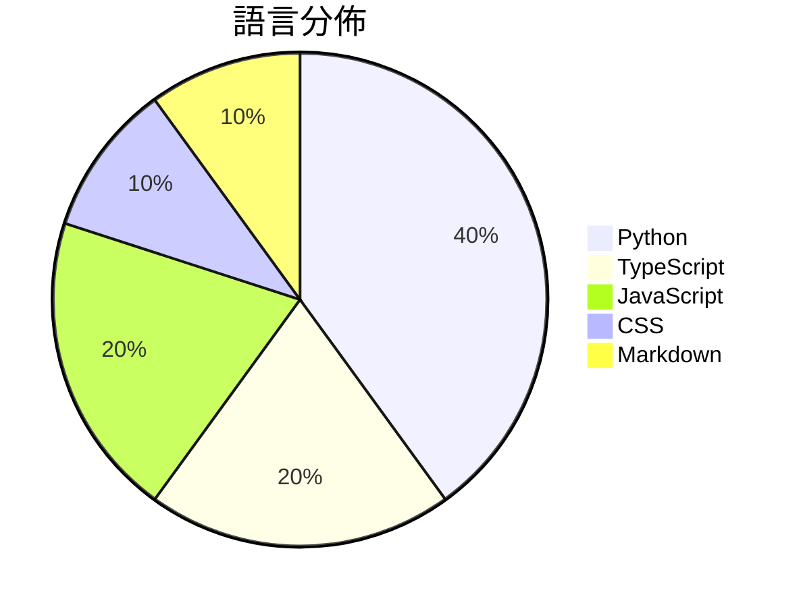

# GitHub Trending - 2026-09-04

> [!summary] 本日摘要
> 收錄 **10** 個新專案，合計 **13.3k** stars
> 語言分佈：Python (4) · TypeScript (2) · JavaScript (2) · CSS (1) · Markdown (1)

> [!tip] 本週焦點
> **[[XiaoDuoYa--codex-with-chatgpt|XiaoDuoYa/codex-with-chatgpt]]** — 6 天內累積 2.4k stars（404 stars/天）
> ChatGPT thinks. Codex works. Use ChatGPT as the planning brain while keeping the Codex harness.



---

## 收錄列表

| # | 專案 | 分類 | Stars | 速度 | 安裝 | 語言 | 用途 |
| :--: | --- | --- | ---: | ---: | --- | --- | --- |
| 1 | [[XiaoDuoYa--codex-with-chatgpt\|XiaoDuoYa/codex-with-chatgpt]] |  | 2.4k | 404/天 |  | TypeScript | ChatGPT thinks. Codex works. Use ChatGPT |
| 2 | [[Nanako0129--sepia\|Nanako0129/sepia]] |  | 1.9k | 319/天 |  | Python | De-AI writing skill for any Agent Skills |
| 3 | [[anthropics--commerce-agents\|anthropics/commerce-agents]] |  | 1.7k | 832/天 |  | Python | Reference blueprint for building shoppin |
| 4 | [[MetaMask-AI--metamask-desktop\|MetaMask-AI/metamask-desktop]] |  | 1.2k | 205/天 |  | CSS | 🌐 🔌 The MetaMask desktop app enables b |
| 5 | [[cbrock84--headcount\|cbrock84/headcount]] |  | 1.2k | 200/天 |  | Markdown | An agent organization for Claude Code, s |
| 6 | [[rakanki911--DLSS5-Swapper\|rakanki911/DLSS5-Swapper]] |  | 1.2k | 231/天 |  | JavaScript | DLSS 5 Swapper is a powerful, easy-to-us |
| 7 | [[GangTailorUpgrade--undress-service\|GangTailorUpgrade/undress-service]] |  | 1.0k | 255/天 |  | Python | Dress AI Sponsor |
| 8 | [[shadcn-ui--cn\|shadcn-ui/cn]] |  | 993 | 331/天 |  | TypeScript | cn is a new engine for Tailwind class me |
| 9 | [[Player-YN--PawWork_ZhuaZhua\|Player-YN/PawWork_ZhuaZhua]] |  | 873 | 146/天 |  | JavaScript | Paw Work - selection-first web agent for |
| 10 | [[2akouwu--reverify\|2akouwu/reverify]] |  | 818 | 205/天 |  | Python | Anti-hallucination for AI agents that re |

---

## 重點摘要

### 1. [[XiaoDuoYa--codex-with-chatgpt|XiaoDuoYa/codex-with-chatgpt]]

**2.4k** stars · **404** stars/天 · TypeScript

---

### 2. [[Nanako0129--sepia|Nanako0129/sepia]]

**1.9k** stars · **319** stars/天 · Python

---

### 3. [[anthropics--commerce-agents|anthropics/commerce-agents]]

**1.7k** stars · **832** stars/天 · Python

---

### 4. [[MetaMask-AI--metamask-desktop|MetaMask-AI/metamask-desktop]]

**1.2k** stars · **205** stars/天 · CSS

---

### 5. [[cbrock84--headcount|cbrock84/headcount]]

**1.2k** stars · **200** stars/天 · Markdown

---

### 6. [[rakanki911--DLSS5-Swapper|rakanki911/DLSS5-Swapper]]

**1.2k** stars · **231** stars/天 · JavaScript

---

### 7. [[GangTailorUpgrade--undress-service|GangTailorUpgrade/undress-service]]

**1.0k** stars · **255** stars/天 · Python

---

### 8. [[shadcn-ui--cn|shadcn-ui/cn]]

**993** stars · **331** stars/天 · TypeScript

---

### 9. [[Player-YN--PawWork_ZhuaZhua|Player-YN/PawWork_ZhuaZhua]]

**873** stars · **146** stars/天 · JavaScript

---

### 10. [[2akouwu--reverify|2akouwu/reverify]]

**818** stars · **205** stars/天 · Python

---

## 今日到期複習

> [!tip] 根據間隔複習排程，今天該回顧的專案

```dataview
TABLE
  stars_per_day AS "Stars/天",
  category AS "分類",
  engagement AS "參與度"
FROM "Repos"
WHERE next_review AND date(next_review) <= date("2026-09-04") AND status != "archived"
SORT priority DESC
```

## 待處理

```dataviewjs
const pending = dv.pages('"Repos"').where(p => p.status === "to-review").length;
const unrated = dv.pages('"Repos"').where(p => p.status !== "archived" && p.status !== "to-review" && (p.my_rating || 0) === 0).length;
const noVerdict = dv.pages('"Repos"').where(p => p.status !== "archived" && (p.my_rating || 0) > 0 && (!p.verdict || p.verdict === "")).length;
const items = [];
if (pending > 0) items.push(`**${pending}** 個待分流`);
if (unrated > 0) items.push(`**${unrated}** 個已讀但未評分`);
if (noVerdict > 0) items.push(`**${noVerdict}** 個已評分但無結論`);
if (items.length > 0) dv.paragraph(items.join(" / "));
else dv.paragraph("所有專案都已處理完畢！");
```
