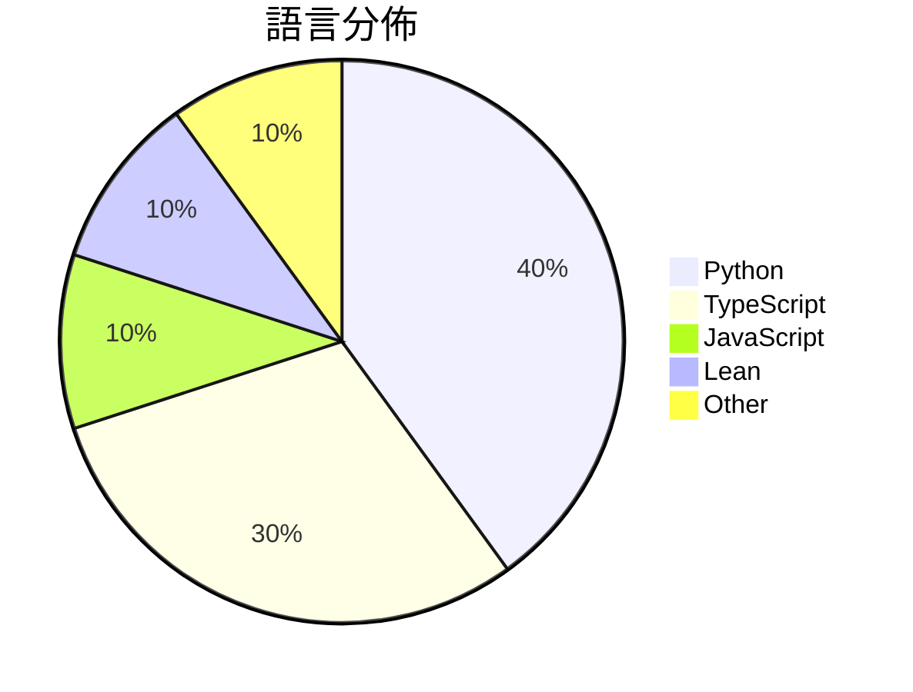

# GitHub Trending - 2026-09-06

> [!summary] 本日摘要
> 收錄 **10** 個新專案，合計 **12.6k** stars
> 語言分佈：Python (4) · TypeScript (3) · JavaScript (1) · Lean (1) · Other (1)

> [!tip] 本週焦點
> **[[lnkiai--m3e-canvas|lnkiai/m3e-canvas]]** — 4 天內累積 3.9k stars（966 stars/天）
> Sketch Material 3 Expressive screens in the browser and turn them into vibe-coding prompts.



---

## 收錄列表

| # | 專案 | 分類 | Stars | 速度 | 安裝 | 語言 | 用途 |
| :--: | --- | --- | ---: | ---: | --- | --- | --- |
| 1 | [[lnkiai--m3e-canvas\|lnkiai/m3e-canvas]] |  | 3.9k | 966/天 |  | TypeScript | Sketch Material 3 Expressive screens in  |
| 2 | [[anthropics--commerce-agents\|anthropics/commerce-agents]] |  | 2.1k | 524/天 |  | Python | Reference blueprint for building shoppin |
| 3 | [[shadcn-ui--cn\|shadcn-ui/cn]] |  | 1.2k | 236/天 |  | TypeScript | cn is a new engine for Tailwind class me |
| 4 | [[GangTailorUpgrade--undress-service\|GangTailorUpgrade/undress-service]] |  | 1.1k | 184/天 |  | Python | Dress AI Sponsor |
| 5 | [[2akouwu--reverify\|2akouwu/reverify]] |  | 925 | 154/天 |  | Python | Stop your AI from making things up — it  |
| 6 | [[yczz--oc-english\|yczz/oc-english]] |  | 823 | 206/天 |  | JavaScript | 养成类游戏英语学习 |
| 7 | [[anthropics--fermats-last-theorem\|anthropics/fermats-last-theorem]] |  | 722 | 722/天 |  | Lean |  |
| 8 | [[danielblnc--DLSS-NR-on-AMD\|danielblnc/DLSS-NR-on-AMD]] |  | 671 | 224/天 |  | N/A | Run DLSS 5 Neural Rendering on your AMD  |
| 9 | [[nahrek--polyledger\|nahrek/polyledger]] |  | 620 | 207/天 |  | Python | Resumable Polymarket indexer: CLOB marke |
| 10 | [[ashemag--human-atlas\|ashemag/human-atlas]] |  | 559 | 559/天 |  | TypeScript | Open-source 3D anatomy explorer: 2,234 s |

---

## 重點摘要

### 1. [[lnkiai--m3e-canvas|lnkiai/m3e-canvas]]

**3.9k** stars · **966** stars/天 · TypeScript

---

### 2. [[anthropics--commerce-agents|anthropics/commerce-agents]]

**2.1k** stars · **524** stars/天 · Python

---

### 3. [[shadcn-ui--cn|shadcn-ui/cn]]

**1.2k** stars · **236** stars/天 · TypeScript

---

### 4. [[GangTailorUpgrade--undress-service|GangTailorUpgrade/undress-service]]

**1.1k** stars · **184** stars/天 · Python

---

### 5. [[2akouwu--reverify|2akouwu/reverify]]

**925** stars · **154** stars/天 · Python

---

### 6. [[yczz--oc-english|yczz/oc-english]]

**823** stars · **206** stars/天 · JavaScript

---

### 7. [[anthropics--fermats-last-theorem|anthropics/fermats-last-theorem]]

**722** stars · **722** stars/天 · Lean

---

### 8. [[danielblnc--DLSS-NR-on-AMD|danielblnc/DLSS-NR-on-AMD]]

**671** stars · **224** stars/天 · N/A

---

### 9. [[nahrek--polyledger|nahrek/polyledger]]

**620** stars · **207** stars/天 · Python

---

### 10. [[ashemag--human-atlas|ashemag/human-atlas]]

**559** stars · **559** stars/天 · TypeScript

---

## 今日到期複習

> [!tip] 根據間隔複習排程，今天該回顧的專案

```dataview
TABLE
  stars_per_day AS "Stars/天",
  category AS "分類",
  engagement AS "參與度"
FROM "Repos"
WHERE next_review AND date(next_review) <= date("2026-09-06") AND status != "archived"
SORT priority DESC
```

## 待處理

```dataviewjs
const pending = dv.pages('"Repos"').where(p => p.status === "to-review").length;
const unrated = dv.pages('"Repos"').where(p => p.status !== "archived" && p.status !== "to-review" && (p.my_rating || 0) === 0).length;
const noVerdict = dv.pages('"Repos"').where(p => p.status !== "archived" && (p.my_rating || 0) > 0 && (!p.verdict || p.verdict === "")).length;
const items = [];
if (pending > 0) items.push(`**${pending}** 個待分流`);
if (unrated > 0) items.push(`**${unrated}** 個已讀但未評分`);
if (noVerdict > 0) items.push(`**${noVerdict}** 個已評分但無結論`);
if (items.length > 0) dv.paragraph(items.join(" / "));
else dv.paragraph("所有專案都已處理完畢！");
```
