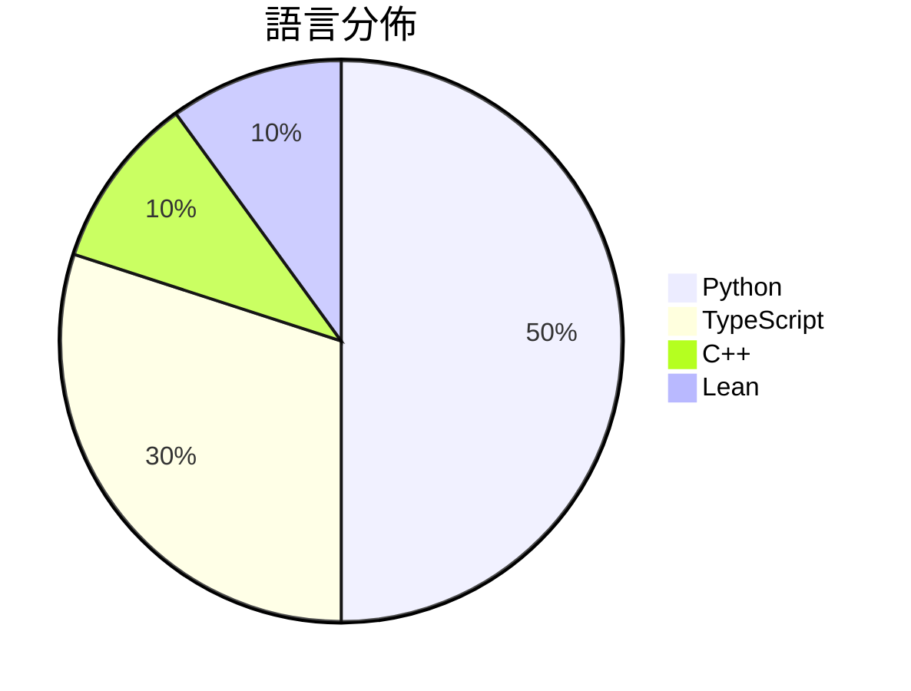

# GitHub Trending - 2026-09-07

> [!summary] 本日摘要
> 收錄 **10** 個新專案，合計 **15.6k** stars
> 語言分佈：Python (5) · TypeScript (3) · C++ (1) · Lean (1)

> [!tip] 本週焦點
> **[[lnkiai--m3e-canvas|lnkiai/m3e-canvas]]** — 5 天內累積 4.4k stars（876 stars/天）
> Sketch Material 3 Expressive screens in the browser and turn them into vibe-coding prompts.



---

## 收錄列表

| # | 專案 | 分類 | Stars | 速度 | 安裝 | 語言 | 用途 |
| :--: | --- | --- | ---: | ---: | --- | --- | --- |
| 1 | [[lnkiai--m3e-canvas\|lnkiai/m3e-canvas]] |  | 4.4k | 876/天 |  | TypeScript | Sketch Material 3 Expressive screens in  |
| 2 | [[anthropics--commerce-agents\|anthropics/commerce-agents]] |  | 2.3k | 452/天 |  | Python | Reference blueprint for building shoppin |
| 3 | [[ashemag--human-atlas\|ashemag/human-atlas]] |  | 1.5k | 744/天 |  | TypeScript | Open-source 3D anatomy explorer: 2,234 s |
| 4 | [[Rion-Wu-tech--wechat-intelligence-hub\|Rion-Wu-tech/wechat-intelligence-hub]] |  | 1.3k | 674/天 |  | Python | Local-first WeChat intelligence system w |
| 5 | [[shadcn-ui--cn\|shadcn-ui/cn]] |  | 1.2k | 203/天 |  | TypeScript | cn is a new engine for Tailwind class me |
| 6 | [[GangTailorUpgrade--undress-service\|GangTailorUpgrade/undress-service]] |  | 1.1k | 163/天 |  | Python | Dress AI Sponsor |
| 7 | [[pierrenade--short-video-generator-AI\|pierrenade/short-video-generator-AI]] |  | 1.0k | 1.0k/天 |  | Python | Free open-source project designed for tu |
| 8 | [[2akouwu--reverify\|2akouwu/reverify]] |  | 975 | 139/天 |  | Python | Stop your AI from making things up — it  |
| 9 | [[sebbbi--NoGraphicsAPI\|sebbbi/NoGraphicsAPI]] |  | 919 | 153/天 |  | C++ | Minimal graphics API. Built on top of la |
| 10 | [[anthropics--fermats-last-theorem\|anthropics/fermats-last-theorem]] |  | 863 | 432/天 |  | Lean |  |

---

## 重點摘要

### 1. [[lnkiai--m3e-canvas|lnkiai/m3e-canvas]]

**4.4k** stars · **876** stars/天 · TypeScript

---

### 2. [[anthropics--commerce-agents|anthropics/commerce-agents]]

**2.3k** stars · **452** stars/天 · Python

---

### 3. [[ashemag--human-atlas|ashemag/human-atlas]]

**1.5k** stars · **744** stars/天 · TypeScript

---

### 4. [[Rion-Wu-tech--wechat-intelligence-hub|Rion-Wu-tech/wechat-intelligence-hub]]

**1.3k** stars · **674** stars/天 · Python

---

### 5. [[shadcn-ui--cn|shadcn-ui/cn]]

**1.2k** stars · **203** stars/天 · TypeScript

---

### 6. [[GangTailorUpgrade--undress-service|GangTailorUpgrade/undress-service]]

**1.1k** stars · **163** stars/天 · Python

---

### 7. [[pierrenade--short-video-generator-AI|pierrenade/short-video-generator-AI]]

**1.0k** stars · **1.0k** stars/天 · Python

---

### 8. [[2akouwu--reverify|2akouwu/reverify]]

**975** stars · **139** stars/天 · Python

---

### 9. [[sebbbi--NoGraphicsAPI|sebbbi/NoGraphicsAPI]]

**919** stars · **153** stars/天 · C++

---

### 10. [[anthropics--fermats-last-theorem|anthropics/fermats-last-theorem]]

**863** stars · **432** stars/天 · Lean

---

## 今日到期複習

> [!tip] 根據間隔複習排程，今天該回顧的專案

```dataview
TABLE
  stars_per_day AS "Stars/天",
  category AS "分類",
  engagement AS "參與度"
FROM "Repos"
WHERE next_review AND date(next_review) <= date("2026-09-07") AND status != "archived"
SORT priority DESC
```

## 待處理

```dataviewjs
const pending = dv.pages('"Repos"').where(p => p.status === "to-review").length;
const unrated = dv.pages('"Repos"').where(p => p.status !== "archived" && p.status !== "to-review" && (p.my_rating || 0) === 0).length;
const noVerdict = dv.pages('"Repos"').where(p => p.status !== "archived" && (p.my_rating || 0) > 0 && (!p.verdict || p.verdict === "")).length;
const items = [];
if (pending > 0) items.push(`**${pending}** 個待分流`);
if (unrated > 0) items.push(`**${unrated}** 個已讀但未評分`);
if (noVerdict > 0) items.push(`**${noVerdict}** 個已評分但無結論`);
if (items.length > 0) dv.paragraph(items.join(" / "));
else dv.paragraph("所有專案都已處理完畢！");
```
