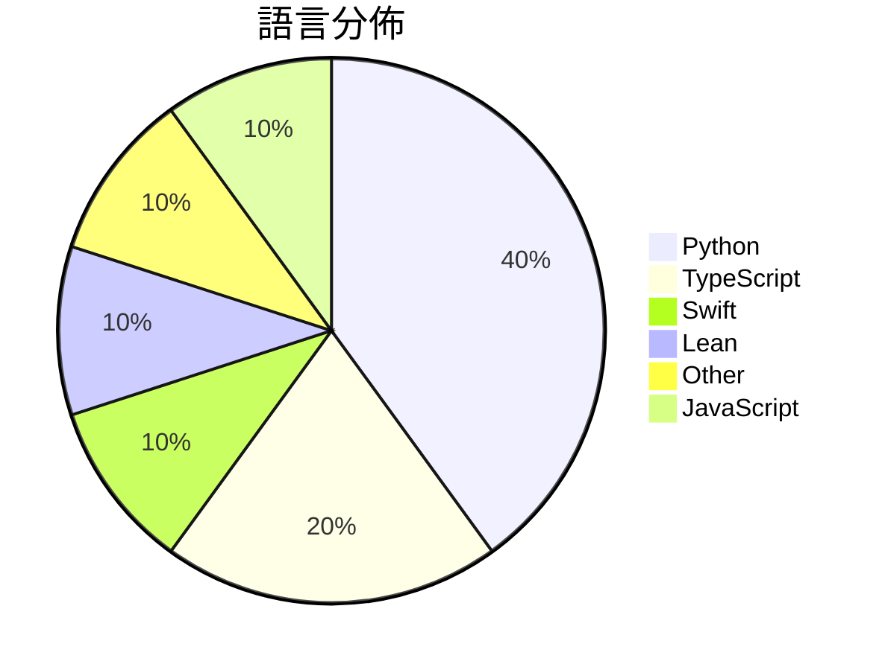

# GitHub Trending - 2026-09-08

> [!summary] 本日摘要
> 收錄 **10** 個新專案，合計 **16.9k** stars
> 語言分佈：Python (4) · TypeScript (2) · Swift (1) · Lean (1) · Other (1) · JavaScript (1)

> [!tip] 本週焦點
> **[[lnkiai--m3e-canvas|lnkiai/m3e-canvas]]** — 6 天內累積 4.8k stars（795 stars/天）
> Sketch Material 3 Expressive screens in the browser and turn them into vibe-coding prompts.



---

## 收錄列表

| # | 專案 | 分類 | Stars | 速度 | 安裝 | 語言 | 用途 |
| :--: | --- | --- | ---: | ---: | --- | --- | --- |
| 1 | [[lnkiai--m3e-canvas\|lnkiai/m3e-canvas]] |  | 4.8k | 795/天 |  | TypeScript | Sketch Material 3 Expressive screens in  |
| 2 | [[anthropics--commerce-agents\|anthropics/commerce-agents]] |  | 2.4k | 406/天 |  | Python | Reference blueprint for building shoppin |
| 3 | [[ashemag--human-atlas\|ashemag/human-atlas]] |  | 2.1k | 704/天 |  | TypeScript | Open-source 3D anatomy explorer: 2,234 s |
| 4 | [[Rion-Wu-tech--wechat-intelligence-hub\|Rion-Wu-tech/wechat-intelligence-hub]] |  | 1.9k | 623/天 |  | Python | Local-first WeChat intelligence system w |
| 5 | [[pierrenade--short-video-generator-AI\|pierrenade/short-video-generator-AI]] |  | 1.2k | 593/天 |  | Python | Free open-source project designed for tu |
| 6 | [[vinzdg--codenotch\|vinzdg/codenotch]] |  | 959 | 480/天 |  | Swift | A macOS app that pins usage limits from  |
| 7 | [[anthropics--fermats-last-theorem\|anthropics/fermats-last-theorem]] |  | 945 | 315/天 |  | Lean |  |
| 8 | [[EverettFish--holo-card-studio\|EverettFish/holo-card-studio]] |  | 936 | 936/天 |  | Python | Turn the user's description or uploaded  |
| 9 | [[danielblnc--DLSS-NR-on-AMD\|danielblnc/DLSS-NR-on-AMD]] |  | 871 | 174/天 |  | N/A | Run DLSS 5 Neural Rendering on your AMD  |
| 10 | [[yczz--oc-english\|yczz/oc-english]] |  | 850 | 142/天 |  | JavaScript | 养成类游戏英语学习 |

---

## 重點摘要

### 1. [[lnkiai--m3e-canvas|lnkiai/m3e-canvas]]

**4.8k** stars · **795** stars/天 · TypeScript

---

### 2. [[anthropics--commerce-agents|anthropics/commerce-agents]]

**2.4k** stars · **406** stars/天 · Python

---

### 3. [[ashemag--human-atlas|ashemag/human-atlas]]

**2.1k** stars · **704** stars/天 · TypeScript

---

### 4. [[Rion-Wu-tech--wechat-intelligence-hub|Rion-Wu-tech/wechat-intelligence-hub]]

**1.9k** stars · **623** stars/天 · Python

---

### 5. [[pierrenade--short-video-generator-AI|pierrenade/short-video-generator-AI]]

**1.2k** stars · **593** stars/天 · Python

---

### 6. [[vinzdg--codenotch|vinzdg/codenotch]]

**959** stars · **480** stars/天 · Swift

---

### 7. [[anthropics--fermats-last-theorem|anthropics/fermats-last-theorem]]

**945** stars · **315** stars/天 · Lean

---

### 8. [[EverettFish--holo-card-studio|EverettFish/holo-card-studio]]

**936** stars · **936** stars/天 · Python

---

### 9. [[danielblnc--DLSS-NR-on-AMD|danielblnc/DLSS-NR-on-AMD]]

**871** stars · **174** stars/天 · N/A

---

### 10. [[yczz--oc-english|yczz/oc-english]]

**850** stars · **142** stars/天 · JavaScript

---

## 今日到期複習

> [!tip] 根據間隔複習排程，今天該回顧的專案

```dataview
TABLE
  stars_per_day AS "Stars/天",
  category AS "分類",
  engagement AS "參與度"
FROM "Repos"
WHERE next_review AND date(next_review) <= date("2026-09-08") AND status != "archived"
SORT priority DESC
```

## 待處理

```dataviewjs
const pending = dv.pages('"Repos"').where(p => p.status === "to-review").length;
const unrated = dv.pages('"Repos"').where(p => p.status !== "archived" && p.status !== "to-review" && (p.my_rating || 0) === 0).length;
const noVerdict = dv.pages('"Repos"').where(p => p.status !== "archived" && (p.my_rating || 0) > 0 && (!p.verdict || p.verdict === "")).length;
const items = [];
if (pending > 0) items.push(`**${pending}** 個待分流`);
if (unrated > 0) items.push(`**${unrated}** 個已讀但未評分`);
if (noVerdict > 0) items.push(`**${noVerdict}** 個已評分但無結論`);
if (items.length > 0) dv.paragraph(items.join(" / "));
else dv.paragraph("所有專案都已處理完畢！");
```
