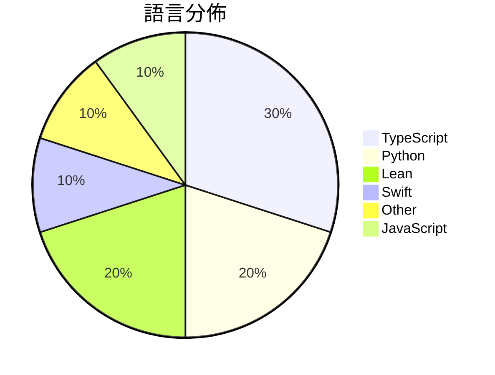

# GitHub Trending - 2026-09-09

> [!summary] 本日摘要
> 收錄 **10** 個新專案，合計 **18.1k** stars
> 語言分佈：TypeScript (3) · Python (2) · Lean (2) · Swift (1) · Other (1) · JavaScript (1)

> [!tip] 本週焦點
> **[[lnkiai--m3e-canvas|lnkiai/m3e-canvas]]** — 7 天內累積 5.3k stars（759 stars/天）
> Sketch Material 3 Expressive screens in the browser and turn them into vibe-coding prompts.



---

## 收錄列表

| # | 專案 | 分類 | Stars | 速度 | 安裝 | 語言 | 用途 |
| :--: | --- | --- | ---: | ---: | --- | --- | --- |
| 1 | [[lnkiai--m3e-canvas\|lnkiai/m3e-canvas]] |  | 5.3k | 759/天 |  | TypeScript | Sketch Material 3 Expressive screens in  |
| 2 | [[ashemag--human-atlas\|ashemag/human-atlas]] |  | 2.5k | 636/天 |  | TypeScript | Open-source 3D anatomy explorer: 2,234 s |
| 3 | [[Albert-Weasker--niubigeo\|Albert-Weasker/niubigeo]] |  | 2.2k | 436/天 |  | TypeScript | Open-source AI brand visibility and comp |
| 4 | [[Rion-Wu-tech--wechat-intelligence-hub\|Rion-Wu-tech/wechat-intelligence-hub]] |  | 2.0k | 488/天 |  | Python | Local-first WeChat intelligence system w |
| 5 | [[EverettFish--holo-card-studio\|EverettFish/holo-card-studio]] |  | 1.2k | 579/天 |  | Python | Turn the user's description or uploaded  |
| 6 | [[vinzdg--codenotch\|vinzdg/codenotch]] |  | 1.1k | 379/天 |  | Swift | A macOS app that pins usage limits from  |
| 7 | [[openai--NavierStokesAndEuler\|openai/NavierStokesAndEuler]] |  | 1.1k | 1.1k/天 |  | Lean | Lean certificates accompanying Navier-St |
| 8 | [[anthropics--fermats-last-theorem\|anthropics/fermats-last-theorem]] |  | 986 | 247/天 |  | Lean |  |
| 9 | [[danielblnc--DLSS-NR-on-AMD\|danielblnc/DLSS-NR-on-AMD]] |  | 942 | 157/天 |  | N/A | Run DLSS 5 Neural Rendering on your AMD  |
| 10 | [[ahujasid--camera-to-blender\|ahujasid/camera-to-blender]] |  | 778 | 156/天 |  | JavaScript | Take a photo of real objects, and paste  |

---

## 重點摘要

### 1. [[lnkiai--m3e-canvas|lnkiai/m3e-canvas]]

**5.3k** stars · **759** stars/天 · TypeScript

---

### 2. [[ashemag--human-atlas|ashemag/human-atlas]]

**2.5k** stars · **636** stars/天 · TypeScript

---

### 3. [[Albert-Weasker--niubigeo|Albert-Weasker/niubigeo]]

**2.2k** stars · **436** stars/天 · TypeScript

---

### 4. [[Rion-Wu-tech--wechat-intelligence-hub|Rion-Wu-tech/wechat-intelligence-hub]]

**2.0k** stars · **488** stars/天 · Python

---

### 5. [[EverettFish--holo-card-studio|EverettFish/holo-card-studio]]

**1.2k** stars · **579** stars/天 · Python

---

### 6. [[vinzdg--codenotch|vinzdg/codenotch]]

**1.1k** stars · **379** stars/天 · Swift

---

### 7. [[openai--NavierStokesAndEuler|openai/NavierStokesAndEuler]]

**1.1k** stars · **1.1k** stars/天 · Lean

---

### 8. [[anthropics--fermats-last-theorem|anthropics/fermats-last-theorem]]

**986** stars · **247** stars/天 · Lean

---

### 9. [[danielblnc--DLSS-NR-on-AMD|danielblnc/DLSS-NR-on-AMD]]

**942** stars · **157** stars/天 · N/A

---

### 10. [[ahujasid--camera-to-blender|ahujasid/camera-to-blender]]

**778** stars · **156** stars/天 · JavaScript

---

## 今日到期複習

> [!tip] 根據間隔複習排程，今天該回顧的專案

```dataview
TABLE
  stars_per_day AS "Stars/天",
  category AS "分類",
  engagement AS "參與度"
FROM "Repos"
WHERE next_review AND date(next_review) <= date("2026-09-09") AND status != "archived"
SORT priority DESC
```

## 待處理

```dataviewjs
const pending = dv.pages('"Repos"').where(p => p.status === "to-review").length;
const unrated = dv.pages('"Repos"').where(p => p.status !== "archived" && p.status !== "to-review" && (p.my_rating || 0) === 0).length;
const noVerdict = dv.pages('"Repos"').where(p => p.status !== "archived" && (p.my_rating || 0) > 0 && (!p.verdict || p.verdict === "")).length;
const items = [];
if (pending > 0) items.push(`**${pending}** 個待分流`);
if (unrated > 0) items.push(`**${unrated}** 個已讀但未評分`);
if (noVerdict > 0) items.push(`**${noVerdict}** 個已評分但無結論`);
if (items.length > 0) dv.paragraph(items.join(" / "));
else dv.paragraph("所有專案都已處理完畢！");
```
