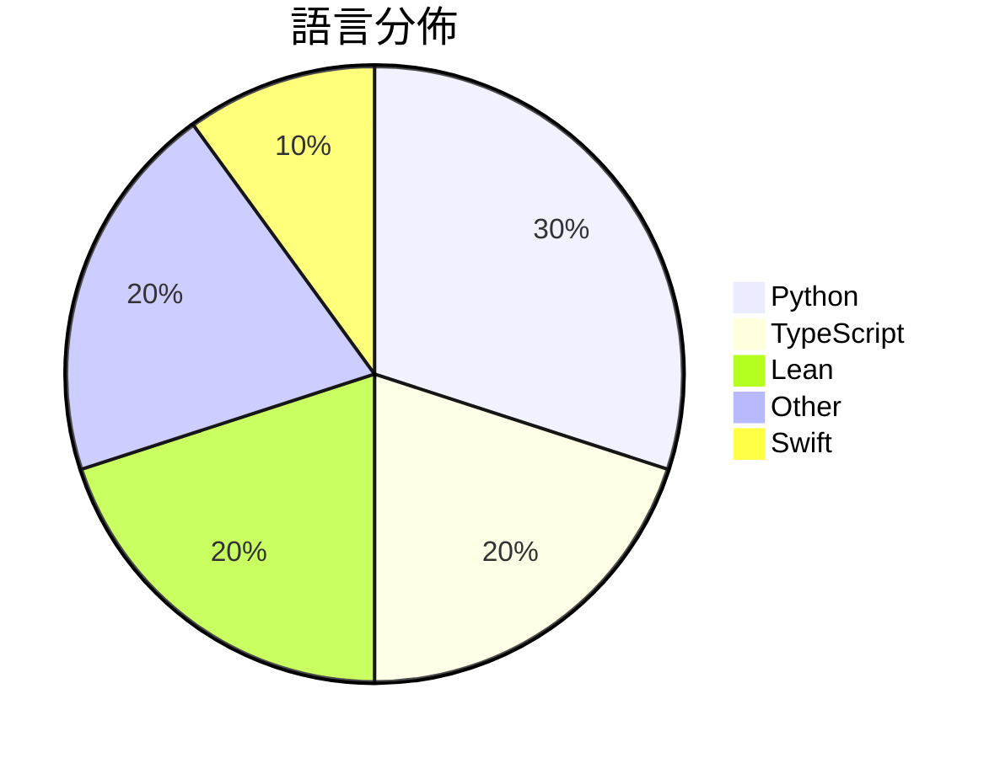

# GitHub Trending - 2026-09-10

> [!summary] 本日摘要
> 收錄 **10** 個新專案，合計 **15.1k** stars
> 語言分佈：Python (3) · TypeScript (2) · Lean (2) · Other (2) · Swift (1)

> [!tip] 本週焦點
> **[[ashemag--human-atlas|ashemag/human-atlas]]** — 5 天內累積 2.9k stars（576 stars/天）
> Open-source 3D anatomy explorer: 2,234 selectable BodyParts3D meshes, system layers, search, and exploded views.



---

## 收錄列表

| # | 專案 | 分類 | Stars | 速度 | 安裝 | 語言 | 用途 |
| :--: | --- | --- | ---: | ---: | --- | --- | --- |
| 1 | [[ashemag--human-atlas\|ashemag/human-atlas]] |  | 2.9k | 576/天 |  | TypeScript | Open-source 3D anatomy explorer: 2,234 s |
| 2 | [[Albert-Weasker--niubigeo\|Albert-Weasker/niubigeo]] |  | 2.3k | 377/天 |  | TypeScript | Open-source AI brand visibility and comp |
| 3 | [[Rion-Wu-tech--wechat-intelligence-hub\|Rion-Wu-tech/wechat-intelligence-hub]] |  | 2.0k | 407/天 |  | Python | Local-first WeChat intelligence system w |
| 4 | [[openai--NavierStokesAndEuler\|openai/NavierStokesAndEuler]] |  | 1.6k | 1.6k/天 |  | Lean | Lean certificates accompanying Navier-St |
| 5 | [[vinzdg--codenotch\|vinzdg/codenotch]] |  | 1.3k | 324/天 |  | Swift | A macOS app that pins usage limits from  |
| 6 | [[EverettFish--holo-card-studio\|EverettFish/holo-card-studio]] |  | 1.3k | 421/天 |  | Python | Turn the user's description or uploaded  |
| 7 | [[anthropics--fermats-last-theorem\|anthropics/fermats-last-theorem]] |  | 1.0k | 201/天 |  | Lean |  |
| 8 | [[danielblnc--DLSS-NR-on-AMD\|danielblnc/DLSS-NR-on-AMD]] |  | 986 | 141/天 |  | N/A | Run DLSS 5 Neural Rendering on your AMD  |
| 9 | [[kajisho5--ffmpeg-skill\|kajisho5/ffmpeg-skill]] |  | 896 | 149/天 |  | Python |  |
| 10 | [[sdli1995--dlssg_for_sm86\|sdli1995/dlssg_for_sm86]] |  | 842 | 421/天 |  | N/A | Here is a dlssg for RTX30 Series GPU  |

---

## 重點摘要

### 1. [[ashemag--human-atlas|ashemag/human-atlas]]

**2.9k** stars · **576** stars/天 · TypeScript

---

### 2. [[Albert-Weasker--niubigeo|Albert-Weasker/niubigeo]]

**2.3k** stars · **377** stars/天 · TypeScript

---

### 3. [[Rion-Wu-tech--wechat-intelligence-hub|Rion-Wu-tech/wechat-intelligence-hub]]

**2.0k** stars · **407** stars/天 · Python

---

### 4. [[openai--NavierStokesAndEuler|openai/NavierStokesAndEuler]]

**1.6k** stars · **1.6k** stars/天 · Lean

---

### 5. [[vinzdg--codenotch|vinzdg/codenotch]]

**1.3k** stars · **324** stars/天 · Swift

---

### 6. [[EverettFish--holo-card-studio|EverettFish/holo-card-studio]]

**1.3k** stars · **421** stars/天 · Python

---

### 7. [[anthropics--fermats-last-theorem|anthropics/fermats-last-theorem]]

**1.0k** stars · **201** stars/天 · Lean

---

### 8. [[danielblnc--DLSS-NR-on-AMD|danielblnc/DLSS-NR-on-AMD]]

**986** stars · **141** stars/天 · N/A

---

### 9. [[kajisho5--ffmpeg-skill|kajisho5/ffmpeg-skill]]

**896** stars · **149** stars/天 · Python

---

### 10. [[sdli1995--dlssg_for_sm86|sdli1995/dlssg_for_sm86]]

**842** stars · **421** stars/天 · N/A

---

## 今日到期複習

> [!tip] 根據間隔複習排程，今天該回顧的專案

```dataview
TABLE
  stars_per_day AS "Stars/天",
  category AS "分類",
  engagement AS "參與度"
FROM "Repos"
WHERE next_review AND date(next_review) <= date("2026-09-10") AND status != "archived"
SORT priority DESC
```

## 待處理

```dataviewjs
const pending = dv.pages('"Repos"').where(p => p.status === "to-review").length;
const unrated = dv.pages('"Repos"').where(p => p.status !== "archived" && p.status !== "to-review" && (p.my_rating || 0) === 0).length;
const noVerdict = dv.pages('"Repos"').where(p => p.status !== "archived" && (p.my_rating || 0) > 0 && (!p.verdict || p.verdict === "")).length;
const items = [];
if (pending > 0) items.push(`**${pending}** 個待分流`);
if (unrated > 0) items.push(`**${unrated}** 個已讀但未評分`);
if (noVerdict > 0) items.push(`**${noVerdict}** 個已評分但無結論`);
if (items.length > 0) dv.paragraph(items.join(" / "));
else dv.paragraph("所有專案都已處理完畢！");
```
