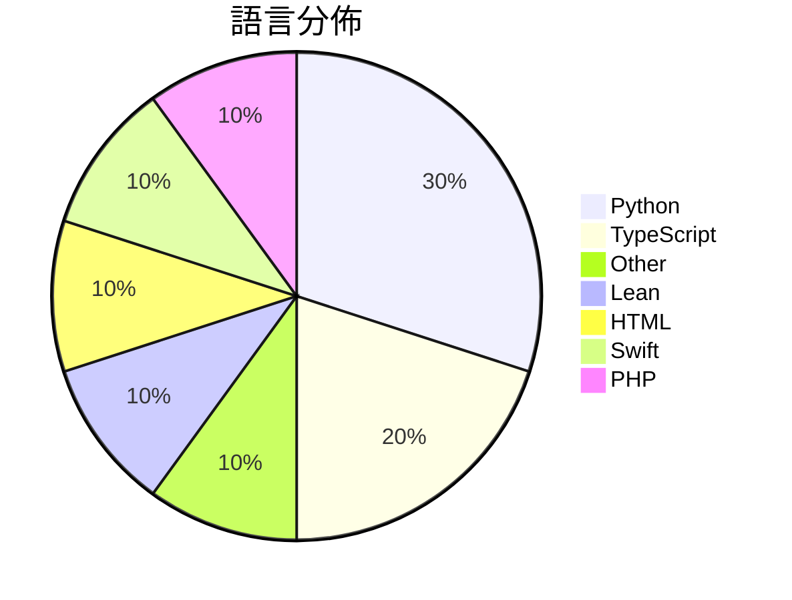

# GitHub Trending - 2026-09-12

> [!summary] 本日摘要
> 收錄 **10** 個新專案，合計 **15.6k** stars
> 語言分佈：Python (3) · TypeScript (2) · Other (1) · Lean (1) · HTML (1) · Swift (1) · PHP (1)

> [!tip] 本週焦點
> **[[ashemag--human-atlas|ashemag/human-atlas]]** — 7 天內累積 3.2k stars（460 stars/天）
> Open-source 3D anatomy explorer: 2,234 selectable BodyParts3D meshes, system layers, search, and exploded views.



---

## 收錄列表

| # | 專案 | 分類 | Stars | 速度 | 安裝 | 語言 | 用途 |
| :--: | --- | --- | ---: | ---: | --- | --- | --- |
| 1 | [[ashemag--human-atlas\|ashemag/human-atlas]] |  | 3.2k | 460/天 |  | TypeScript | Open-source 3D anatomy explorer: 2,234 s |
| 2 | [[sdli1995--dlssg_for_sm86\|sdli1995/dlssg_for_sm86]] |  | 1.9k | 466/天 |  | N/A | Here is a dlssg for RTX30 Series GPU  |
| 3 | [[openai--NavierStokesAndEuler\|openai/NavierStokesAndEuler]] |  | 1.8k | 594/天 |  | Lean | Lean certificates accompanying Navier-St |
| 4 | [[yang0--handraw-style\|yang0/handraw-style]] |  | 1.5k | 254/天 |  | HTML | 手绘风格编号画廊与双语提示词 Skill |
| 5 | [[vinzdg--codenotch\|vinzdg/codenotch]] |  | 1.5k | 246/天 |  | Swift | A macOS app that pins usage limits from  |
| 6 | [[EverettFish--holo-card-studio\|EverettFish/holo-card-studio]] |  | 1.4k | 290/天 |  | Python | Turn the user's description or uploaded  |
| 7 | [[Edge0-AI--Edge0\|Edge0-AI/Edge0]] |  | 1.4k | 455/天 |  | Python |  |
| 8 | [[donvito--codex-astra-luna-orchestrator\|donvito/codex-astra-luna-orchestrator]] |  | 990 | 165/天 |  | Python | Use Astra as orchestrator and Luna for s |
| 9 | [[Vincentwei1021--anything2explainer\|Vincentwei1021/anything2explainer]] |  | 967 | 322/天 |  | TypeScript | Topic in, narrated explainer video out.  |
| 10 | [[Faizpi--bank-sampah\|Faizpi/bank-sampah]] |  | 919 | 919/天 |  | PHP |  |

---

## 重點摘要

### 1. [[ashemag--human-atlas|ashemag/human-atlas]]

**3.2k** stars · **460** stars/天 · TypeScript

---

### 2. [[sdli1995--dlssg_for_sm86|sdli1995/dlssg_for_sm86]]

**1.9k** stars · **466** stars/天 · N/A

---

### 3. [[openai--NavierStokesAndEuler|openai/NavierStokesAndEuler]]

**1.8k** stars · **594** stars/天 · Lean

---

### 4. [[yang0--handraw-style|yang0/handraw-style]]

**1.5k** stars · **254** stars/天 · HTML

---

### 5. [[vinzdg--codenotch|vinzdg/codenotch]]

**1.5k** stars · **246** stars/天 · Swift

---

### 6. [[EverettFish--holo-card-studio|EverettFish/holo-card-studio]]

**1.4k** stars · **290** stars/天 · Python

---

### 7. [[Edge0-AI--Edge0|Edge0-AI/Edge0]]

**1.4k** stars · **455** stars/天 · Python

---

### 8. [[donvito--codex-astra-luna-orchestrator|donvito/codex-astra-luna-orchestrator]]

**990** stars · **165** stars/天 · Python

---

### 9. [[Vincentwei1021--anything2explainer|Vincentwei1021/anything2explainer]]

**967** stars · **322** stars/天 · TypeScript

---

### 10. [[Faizpi--bank-sampah|Faizpi/bank-sampah]]

**919** stars · **919** stars/天 · PHP

---

## 今日到期複習

> [!tip] 根據間隔複習排程，今天該回顧的專案

```dataview
TABLE
  stars_per_day AS "Stars/天",
  category AS "分類",
  engagement AS "參與度"
FROM "Repos"
WHERE next_review AND date(next_review) <= date("2026-09-12") AND status != "archived"
SORT priority DESC
```

## 待處理

```dataviewjs
const pending = dv.pages('"Repos"').where(p => p.status === "to-review").length;
const unrated = dv.pages('"Repos"').where(p => p.status !== "archived" && p.status !== "to-review" && (p.my_rating || 0) === 0).length;
const noVerdict = dv.pages('"Repos"').where(p => p.status !== "archived" && (p.my_rating || 0) > 0 && (!p.verdict || p.verdict === "")).length;
const items = [];
if (pending > 0) items.push(`**${pending}** 個待分流`);
if (unrated > 0) items.push(`**${unrated}** 個已讀但未評分`);
if (noVerdict > 0) items.push(`**${noVerdict}** 個已評分但無結論`);
if (items.length > 0) dv.paragraph(items.join(" / "));
else dv.paragraph("所有專案都已處理完畢！");
```
