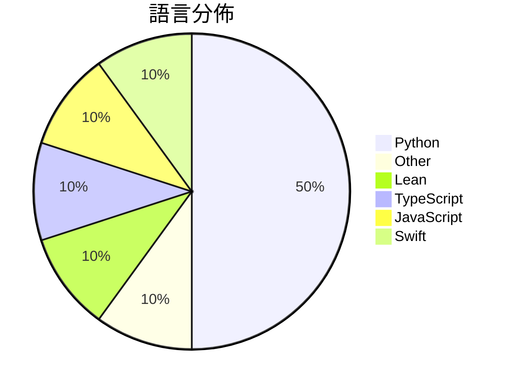

# GitHub Trending - 2026-09-13

> [!summary] 本日摘要
> 收錄 **10** 個新專案，合計 **12.2k** stars
> 語言分佈：Python (5) · Other (1) · Lean (1) · TypeScript (1) · JavaScript (1) · Swift (1)

> [!tip] 本週焦點
> **[[sdli1995--dlssg_for_sm86|sdli1995/dlssg_for_sm86]]** — 5 天內累積 2.2k stars（446 stars/天）
> Here is a dlssg for RTX30 Series GPU 



---

## 收錄列表

| # | 專案 | 分類 | Stars | 速度 | 安裝 | 語言 | 用途 |
| :--: | --- | --- | ---: | ---: | --- | --- | --- |
| 1 | [[sdli1995--dlssg_for_sm86\|sdli1995/dlssg_for_sm86]] |  | 2.2k | 446/天 |  | N/A | Here is a dlssg for RTX30 Series GPU  |
| 2 | [[openai--NavierStokesAndEuler\|openai/NavierStokesAndEuler]] |  | 1.8k | 459/天 |  | Lean | Lean certificates accompanying Navier-St |
| 3 | [[EverettFish--holo-card-studio\|EverettFish/holo-card-studio]] |  | 1.5k | 246/天 |  | Python | Turn the user's description or uploaded  |
| 4 | [[Edge0-AI--Edge0\|Edge0-AI/Edge0]] |  | 1.5k | 366/天 |  | Python |  |
| 5 | [[Vincentwei1021--anything2explainer\|Vincentwei1021/anything2explainer]] |  | 1.1k | 276/天 |  | TypeScript | Topic in, narrated explainer video out.  |
| 6 | [[achimala--dream-loop\|achimala/dream-loop]] |  | 927 | 185/天 |  | JavaScript | Agent skill for impressive 3D visuals us |
| 7 | [[jtydhr88--screenwriting-skills\|jtydhr88/screenwriting-skills]] |  | 915 | 153/天 |  | Python |  |
| 8 | [[gazijarin--itsgiving\|gazijarin/itsgiving]] |  | 793 | 159/天 |  | Python | Express yourself in meetings (with memes |
| 9 | [[SpaceDudem--text-humanizer\|SpaceDudem/text-humanizer]] |  | 708 | 177/天 |  | Python | text-humanizer is an open-source project |
| 10 | [[sumimakito--Mac-Duo\|sumimakito/Mac-Duo]] |  | 706 | 353/天 |  | Swift | Wish you could bring the iPhone Duo effe |

---

## 重點摘要

### 1. [[sdli1995--dlssg_for_sm86|sdli1995/dlssg_for_sm86]]

**2.2k** stars · **446** stars/天 · N/A

---

### 2. [[openai--NavierStokesAndEuler|openai/NavierStokesAndEuler]]

**1.8k** stars · **459** stars/天 · Lean

---

### 3. [[EverettFish--holo-card-studio|EverettFish/holo-card-studio]]

**1.5k** stars · **246** stars/天 · Python

---

### 4. [[Edge0-AI--Edge0|Edge0-AI/Edge0]]

**1.5k** stars · **366** stars/天 · Python

---

### 5. [[Vincentwei1021--anything2explainer|Vincentwei1021/anything2explainer]]

**1.1k** stars · **276** stars/天 · TypeScript

---

### 6. [[achimala--dream-loop|achimala/dream-loop]]

**927** stars · **185** stars/天 · JavaScript

---

### 7. [[jtydhr88--screenwriting-skills|jtydhr88/screenwriting-skills]]

**915** stars · **153** stars/天 · Python

---

### 8. [[gazijarin--itsgiving|gazijarin/itsgiving]]

**793** stars · **159** stars/天 · Python

---

### 9. [[SpaceDudem--text-humanizer|SpaceDudem/text-humanizer]]

**708** stars · **177** stars/天 · Python

---

### 10. [[sumimakito--Mac-Duo|sumimakito/Mac-Duo]]

**706** stars · **353** stars/天 · Swift

---

## 今日到期複習

> [!tip] 根據間隔複習排程，今天該回顧的專案

```dataview
TABLE
  stars_per_day AS "Stars/天",
  category AS "分類",
  engagement AS "參與度"
FROM "Repos"
WHERE next_review AND date(next_review) <= date("2026-09-13") AND status != "archived"
SORT priority DESC
```

## 待處理

```dataviewjs
const pending = dv.pages('"Repos"').where(p => p.status === "to-review").length;
const unrated = dv.pages('"Repos"').where(p => p.status !== "archived" && p.status !== "to-review" && (p.my_rating || 0) === 0).length;
const noVerdict = dv.pages('"Repos"').where(p => p.status !== "archived" && (p.my_rating || 0) > 0 && (!p.verdict || p.verdict === "")).length;
const items = [];
if (pending > 0) items.push(`**${pending}** 個待分流`);
if (unrated > 0) items.push(`**${unrated}** 個已讀但未評分`);
if (noVerdict > 0) items.push(`**${noVerdict}** 個已評分但無結論`);
if (items.length > 0) dv.paragraph(items.join(" / "));
else dv.paragraph("所有專案都已處理完畢！");
```
