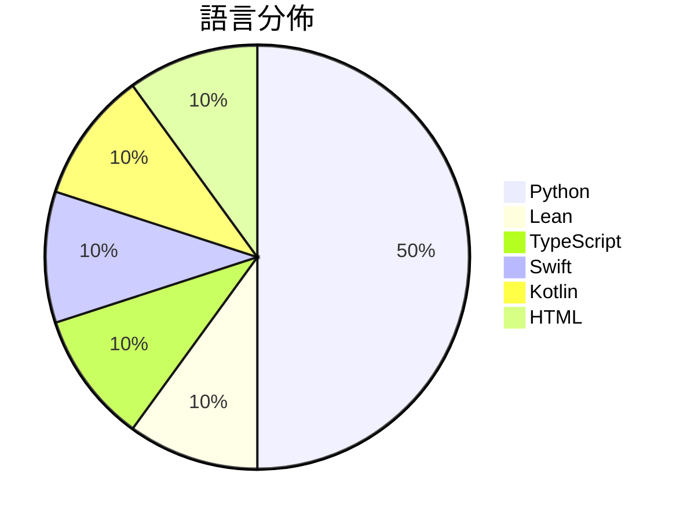

# GitHub Trending - 2026-09-15

> [!summary] 本日摘要
> 收錄 **10** 個新專案，合計 **10.6k** stars
> 語言分佈：Python (5) · Lean (1) · TypeScript (1) · Swift (1) · Kotlin (1) · HTML (1)

> [!tip] 本週焦點
> **[[openai--NavierStokesAndEuler|openai/NavierStokesAndEuler]]** — 6 天內累積 1.9k stars（316 stars/天）
> Lean certificates accompanying Navier-Stokes and Euler results



---

## 收錄列表

| # | 專案 | 分類 | Stars | 速度 | 安裝 | 語言 | 用途 |
| :--: | --- | --- | ---: | ---: | --- | --- | --- |
| 1 | [[openai--NavierStokesAndEuler\|openai/NavierStokesAndEuler]] |  | 1.9k | 316/天 |  | Lean | Lean certificates accompanying Navier-St |
| 2 | [[Edge0-AI--Edge0\|Edge0-AI/Edge0]] |  | 1.7k | 286/天 |  | Python |  |
| 3 | [[Vincentwei1021--anything2explainer\|Vincentwei1021/anything2explainer]] |  | 1.3k | 224/天 |  | TypeScript | Topic in, narrated explainer video out.  |
| 4 | [[sumimakito--Mac-Duo\|sumimakito/Mac-Duo]] |  | 876 | 219/天 |  | Swift | Wish you could bring the iPhone Duo effe |
| 5 | [[Chuloo--mural\|Chuloo/mural]] |  | 866 | 433/天 |  | Kotlin | The language app you eventually delete.  |
| 6 | [[gazijarin--itsgiving\|gazijarin/itsgiving]] |  | 847 | 121/天 |  | Python | Express yourself in meetings (with memes |
| 7 | [[kruzovic7--ai-data-extractor\|kruzovic7/ai-data-extractor]] |  | 813 | 271/天 |  | Python | Free open-source extractor for AI coding |
| 8 | [[yifanzhang-pro--recurrent-looped-tranformer\|yifanzhang-pro/recurrent-looped-tranformer]] |  | 763 | 382/天 |  | HTML | Official Project Page for Recurrent Loop |
| 9 | [[SpaceDudem--text-humanizer\|SpaceDudem/text-humanizer]] |  | 749 | 125/天 |  | Python | text-humanizer is an open-source project |
| 10 | [[Colafornia--short-video-generator-AI\|Colafornia/short-video-generator-AI]] |  | 738 | 123/天 |  | Python | Free open-source project designed for tu |

---

## 重點摘要

### 1. [[openai--NavierStokesAndEuler|openai/NavierStokesAndEuler]]

**1.9k** stars · **316** stars/天 · Lean

---

### 2. [[Edge0-AI--Edge0|Edge0-AI/Edge0]]

**1.7k** stars · **286** stars/天 · Python

---

### 3. [[Vincentwei1021--anything2explainer|Vincentwei1021/anything2explainer]]

**1.3k** stars · **224** stars/天 · TypeScript

---

### 4. [[sumimakito--Mac-Duo|sumimakito/Mac-Duo]]

**876** stars · **219** stars/天 · Swift

---

### 5. [[Chuloo--mural|Chuloo/mural]]

**866** stars · **433** stars/天 · Kotlin

---

### 6. [[gazijarin--itsgiving|gazijarin/itsgiving]]

**847** stars · **121** stars/天 · Python

---

### 7. [[kruzovic7--ai-data-extractor|kruzovic7/ai-data-extractor]]

**813** stars · **271** stars/天 · Python

---

### 8. [[yifanzhang-pro--recurrent-looped-tranformer|yifanzhang-pro/recurrent-looped-tranformer]]

**763** stars · **382** stars/天 · HTML

---

### 9. [[SpaceDudem--text-humanizer|SpaceDudem/text-humanizer]]

**749** stars · **125** stars/天 · Python

---

### 10. [[Colafornia--short-video-generator-AI|Colafornia/short-video-generator-AI]]

**738** stars · **123** stars/天 · Python

---

## 今日到期複習

> [!tip] 根據間隔複習排程，今天該回顧的專案

```dataview
TABLE
  stars_per_day AS "Stars/天",
  category AS "分類",
  engagement AS "參與度"
FROM "Repos"
WHERE next_review AND date(next_review) <= date("2026-09-15") AND status != "archived"
SORT priority DESC
```

## 待處理

```dataviewjs
const pending = dv.pages('"Repos"').where(p => p.status === "to-review").length;
const unrated = dv.pages('"Repos"').where(p => p.status !== "archived" && p.status !== "to-review" && (p.my_rating || 0) === 0).length;
const noVerdict = dv.pages('"Repos"').where(p => p.status !== "archived" && (p.my_rating || 0) > 0 && (!p.verdict || p.verdict === "")).length;
const items = [];
if (pending > 0) items.push(`**${pending}** 個待分流`);
if (unrated > 0) items.push(`**${unrated}** 個已讀但未評分`);
if (noVerdict > 0) items.push(`**${noVerdict}** 個已評分但無結論`);
if (items.length > 0) dv.paragraph(items.join(" / "));
else dv.paragraph("所有專案都已處理完畢！");
```
