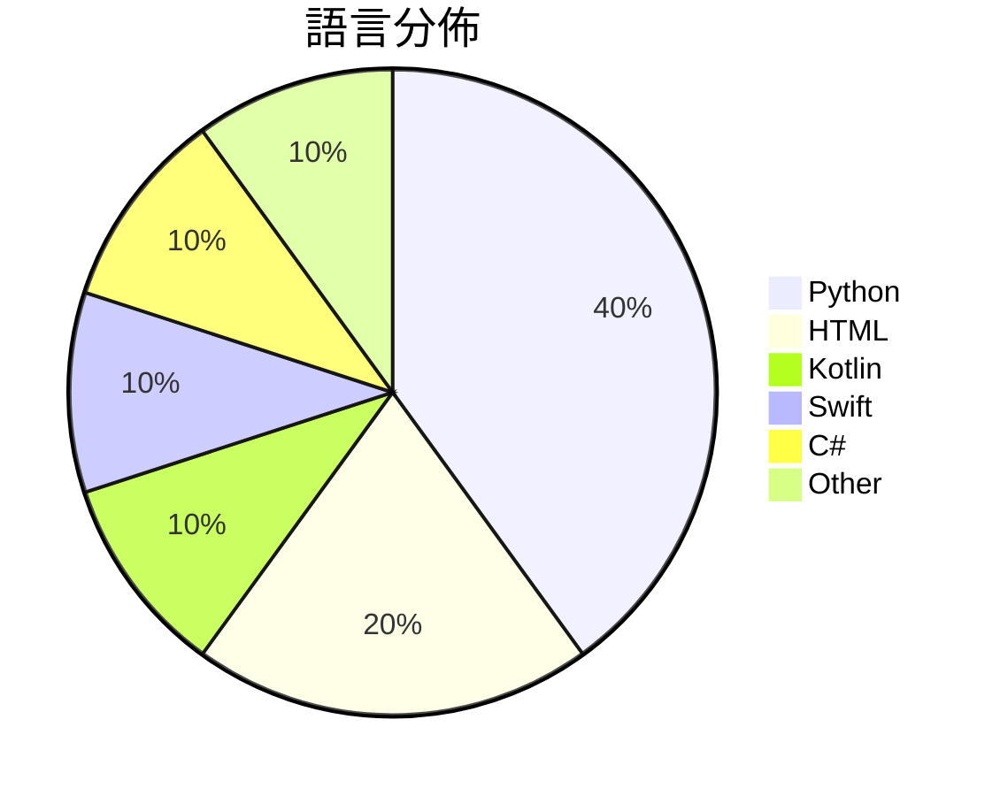

# GitHub Trending - 2026-09-16

> [!summary] 本日摘要
> 收錄 **10** 個新專案，合計 **8.2k** stars
> 語言分佈：Python (4) · HTML (2) · Kotlin (1) · Swift (1) · C# (1) · Other (1)

> [!tip] 本週焦點
> **[[Chuloo--mural|Chuloo/mural]]** — 3 天內累積 1.1k stars（360 stars/天）
> The language app you eventually delete. A native iPhone companion for learning through conversation.



---

## 收錄列表

| # | 專案 | 分類 | Stars | 速度 | 安裝 | 語言 | 用途 |
| :--: | --- | --- | ---: | ---: | --- | --- | --- |
| 1 | [[Chuloo--mural\|Chuloo/mural]] |  | 1.1k | 360/天 |  | Kotlin | The language app you eventually delete.  |
| 2 | [[ai-sucks-butt--ai-sucks-butt\|ai-sucks-butt/ai-sucks-butt]] |  | 1.0k | 515/天 |  | Python | If you think AI sucks, star the repo. |
| 3 | [[sumimakito--Mac-Duo\|sumimakito/Mac-Duo]] |  | 918 | 184/天 |  | Swift | Wish you could bring the iPhone Duo effe |
| 4 | [[yifanzhang-pro--recurrent-looped-tranformer\|yifanzhang-pro/recurrent-looped-tranformer]] |  | 837 | 279/天 |  | HTML | Official Project Page for Recurrent Loop |
| 5 | [[kruzovic7--ai-data-extractor\|kruzovic7/ai-data-extractor]] |  | 823 | 206/天 |  | Python | Free open-source extractor for AI coding |
| 6 | [[angusdevgo--IDM_Pro_Tool\|angusdevgo/IDM_Pro_Tool]] |  | 715 | 143/天 |  | C# | IDM激活与状态维护工具 |
| 7 | [[zjwzcx--Awesome-Astra-Embodied-AI\|zjwzcx/Awesome-Astra-Embodied-AI]] |  | 711 | 237/天 |  | N/A | GPT-6 Astra for embodied AI and robotics |
| 8 | [[eternityspring--reelbench-skills\|eternityspring/reelbench-skills]] |  | 698 | 140/天 |  | HTML | Learning notes and tooling skills for AI |
| 9 | [[nftechie--stonkfly\|nftechie/stonkfly]] |  | 693 | 116/天 |  | Python | A full retained fly-connectome simulatio |
| 10 | [[ArasTey--lunel\|ArasTey/lunel]] |  | 692 | 115/天 |  | Python |  |

---

## 重點摘要

### 1. [[Chuloo--mural|Chuloo/mural]]

**1.1k** stars · **360** stars/天 · Kotlin

---

### 2. [[ai-sucks-butt--ai-sucks-butt|ai-sucks-butt/ai-sucks-butt]]

**1.0k** stars · **515** stars/天 · Python

---

### 3. [[sumimakito--Mac-Duo|sumimakito/Mac-Duo]]

**918** stars · **184** stars/天 · Swift

---

### 4. [[yifanzhang-pro--recurrent-looped-tranformer|yifanzhang-pro/recurrent-looped-tranformer]]

**837** stars · **279** stars/天 · HTML

---

### 5. [[kruzovic7--ai-data-extractor|kruzovic7/ai-data-extractor]]

**823** stars · **206** stars/天 · Python

---

### 6. [[angusdevgo--IDM_Pro_Tool|angusdevgo/IDM_Pro_Tool]]

**715** stars · **143** stars/天 · C#

---

### 7. [[zjwzcx--Awesome-Astra-Embodied-AI|zjwzcx/Awesome-Astra-Embodied-AI]]

**711** stars · **237** stars/天 · N/A

---

### 8. [[eternityspring--reelbench-skills|eternityspring/reelbench-skills]]

**698** stars · **140** stars/天 · HTML

---

### 9. [[nftechie--stonkfly|nftechie/stonkfly]]

**693** stars · **116** stars/天 · Python

---

### 10. [[ArasTey--lunel|ArasTey/lunel]]

**692** stars · **115** stars/天 · Python

---

## 今日到期複習

> [!tip] 根據間隔複習排程，今天該回顧的專案

```dataview
TABLE
  stars_per_day AS "Stars/天",
  category AS "分類",
  engagement AS "參與度"
FROM "Repos"
WHERE next_review AND date(next_review) <= date("2026-09-16") AND status != "archived"
SORT priority DESC
```

## 待處理

```dataviewjs
const pending = dv.pages('"Repos"').where(p => p.status === "to-review").length;
const unrated = dv.pages('"Repos"').where(p => p.status !== "archived" && p.status !== "to-review" && (p.my_rating || 0) === 0).length;
const noVerdict = dv.pages('"Repos"').where(p => p.status !== "archived" && (p.my_rating || 0) > 0 && (!p.verdict || p.verdict === "")).length;
const items = [];
if (pending > 0) items.push(`**${pending}** 個待分流`);
if (unrated > 0) items.push(`**${unrated}** 個已讀但未評分`);
if (noVerdict > 0) items.push(`**${noVerdict}** 個已評分但無結論`);
if (items.length > 0) dv.paragraph(items.join(" / "));
else dv.paragraph("所有專案都已處理完畢！");
```
