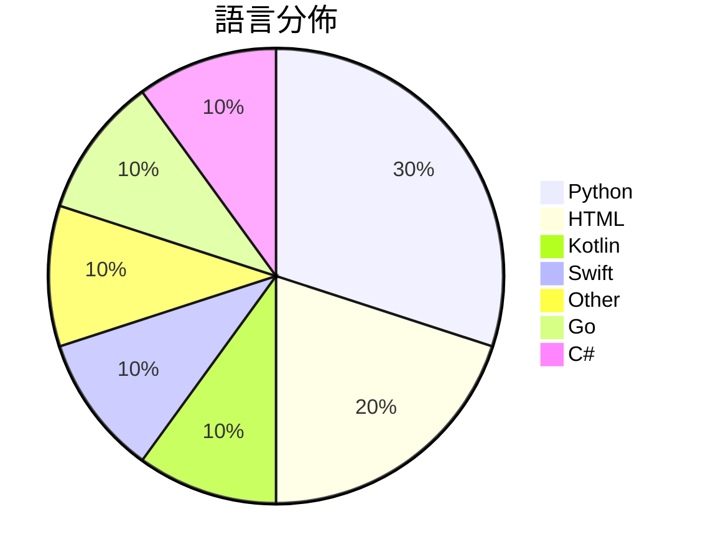

# GitHub Trending - 2026-09-17

> [!summary] 本日摘要
> 收錄 **10** 個新專案，合計 **9.7k** stars
> 語言分佈：Python (3) · HTML (2) · Kotlin (1) · Swift (1) · Other (1) · Go (1) · C# (1)

> [!tip] 本週焦點
> **[[ai-sucks-butt--ai-sucks-butt|ai-sucks-butt/ai-sucks-butt]]** — 3 天內累積 2.0k stars（680 stars/天）
> If you think AI sucks, star the repo.



---

## 收錄列表

| # | 專案 | 分類 | Stars | 速度 | 安裝 | 語言 | 用途 |
| :--: | --- | --- | ---: | ---: | --- | --- | --- |
| 1 | [[ai-sucks-butt--ai-sucks-butt\|ai-sucks-butt/ai-sucks-butt]] |  | 2.0k | 680/天 |  | Python | If you think AI sucks, star the repo. |
| 2 | [[Chuloo--mural\|Chuloo/mural]] |  | 1.3k | 318/天 |  | Kotlin | The language app you eventually delete.  |
| 3 | [[sumimakito--Mac-Duo\|sumimakito/Mac-Duo]] |  | 952 | 159/天 |  | Swift | Wish you could bring the iPhone Duo effe |
| 4 | [[yifanzhang-pro--recurrent-looped-tranformer\|yifanzhang-pro/recurrent-looped-tranformer]] |  | 863 | 216/天 |  | HTML | Official Project Page for Recurrent Loop |
| 5 | [[kruzovic7--ai-data-extractor\|kruzovic7/ai-data-extractor]] |  | 827 | 165/天 |  | Python | Free open-source extractor for AI coding |
| 6 | [[zjwzcx--Awesome-Astra-Embodied-AI\|zjwzcx/Awesome-Astra-Embodied-AI]] |  | 790 | 198/天 |  | N/A | GPT-6 Astra for embodied AI and robotics |
| 7 | [[unstablebuild--rune\|unstablebuild/rune]] |  | 756 | 126/天 |  | Go | the development environment for pros |
| 8 | [[angusdevgo--IDM_Pro_Tool\|angusdevgo/IDM_Pro_Tool]] |  | 722 | 120/天 |  | C# | IDM激活与状态维护工具 |
| 9 | [[nftechie--stonkfly\|nftechie/stonkfly]] |  | 722 | 103/天 |  | Python | A full retained fly-connectome simulatio |
| 10 | [[eternityspring--reelbench-skills\|eternityspring/reelbench-skills]] |  | 709 | 118/天 |  | HTML | Learning notes and tooling skills for AI |

---

## 重點摘要

### 1. [[ai-sucks-butt--ai-sucks-butt|ai-sucks-butt/ai-sucks-butt]]

**2.0k** stars · **680** stars/天 · Python

---

### 2. [[Chuloo--mural|Chuloo/mural]]

**1.3k** stars · **318** stars/天 · Kotlin

---

### 3. [[sumimakito--Mac-Duo|sumimakito/Mac-Duo]]

**952** stars · **159** stars/天 · Swift

---

### 4. [[yifanzhang-pro--recurrent-looped-tranformer|yifanzhang-pro/recurrent-looped-tranformer]]

**863** stars · **216** stars/天 · HTML

---

### 5. [[kruzovic7--ai-data-extractor|kruzovic7/ai-data-extractor]]

**827** stars · **165** stars/天 · Python

---

### 6. [[zjwzcx--Awesome-Astra-Embodied-AI|zjwzcx/Awesome-Astra-Embodied-AI]]

**790** stars · **198** stars/天 · N/A

---

### 7. [[unstablebuild--rune|unstablebuild/rune]]

**756** stars · **126** stars/天 · Go

---

### 8. [[angusdevgo--IDM_Pro_Tool|angusdevgo/IDM_Pro_Tool]]

**722** stars · **120** stars/天 · C#

---

### 9. [[nftechie--stonkfly|nftechie/stonkfly]]

**722** stars · **103** stars/天 · Python

---

### 10. [[eternityspring--reelbench-skills|eternityspring/reelbench-skills]]

**709** stars · **118** stars/天 · HTML

---

## 今日到期複習

> [!tip] 根據間隔複習排程，今天該回顧的專案

```dataview
TABLE
  stars_per_day AS "Stars/天",
  category AS "分類",
  engagement AS "參與度"
FROM "Repos"
WHERE next_review AND date(next_review) <= date("2026-09-17") AND status != "archived"
SORT priority DESC
```

## 待處理

```dataviewjs
const pending = dv.pages('"Repos"').where(p => p.status === "to-review").length;
const unrated = dv.pages('"Repos"').where(p => p.status !== "archived" && p.status !== "to-review" && (p.my_rating || 0) === 0).length;
const noVerdict = dv.pages('"Repos"').where(p => p.status !== "archived" && (p.my_rating || 0) > 0 && (!p.verdict || p.verdict === "")).length;
const items = [];
if (pending > 0) items.push(`**${pending}** 個待分流`);
if (unrated > 0) items.push(`**${unrated}** 個已讀但未評分`);
if (noVerdict > 0) items.push(`**${noVerdict}** 個已評分但無結論`);
if (items.length > 0) dv.paragraph(items.join(" / "));
else dv.paragraph("所有專案都已處理完畢！");
```
