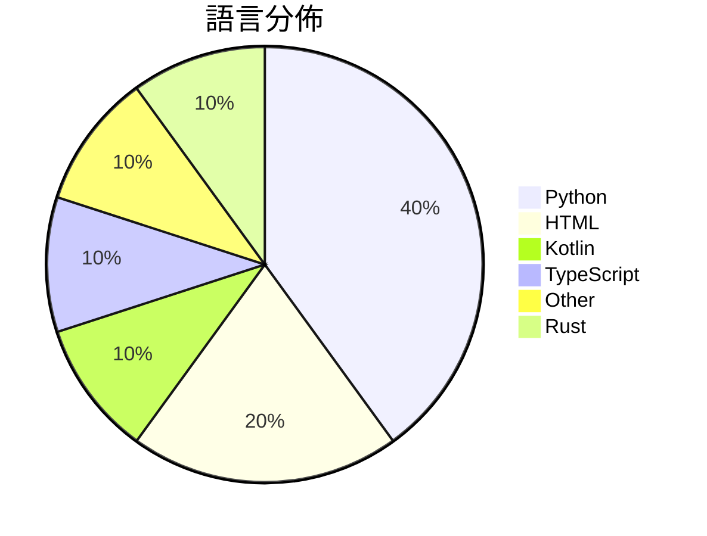

# GitHub Trending - 2026-09-18

> [!summary] 本日摘要
> 收錄 **10** 個新專案，合計 **11.1k** stars
> 語言分佈：Python (4) · HTML (2) · Kotlin (1) · TypeScript (1) · Other (1) · Rust (1)

> [!tip] 本週焦點
> **[[browser-use--jev-ultrafast|browser-use/jev-ultrafast]]** — 1 天內累積 2.9k stars（2.9k stars/天）
> i. am. speed.



---

## 收錄列表

| # | 專案 | 分類 | Stars | 速度 | 安裝 | 語言 | 用途 |
| :--: | --- | --- | ---: | ---: | --- | --- | --- |
| 1 | [[browser-use--jev-ultrafast\|browser-use/jev-ultrafast]] |  | 2.9k | 2.9k/天 |  | Python | i. am. speed. |
| 2 | [[Chuloo--mural\|Chuloo/mural]] |  | 1.3k | 265/天 |  | Kotlin | The language app you eventually delete.  |
| 3 | [[tamaratran--fast-jev-compaction\|tamaratran/fast-jev-compaction]] |  | 1.2k | 1.2k/天 |  | TypeScript | Claude Code plugin that replaces the com |
| 4 | [[TheoLeeCJ--openjev\|TheoLeeCJ/openjev]] |  | 963 | 482/天 |  | Python | Can we run something like Jev on a 3090  |
| 5 | [[yifanzhang-pro--recurrent-looped-tranformer\|yifanzhang-pro/recurrent-looped-tranformer]] |  | 874 | 175/天 |  | HTML | Official Project Page for Recurrent Loop |
| 6 | [[zjwzcx--Awesome-Astra-Embodied-AI\|zjwzcx/Awesome-Astra-Embodied-AI]] |  | 839 | 168/天 |  | N/A | GPT-6 Astra for embodied AI and robotics |
| 7 | [[kruzovic7--ai-data-extractor\|kruzovic7/ai-data-extractor]] |  | 836 | 139/天 |  | Python | Free open-source extractor for AI coding |
| 8 | [[agentverse-os--AgentVerse-OS\|agentverse-os/AgentVerse-OS]] |  | 756 | 151/天 |  | Rust | Personal cloud OS for a developer and th |
| 9 | [[eternityspring--reelbench-skills\|eternityspring/reelbench-skills]] |  | 736 | 105/天 |  | HTML | Learning notes and tooling skills for AI |
| 10 | [[vinnylarouge--jevlike\|vinnylarouge/jevlike]] |  | 728 | 728/天 |  | Python |  |

---

## 重點摘要

### 1. [[browser-use--jev-ultrafast|browser-use/jev-ultrafast]]

**2.9k** stars · **2.9k** stars/天 · Python

---

### 2. [[Chuloo--mural|Chuloo/mural]]

**1.3k** stars · **265** stars/天 · Kotlin

---

### 3. [[tamaratran--fast-jev-compaction|tamaratran/fast-jev-compaction]]

**1.2k** stars · **1.2k** stars/天 · TypeScript

---

### 4. [[TheoLeeCJ--openjev|TheoLeeCJ/openjev]]

**963** stars · **482** stars/天 · Python

---

### 5. [[yifanzhang-pro--recurrent-looped-tranformer|yifanzhang-pro/recurrent-looped-tranformer]]

**874** stars · **175** stars/天 · HTML

---

### 6. [[zjwzcx--Awesome-Astra-Embodied-AI|zjwzcx/Awesome-Astra-Embodied-AI]]

**839** stars · **168** stars/天 · N/A

---

### 7. [[kruzovic7--ai-data-extractor|kruzovic7/ai-data-extractor]]

**836** stars · **139** stars/天 · Python

---

### 8. [[agentverse-os--AgentVerse-OS|agentverse-os/AgentVerse-OS]]

**756** stars · **151** stars/天 · Rust

---

### 9. [[eternityspring--reelbench-skills|eternityspring/reelbench-skills]]

**736** stars · **105** stars/天 · HTML

---

### 10. [[vinnylarouge--jevlike|vinnylarouge/jevlike]]

**728** stars · **728** stars/天 · Python

---

## 今日到期複習

> [!tip] 根據間隔複習排程，今天該回顧的專案

```dataview
TABLE
  stars_per_day AS "Stars/天",
  category AS "分類",
  engagement AS "參與度"
FROM "Repos"
WHERE next_review AND date(next_review) <= date("2026-09-18") AND status != "archived"
SORT priority DESC
```

## 待處理

```dataviewjs
const pending = dv.pages('"Repos"').where(p => p.status === "to-review").length;
const unrated = dv.pages('"Repos"').where(p => p.status !== "archived" && p.status !== "to-review" && (p.my_rating || 0) === 0).length;
const noVerdict = dv.pages('"Repos"').where(p => p.status !== "archived" && (p.my_rating || 0) > 0 && (!p.verdict || p.verdict === "")).length;
const items = [];
if (pending > 0) items.push(`**${pending}** 個待分流`);
if (unrated > 0) items.push(`**${unrated}** 個已讀但未評分`);
if (noVerdict > 0) items.push(`**${noVerdict}** 個已評分但無結論`);
if (items.length > 0) dv.paragraph(items.join(" / "));
else dv.paragraph("所有專案都已處理完畢！");
```
