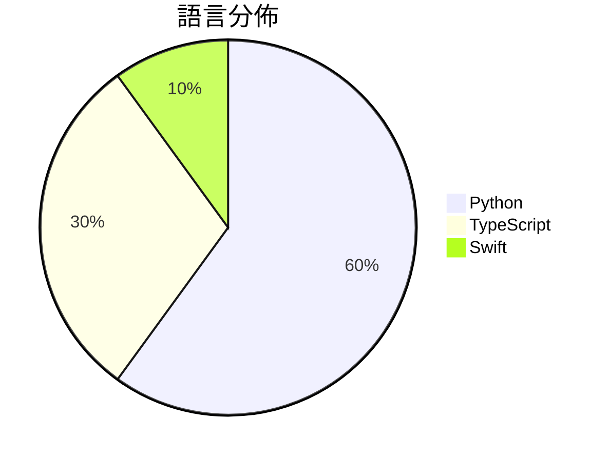

# GitHub Trending - 2026-09-21

> [!summary] 本日摘要
> 收錄 **10** 個新專案，合計 **40.9k** stars
> 語言分佈：Python (6) · TypeScript (3) · Swift (1)

> [!tip] 本週焦點
> **[[browser-use--jev-ultrafast|browser-use/jev-ultrafast]]** — 4 天內累積 12.9k stars（3.2k stars/天）
> i. am. speed.



---

## 收錄列表

| # | 專案 | 分類 | Stars | 速度 | 安裝 | 語言 | 用途 |
| :--: | --- | --- | ---: | ---: | --- | --- | --- |
| 1 | [[browser-use--jev-ultrafast\|browser-use/jev-ultrafast]] |  | 12.9k | 3.2k/天 |  | Python | i. am. speed. |
| 2 | [[tamaratran--fast-jev-compaction\|tamaratran/fast-jev-compaction]] |  | 5.4k | 1.8k/天 |  | TypeScript | Claude Code plugin that replaces the com |
| 3 | [[NandhaKishorM--laya\|NandhaKishorM/laya]] |  | 5.4k | 1.8k/天 |  | Python |  |
| 4 | [[robbietilton--Compositor\|robbietilton/Compositor]] |  | 3.8k | 959/天 |  | Swift | The Photoshop alternative for Mac |
| 5 | [[zai-org--ZCode\|zai-org/ZCode]] |  | 3.5k | 3.5k/天 |  | TypeScript | Z.ai's coding agent harness. Powerful, i |
| 6 | [[TheoLeeCJ--SemIf\|TheoLeeCJ/SemIf]] |  | 2.6k | 516/天 |  | Python | Semantic ifs from open models, on a 3090 |
| 7 | [[mcncarl--jianying-headless\|mcncarl/jianying-headless]] |  | 2.1k | 423/天 |  | Python | Private source preview: native Jianying  |
| 8 | [[mizorewww--laya-mlx\|mizorewww/laya-mlx]] |  | 2.0k | 2.0k/天 |  | Python | Native MLX runtime for Laya typed decisi |
| 9 | [[jarrodwatts--jev-trader\|jarrodwatts/jev-trader]] |  | 1.6k | 401/天 |  | TypeScript | One AI trade decision every Monad block. |
| 10 | [[TianyuCodings--NanoJev\|TianyuCodings/NanoJev]] |  | 1.6k | 521/天 |  | Python | A nano replica of Jev: parallel decision |

---

## 重點摘要

### 1. [[browser-use--jev-ultrafast|browser-use/jev-ultrafast]]

**12.9k** stars · **3.2k** stars/天 · Python

---

### 2. [[tamaratran--fast-jev-compaction|tamaratran/fast-jev-compaction]]

**5.4k** stars · **1.8k** stars/天 · TypeScript

---

### 3. [[NandhaKishorM--laya|NandhaKishorM/laya]]

**5.4k** stars · **1.8k** stars/天 · Python

---

### 4. [[robbietilton--Compositor|robbietilton/Compositor]]

**3.8k** stars · **959** stars/天 · Swift

---

### 5. [[zai-org--ZCode|zai-org/ZCode]]

**3.5k** stars · **3.5k** stars/天 · TypeScript

---

### 6. [[TheoLeeCJ--SemIf|TheoLeeCJ/SemIf]]

**2.6k** stars · **516** stars/天 · Python

---

### 7. [[mcncarl--jianying-headless|mcncarl/jianying-headless]]

**2.1k** stars · **423** stars/天 · Python

---

### 8. [[mizorewww--laya-mlx|mizorewww/laya-mlx]]

**2.0k** stars · **2.0k** stars/天 · Python

---

### 9. [[jarrodwatts--jev-trader|jarrodwatts/jev-trader]]

**1.6k** stars · **401** stars/天 · TypeScript

---

### 10. [[TianyuCodings--NanoJev|TianyuCodings/NanoJev]]

**1.6k** stars · **521** stars/天 · Python

---

## 今日到期複習

> [!tip] 根據間隔複習排程，今天該回顧的專案

```dataview
TABLE
  stars_per_day AS "Stars/天",
  category AS "分類",
  engagement AS "參與度"
FROM "Repos"
WHERE next_review AND date(next_review) <= date("2026-09-21") AND status != "archived"
SORT priority DESC
```

## 待處理

```dataviewjs
const pending = dv.pages('"Repos"').where(p => p.status === "to-review").length;
const unrated = dv.pages('"Repos"').where(p => p.status !== "archived" && p.status !== "to-review" && (p.my_rating || 0) === 0).length;
const noVerdict = dv.pages('"Repos"').where(p => p.status !== "archived" && (p.my_rating || 0) > 0 && (!p.verdict || p.verdict === "")).length;
const items = [];
if (pending > 0) items.push(`**${pending}** 個待分流`);
if (unrated > 0) items.push(`**${unrated}** 個已讀但未評分`);
if (noVerdict > 0) items.push(`**${noVerdict}** 個已評分但無結論`);
if (items.length > 0) dv.paragraph(items.join(" / "));
else dv.paragraph("所有專案都已處理完畢！");
```
