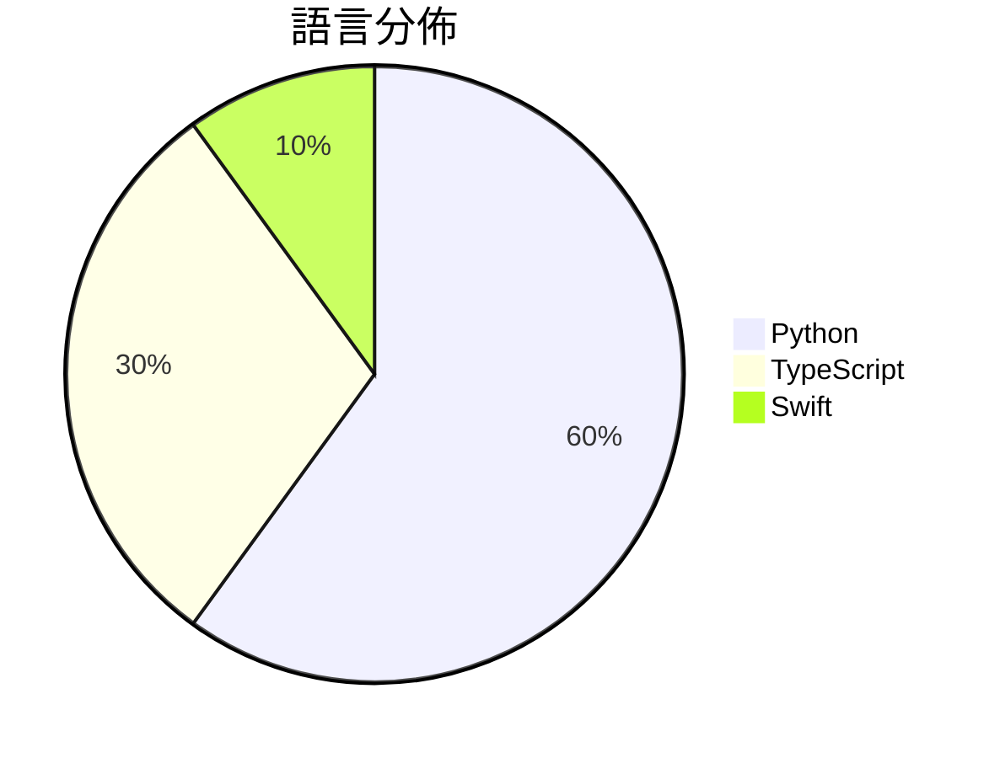

# GitHub Trending - 2026-09-22

> [!summary] 本日摘要
> 收錄 **10** 個新專案，合計 **59.4k** stars
> 語言分佈：Python (6) · TypeScript (3) · Swift (1)

> [!tip] 本週焦點
> **[[browser-use--jev-ultrafast|browser-use/jev-ultrafast]]** — 5 天內累積 16.5k stars（3.3k stars/天）
> Fastest and cheapest web agent



---

## 收錄列表

| # | 專案 | 分類 | Stars | 速度 | 安裝 | 語言 | 用途 |
| :--: | --- | --- | ---: | ---: | --- | --- | --- |
| 1 | [[browser-use--jev-ultrafast\|browser-use/jev-ultrafast]] |  | 16.5k | 3.3k/天 |  | Python | Fastest and cheapest web agent |
| 2 | [[NandhaKishorM--laya\|NandhaKishorM/laya]] |  | 11.8k | 3.0k/天 |  | Python |  |
| 3 | [[tamaratran--fast-jev-compaction\|tamaratran/fast-jev-compaction]] |  | 6.1k | 1.5k/天 |  | TypeScript | Claude Code plugin that replaces the com |
| 4 | [[zai-org--ZCode\|zai-org/ZCode]] |  | 5.9k | 5.9k/天 |  | TypeScript | Z.ai's coding agent harness. Powerful, i |
| 5 | [[robbietilton--Compositor\|robbietilton/Compositor]] |  | 4.5k | 904/天 |  | Swift | The Photoshop alternative for Mac |
| 6 | [[mizorewww--laya-mlx\|mizorewww/laya-mlx]] |  | 4.3k | 2.1k/天 |  | Python | Native MLX runtime for Laya typed decisi |
| 7 | [[TheoLeeCJ--SemIf\|TheoLeeCJ/SemIf]] |  | 3.4k | 564/天 |  | Python | Semantic ifs from open models, on a 3090 |
| 8 | [[jaredpalmer--kev\|jaredpalmer/kev]] |  | 2.7k | 670/天 |  | Python | tiny Jev-like family of decision models  |
| 9 | [[mcncarl--jianying-headless\|mcncarl/jianying-headless]] |  | 2.4k | 402/天 |  | Python | Private source preview: native Jianying  |
| 10 | [[jarrodwatts--jev-trader\|jarrodwatts/jev-trader]] |  | 1.9k | 378/天 |  | TypeScript | One AI trade decision every Monad block. |

---

## 重點摘要

### 1. [[browser-use--jev-ultrafast|browser-use/jev-ultrafast]]

**16.5k** stars · **3.3k** stars/天 · Python

---

### 2. [[NandhaKishorM--laya|NandhaKishorM/laya]]

**11.8k** stars · **3.0k** stars/天 · Python

---

### 3. [[tamaratran--fast-jev-compaction|tamaratran/fast-jev-compaction]]

**6.1k** stars · **1.5k** stars/天 · TypeScript

---

### 4. [[zai-org--ZCode|zai-org/ZCode]]

**5.9k** stars · **5.9k** stars/天 · TypeScript

---

### 5. [[robbietilton--Compositor|robbietilton/Compositor]]

**4.5k** stars · **904** stars/天 · Swift

---

### 6. [[mizorewww--laya-mlx|mizorewww/laya-mlx]]

**4.3k** stars · **2.1k** stars/天 · Python

---

### 7. [[TheoLeeCJ--SemIf|TheoLeeCJ/SemIf]]

**3.4k** stars · **564** stars/天 · Python

---

### 8. [[jaredpalmer--kev|jaredpalmer/kev]]

**2.7k** stars · **670** stars/天 · Python

---

### 9. [[mcncarl--jianying-headless|mcncarl/jianying-headless]]

**2.4k** stars · **402** stars/天 · Python

---

### 10. [[jarrodwatts--jev-trader|jarrodwatts/jev-trader]]

**1.9k** stars · **378** stars/天 · TypeScript

---

## 今日到期複習

> [!tip] 根據間隔複習排程，今天該回顧的專案

```dataview
TABLE
  stars_per_day AS "Stars/天",
  category AS "分類",
  engagement AS "參與度"
FROM "Repos"
WHERE next_review AND date(next_review) <= date("2026-09-22") AND status != "archived"
SORT priority DESC
```

## 待處理

```dataviewjs
const pending = dv.pages('"Repos"').where(p => p.status === "to-review").length;
const unrated = dv.pages('"Repos"').where(p => p.status !== "archived" && p.status !== "to-review" && (p.my_rating || 0) === 0).length;
const noVerdict = dv.pages('"Repos"').where(p => p.status !== "archived" && (p.my_rating || 0) > 0 && (!p.verdict || p.verdict === "")).length;
const items = [];
if (pending > 0) items.push(`**${pending}** 個待分流`);
if (unrated > 0) items.push(`**${unrated}** 個已讀但未評分`);
if (noVerdict > 0) items.push(`**${noVerdict}** 個已評分但無結論`);
if (items.length > 0) dv.paragraph(items.join(" / "));
else dv.paragraph("所有專案都已處理完畢！");
```
