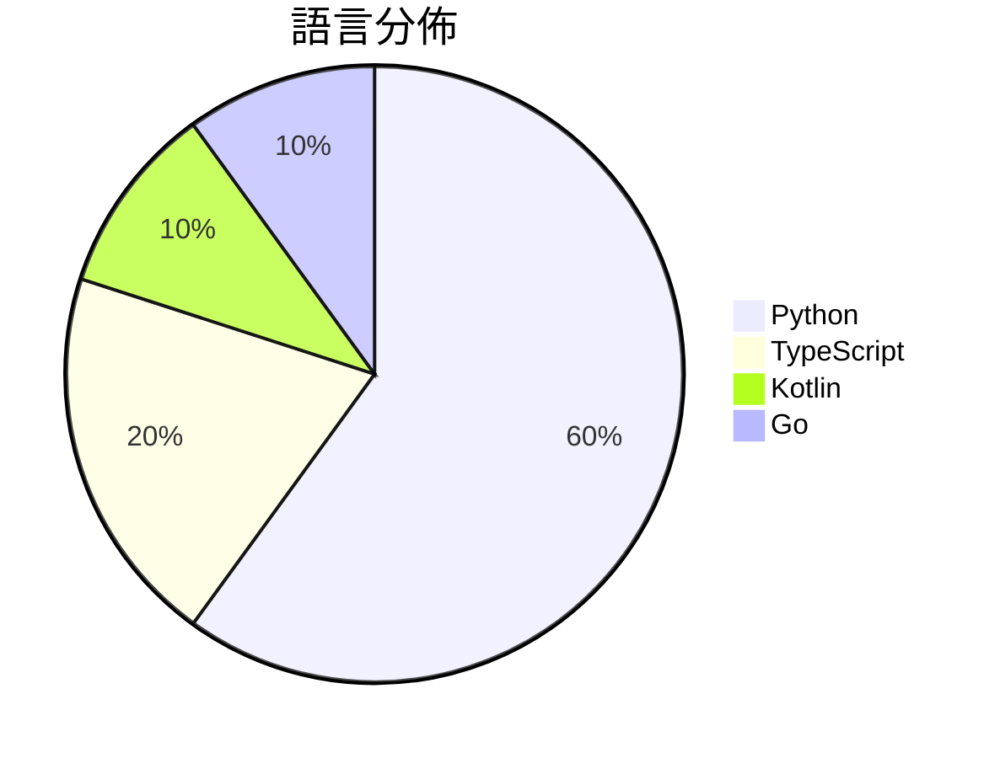

# GitHub Trending - 2026-09-24

> [!summary] 本日摘要
> 收錄 **10** 個新專案，合計 **59.2k** stars
> 語言分佈：Python (6) · TypeScript (2) · Kotlin (1) · Go (1)

> [!tip] 本週焦點
> **[[NandhaKishorM--laya|NandhaKishorM/laya]]** — 6 天內累積 21.1k stars（3.5k stars/天）
> Non-autoregressive System 1 decision engine. Typed choice, score and yes/no decisions over any text in a single forward pass, in 100+ languages, with a router that picks the right checkpoint per request.



---

## 收錄列表

| # | 專案 | 分類 | Stars | 速度 | 安裝 | 語言 | 用途 |
| :--: | --- | --- | ---: | ---: | --- | --- | --- |
| 1 | [[NandhaKishorM--laya\|NandhaKishorM/laya]] |  | 21.1k | 3.5k/天 |  | Python | Non-autoregressive System 1 decision eng |
| 2 | [[tamaratran--fast-jev-compaction\|tamaratran/fast-jev-compaction]] |  | 6.6k | 1.1k/天 |  | TypeScript | Claude Code plugin that replaces the com |
| 3 | [[zai-org--ZCode\|zai-org/ZCode]] |  | 6.6k | 2.2k/天 |  | TypeScript | Z.ai's coding agent harness. Powerful, i |
| 4 | [[jaredpalmer--kev\|jaredpalmer/kev]] |  | 6.2k | 1.0k/天 |  | Python | tiny Jev-like family of decision models  |
| 5 | [[mizorewww--laya-mlx\|mizorewww/laya-mlx]] |  | 6.0k | 1.5k/天 |  | Python | Native MLX runtime for Laya typed decisi |
| 6 | [[jev-chat--jev-chat-jarvis\|jev-chat/jev-chat-jarvis]] |  | 5.4k | 2.7k/天 |  | Kotlin | 装在手机上的对话副驾：在微信 / QQ / X / 飞书里读懂对方、给出候选回复 |
| 7 | [[TianyuCodings--NanoJev\|TianyuCodings/NanoJev]] |  | 2.1k | 356/天 |  | Python | A nano replica of Jev: parallel decision |
| 8 | [[unreallabsai--unreal-agent\|unreallabsai/unreal-agent]] |  | 1.8k | 888/天 |  | Go | Async-first agent harness |
| 9 | [[bespokelabsai--nimble\|bespokelabsai/nimble]] |  | 1.7k | 340/天 |  | Python | Local typed decisions, contrastive data  |
| 10 | [[yibie--awesome-jev\|yibie/awesome-jev]] |  | 1.5k | 255/天 |  | Python | A curated list of public projects, integ |

---

## 重點摘要

### 1. [[NandhaKishorM--laya|NandhaKishorM/laya]]

**21.1k** stars · **3.5k** stars/天 · Python

---

### 2. [[tamaratran--fast-jev-compaction|tamaratran/fast-jev-compaction]]

**6.6k** stars · **1.1k** stars/天 · TypeScript

---

### 3. [[zai-org--ZCode|zai-org/ZCode]]

**6.6k** stars · **2.2k** stars/天 · TypeScript

---

### 4. [[jaredpalmer--kev|jaredpalmer/kev]]

**6.2k** stars · **1.0k** stars/天 · Python

---

### 5. [[mizorewww--laya-mlx|mizorewww/laya-mlx]]

**6.0k** stars · **1.5k** stars/天 · Python

---

### 6. [[jev-chat--jev-chat-jarvis|jev-chat/jev-chat-jarvis]]

**5.4k** stars · **2.7k** stars/天 · Kotlin

---

### 7. [[TianyuCodings--NanoJev|TianyuCodings/NanoJev]]

**2.1k** stars · **356** stars/天 · Python

---

### 8. [[unreallabsai--unreal-agent|unreallabsai/unreal-agent]]

**1.8k** stars · **888** stars/天 · Go

---

### 9. [[bespokelabsai--nimble|bespokelabsai/nimble]]

**1.7k** stars · **340** stars/天 · Python

---

### 10. [[yibie--awesome-jev|yibie/awesome-jev]]

**1.5k** stars · **255** stars/天 · Python

---

## 今日到期複習

> [!tip] 根據間隔複習排程，今天該回顧的專案

```dataview
TABLE
  stars_per_day AS "Stars/天",
  category AS "分類",
  engagement AS "參與度"
FROM "Repos"
WHERE next_review AND date(next_review) <= date("2026-09-24") AND status != "archived"
SORT priority DESC
```

## 待處理

```dataviewjs
const pending = dv.pages('"Repos"').where(p => p.status === "to-review").length;
const unrated = dv.pages('"Repos"').where(p => p.status !== "archived" && p.status !== "to-review" && (p.my_rating || 0) === 0).length;
const noVerdict = dv.pages('"Repos"').where(p => p.status !== "archived" && (p.my_rating || 0) > 0 && (!p.verdict || p.verdict === "")).length;
const items = [];
if (pending > 0) items.push(`**${pending}** 個待分流`);
if (unrated > 0) items.push(`**${unrated}** 個已讀但未評分`);
if (noVerdict > 0) items.push(`**${noVerdict}** 個已評分但無結論`);
if (items.length > 0) dv.paragraph(items.join(" / "));
else dv.paragraph("所有專案都已處理完畢！");
```
