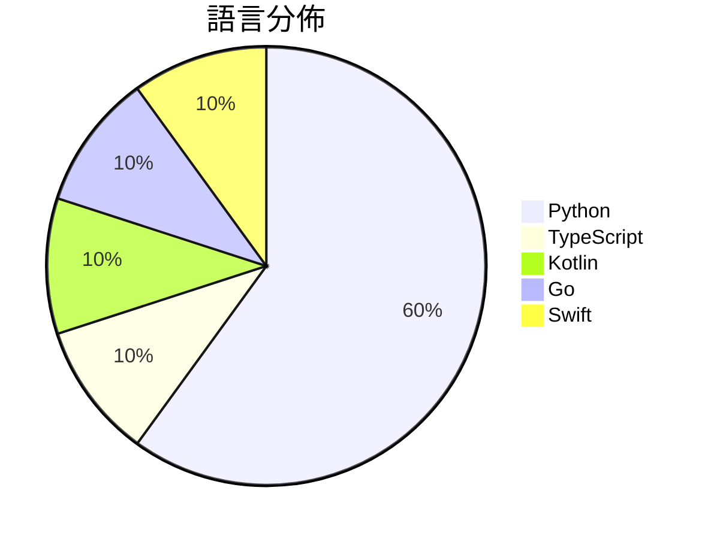

# GitHub Trending - 2026-09-25

> [!summary] 本日摘要
> 收錄 **10** 個新專案，合計 **51.4k** stars
> 語言分佈：Python (6) · TypeScript (1) · Kotlin (1) · Go (1) · Swift (1)

> [!tip] 本週焦點
> **[[NandhaKishorM--laya|NandhaKishorM/laya]]** — 7 天內累積 23.4k stars（3.3k stars/天）
> Non-autoregressive System 1 decision engine. Typed choice, score and yes/no decisions over any text in a single forward pass, in 100+ languages, with a router that picks the right checkpoint per request.



---

## 收錄列表

| # | 專案 | 分類 | Stars | 速度 | 安裝 | 語言 | 用途 |
| :--: | --- | --- | ---: | ---: | --- | --- | --- |
| 1 | [[NandhaKishorM--laya\|NandhaKishorM/laya]] |  | 23.4k | 3.3k/天 |  | Python | Non-autoregressive System 1 decision eng |
| 2 | [[zai-org--ZCode\|zai-org/ZCode]] |  | 6.7k | 1.7k/天 |  | TypeScript | Z.ai's coding agent harness. Powerful, i |
| 3 | [[mizorewww--laya-mlx\|mizorewww/laya-mlx]] |  | 6.2k | 1.3k/天 |  | Python | Native MLX runtime for Laya typed decisi |
| 4 | [[jev-chat--jev-chat-jarvis\|jev-chat/jev-chat-jarvis]] |  | 6.2k | 2.1k/天 |  | Kotlin | 装在手机上的对话副驾：在 QQ / X / 飞书里读懂对方、给出候选回复、一键填 |
| 5 | [[unreallabsai--unreal-agent\|unreallabsai/unreal-agent]] |  | 1.9k | 628/天 |  | Go | Async-first agent harness |
| 6 | [[bespokelabsai--nimble\|bespokelabsai/nimble]] |  | 1.7k | 291/天 |  | Python | Local typed decisions, contrastive data  |
| 7 | [[mizorewww--laya-coreml\|mizorewww/laya-coreml]] |  | 1.4k | 288/天 |  | Python | Local Laya typed decisions on Apple Core |
| 8 | [[newliver666--apk-reverse\|newliver666/apk-reverse]] |  | 1.4k | 286/天 |  | Python | Suitable for Android APK reverse enginee |
| 9 | [[driceroland--Search\|driceroland/Search]] |  | 1.3k | 321/天 |  | Swift | A small, fast WebKit browser for macOS,  |
| 10 | [[deepopen-com--deepopen\|deepopen-com/deepopen]] |  | 1.0k | 253/天 |  | Python | 非自回归System 1决策引擎，专为结构化类型决策场景设计  DeepOpen |

---

## 重點摘要

### 1. [[NandhaKishorM--laya|NandhaKishorM/laya]]

**23.4k** stars · **3.3k** stars/天 · Python

---

### 2. [[zai-org--ZCode|zai-org/ZCode]]

**6.7k** stars · **1.7k** stars/天 · TypeScript

---

### 3. [[mizorewww--laya-mlx|mizorewww/laya-mlx]]

**6.2k** stars · **1.3k** stars/天 · Python

---

### 4. [[jev-chat--jev-chat-jarvis|jev-chat/jev-chat-jarvis]]

**6.2k** stars · **2.1k** stars/天 · Kotlin

---

### 5. [[unreallabsai--unreal-agent|unreallabsai/unreal-agent]]

**1.9k** stars · **628** stars/天 · Go

---

### 6. [[bespokelabsai--nimble|bespokelabsai/nimble]]

**1.7k** stars · **291** stars/天 · Python

---

### 7. [[mizorewww--laya-coreml|mizorewww/laya-coreml]]

**1.4k** stars · **288** stars/天 · Python

---

### 8. [[newliver666--apk-reverse|newliver666/apk-reverse]]

**1.4k** stars · **286** stars/天 · Python

---

### 9. [[driceroland--Search|driceroland/Search]]

**1.3k** stars · **321** stars/天 · Swift

---

### 10. [[deepopen-com--deepopen|deepopen-com/deepopen]]

**1.0k** stars · **253** stars/天 · Python

---

## 今日到期複習

> [!tip] 根據間隔複習排程，今天該回顧的專案

```dataview
TABLE
  stars_per_day AS "Stars/天",
  category AS "分類",
  engagement AS "參與度"
FROM "Repos"
WHERE next_review AND date(next_review) <= date("2026-09-25") AND status != "archived"
SORT priority DESC
```

## 待處理

```dataviewjs
const pending = dv.pages('"Repos"').where(p => p.status === "to-review").length;
const unrated = dv.pages('"Repos"').where(p => p.status !== "archived" && p.status !== "to-review" && (p.my_rating || 0) === 0).length;
const noVerdict = dv.pages('"Repos"').where(p => p.status !== "archived" && (p.my_rating || 0) > 0 && (!p.verdict || p.verdict === "")).length;
const items = [];
if (pending > 0) items.push(`**${pending}** 個待分流`);
if (unrated > 0) items.push(`**${unrated}** 個已讀但未評分`);
if (noVerdict > 0) items.push(`**${noVerdict}** 個已評分但無結論`);
if (items.length > 0) dv.paragraph(items.join(" / "));
else dv.paragraph("所有專案都已處理完畢！");
```
