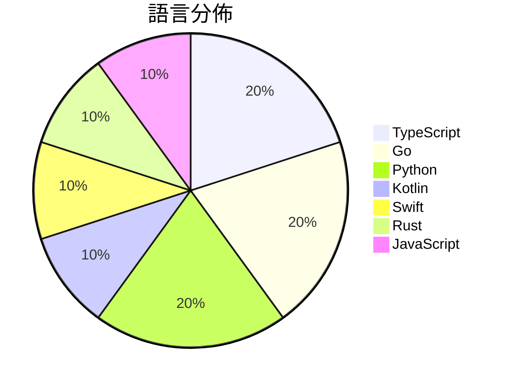

# GitHub Trending - 2026-09-27

> [!summary] 本日摘要
> 收錄 **10** 個新專案，合計 **24.9k** stars
> 語言分佈：TypeScript (2) · Go (2) · Python (2) · Kotlin (1) · Swift (1) · Rust (1) · JavaScript (1)

> [!tip] 本週焦點
> **[[zai-org--ZCode|zai-org/ZCode]]** — 6 天內累積 6.8k stars（1.1k stars/天）
> Z.ai's coding agent harness. Powerful, intelligent, extensible.



---

## 收錄列表

| # | 專案 | 分類 | Stars | 速度 | 安裝 | 語言 | 用途 |
| :--: | --- | --- | ---: | ---: | --- | --- | --- |
| 1 | [[zai-org--ZCode\|zai-org/ZCode]] |  | 6.8k | 1.1k/天 |  | TypeScript | Z.ai's coding agent harness. Powerful, i |
| 2 | [[jev-chat--jev-chat-jarvis\|jev-chat/jev-chat-jarvis]] |  | 6.7k | 1.3k/天 |  | Kotlin | 装在手机上的对话副驾：在 QQ / X / 飞书里读懂对方、给出候选回复、一键填 |
| 3 | [[driceroland--Search\|driceroland/Search]] |  | 2.1k | 355/天 |  | Swift | A small, fast WebKit browser for macOS,  |
| 4 | [[unreallabsai--unreal-agent\|unreallabsai/unreal-agent]] |  | 2.0k | 394/天 |  | Go | Async-first agent harness |
| 5 | [[Contrastive-LM--CLM\|Contrastive-LM/CLM]] |  | 1.7k | 551/天 |  | Python |  |
| 6 | [[tobi--disktree\|tobi/disktree]] |  | 1.4k | 676/天 |  | Rust | A treemap for finding and removing what  |
| 7 | [[yetone--magpie\|yetone/magpie]] |  | 1.1k | 366/天 |  | Go | Every agent's model. One place. Codex on |
| 8 | [[JohnHeibel--PDoomVideo\|JohnHeibel/PDoomVideo]] |  | 1.1k | 271/天 |  | JavaScript | Source code for the Claude Opus 5.5 musi |
| 9 | [[deepopen-com--deepopen\|deepopen-com/deepopen]] |  | 1.0k | 173/天 |  | Python | 非自回归System 1决策引擎，专为结构化类型决策场景设计  DeepOpen |
| 10 | [[mikehasa--golive-skill\|mikehasa/golive-skill]] |  | 985 | 328/天 |  | TypeScript | Take your agent-built product live: host |

---

## 重點摘要

### 1. [[zai-org--ZCode|zai-org/ZCode]]

**6.8k** stars · **1.1k** stars/天 · TypeScript

---

### 2. [[jev-chat--jev-chat-jarvis|jev-chat/jev-chat-jarvis]]

**6.7k** stars · **1.3k** stars/天 · Kotlin

---

### 3. [[driceroland--Search|driceroland/Search]]

**2.1k** stars · **355** stars/天 · Swift

---

### 4. [[unreallabsai--unreal-agent|unreallabsai/unreal-agent]]

**2.0k** stars · **394** stars/天 · Go

---

### 5. [[Contrastive-LM--CLM|Contrastive-LM/CLM]]

**1.7k** stars · **551** stars/天 · Python

---

### 6. [[tobi--disktree|tobi/disktree]]

**1.4k** stars · **676** stars/天 · Rust

---

### 7. [[yetone--magpie|yetone/magpie]]

**1.1k** stars · **366** stars/天 · Go

---

### 8. [[JohnHeibel--PDoomVideo|JohnHeibel/PDoomVideo]]

**1.1k** stars · **271** stars/天 · JavaScript

---

### 9. [[deepopen-com--deepopen|deepopen-com/deepopen]]

**1.0k** stars · **173** stars/天 · Python

---

### 10. [[mikehasa--golive-skill|mikehasa/golive-skill]]

**985** stars · **328** stars/天 · TypeScript

---

## 今日到期複習

> [!tip] 根據間隔複習排程，今天該回顧的專案

```dataview
TABLE
  stars_per_day AS "Stars/天",
  category AS "分類",
  engagement AS "參與度"
FROM "Repos"
WHERE next_review AND date(next_review) <= date("2026-09-27") AND status != "archived"
SORT priority DESC
```

## 待處理

```dataviewjs
const pending = dv.pages('"Repos"').where(p => p.status === "to-review").length;
const unrated = dv.pages('"Repos"').where(p => p.status !== "archived" && p.status !== "to-review" && (p.my_rating || 0) === 0).length;
const noVerdict = dv.pages('"Repos"').where(p => p.status !== "archived" && (p.my_rating || 0) > 0 && (!p.verdict || p.verdict === "")).length;
const items = [];
if (pending > 0) items.push(`**${pending}** 個待分流`);
if (unrated > 0) items.push(`**${unrated}** 個已讀但未評分`);
if (noVerdict > 0) items.push(`**${noVerdict}** 個已評分但無結論`);
if (items.length > 0) dv.paragraph(items.join(" / "));
else dv.paragraph("所有專案都已處理完畢！");
```
