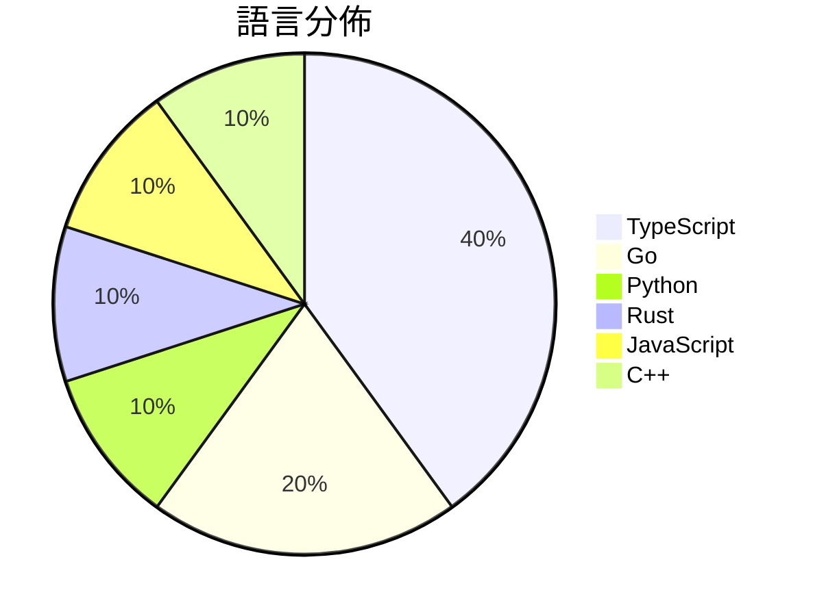

# GitHub Trending - 2026-09-29

> [!summary] 本日摘要
> 收錄 **10** 個新專案，合計 **15.7k** stars
> 語言分佈：TypeScript (4) · Go (2) · Python (1) · Rust (1) · JavaScript (1) · C++ (1)

> [!tip] 本週焦點
> **[[Contrastive-LM--CLM|Contrastive-LM/CLM]]** — 5 天內累積 2.3k stars（467 stars/天）
> 



---

## 收錄列表

| # | 專案 | 分類 | Stars | 速度 | 安裝 | 語言 | 用途 |
| :--: | --- | --- | ---: | ---: | --- | --- | --- |
| 1 | [[Contrastive-LM--CLM\|Contrastive-LM/CLM]] |  | 2.3k | 467/天 |  | Python |  |
| 2 | [[tobi--disktree\|tobi/disktree]] |  | 1.8k | 461/天 |  | Rust | A treemap for finding and removing what  |
| 3 | [[mexicat--pdoom-video\|mexicat/pdoom-video]] |  | 1.8k | 458/天 |  | TypeScript | Code-rendered music video for "I'm Uppin |
| 4 | [[yetone--magpie\|yetone/magpie]] |  | 1.7k | 344/天 |  | Go | Every agent's model. One place. Codex on |
| 5 | [[KKKKhazix--AIHOT\|KKKKhazix/AIHOT]] |  | 1.7k | 1.7k/天 |  | TypeScript | 一个自己找热点、自己写日报的网站框架。把信源和精选标准换成你的，它就是你的行业热 |
| 6 | [[dzhng--jevgrep\|dzhng/jevgrep]] |  | 1.5k | 507/天 |  | TypeScript | Find code by asking what it does. A CLI  |
| 7 | [[JohnHeibel--PDoomVideo\|JohnHeibel/PDoomVideo]] |  | 1.5k | 243/天 |  | JavaScript | Source code for the Claude Opus 5.5 musi |
| 8 | [[Niko1221--Strata\|Niko1221/Strata]] |  | 1.2k | 302/天 |  | C++ | Qwen3.8-Flash-Next (125B MoE) on a 8GB+  |
| 9 | [[mikehasa--golive-skill\|mikehasa/golive-skill]] |  | 1.1k | 211/天 |  | TypeScript | Take your agent-built product live: host |
| 10 | [[kryvora-network--kryvora-node\|kryvora-network/kryvora-node]] |  | 1.1k | 175/天 |  | Go | Reference client daemon and verification |

---

## 重點摘要

### 1. [[Contrastive-LM--CLM|Contrastive-LM/CLM]]

**2.3k** stars · **467** stars/天 · Python

---

### 2. [[tobi--disktree|tobi/disktree]]

**1.8k** stars · **461** stars/天 · Rust

---

### 3. [[mexicat--pdoom-video|mexicat/pdoom-video]]

**1.8k** stars · **458** stars/天 · TypeScript

---

### 4. [[yetone--magpie|yetone/magpie]]

**1.7k** stars · **344** stars/天 · Go

---

### 5. [[KKKKhazix--AIHOT|KKKKhazix/AIHOT]]

**1.7k** stars · **1.7k** stars/天 · TypeScript

---

### 6. [[dzhng--jevgrep|dzhng/jevgrep]]

**1.5k** stars · **507** stars/天 · TypeScript

---

### 7. [[JohnHeibel--PDoomVideo|JohnHeibel/PDoomVideo]]

**1.5k** stars · **243** stars/天 · JavaScript

---

### 8. [[Niko1221--Strata|Niko1221/Strata]]

**1.2k** stars · **302** stars/天 · C++

---

### 9. [[mikehasa--golive-skill|mikehasa/golive-skill]]

**1.1k** stars · **211** stars/天 · TypeScript

---

### 10. [[kryvora-network--kryvora-node|kryvora-network/kryvora-node]]

**1.1k** stars · **175** stars/天 · Go

---

## 今日到期複習

> [!tip] 根據間隔複習排程，今天該回顧的專案

```dataview
TABLE
  stars_per_day AS "Stars/天",
  category AS "分類",
  engagement AS "參與度"
FROM "Repos"
WHERE next_review AND date(next_review) <= date("2026-09-29") AND status != "archived"
SORT priority DESC
```

## 待處理

```dataviewjs
const pending = dv.pages('"Repos"').where(p => p.status === "to-review").length;
const unrated = dv.pages('"Repos"').where(p => p.status !== "archived" && p.status !== "to-review" && (p.my_rating || 0) === 0).length;
const noVerdict = dv.pages('"Repos"').where(p => p.status !== "archived" && (p.my_rating || 0) > 0 && (!p.verdict || p.verdict === "")).length;
const items = [];
if (pending > 0) items.push(`**${pending}** 個待分流`);
if (unrated > 0) items.push(`**${unrated}** 個已讀但未評分`);
if (noVerdict > 0) items.push(`**${noVerdict}** 個已評分但無結論`);
if (items.length > 0) dv.paragraph(items.join(" / "));
else dv.paragraph("所有專案都已處理完畢！");
```
