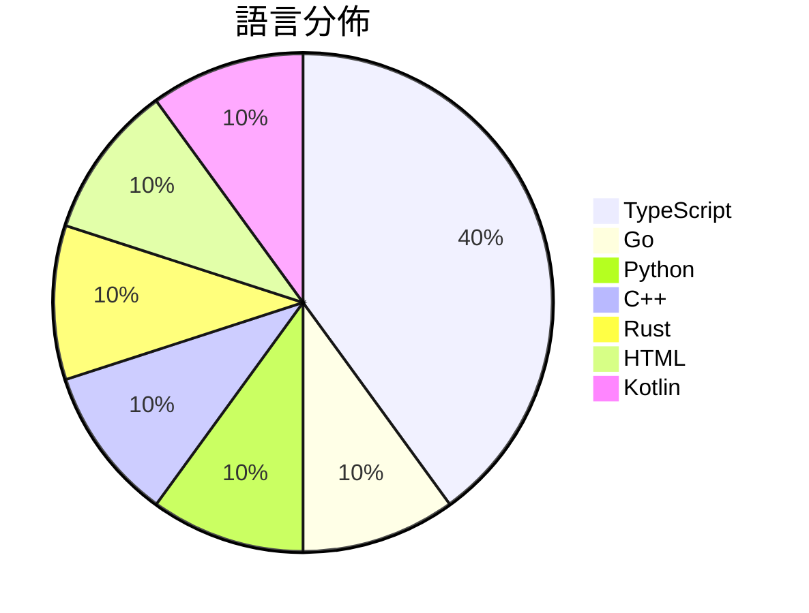

# GitHub Trending - 2026-09-30

> [!summary] 本日摘要
> 收錄 **10** 個新專案，合計 **20.3k** stars
> 語言分佈：TypeScript (4) · Go (1) · Python (1) · C++ (1) · Rust (1) · HTML (1) · Kotlin (1)

> [!tip] 本週焦點
> **[[KKKKhazix--AIHOT|KKKKhazix/AIHOT]]** — 1 天內累積 3.6k stars（3.6k stars/天）
> 一个自己找热点、自己写日报的网站框架。把信源和精选标准换成你的，它就是你的行业热点站。



---

## 收錄列表

| # | 專案 | 分類 | Stars | 速度 | 安裝 | 語言 | 用途 |
| :--: | --- | --- | ---: | ---: | --- | --- | --- |
| 1 | [[KKKKhazix--AIHOT\|KKKKhazix/AIHOT]] |  | 3.6k | 3.6k/天 |  | TypeScript | 一个自己找热点、自己写日报的网站框架。把信源和精选标准换成你的，它就是你的行业热 |
| 2 | [[yetone--magpie\|yetone/magpie]] |  | 3.1k | 521/天 |  | Go | Every agent's model. One place. Codex on |
| 3 | [[Contrastive-LM--CLM\|Contrastive-LM/CLM]] |  | 2.5k | 423/天 |  | Python |  |
| 4 | [[mexicat--pdoom-video\|mexicat/pdoom-video]] |  | 2.0k | 402/天 |  | TypeScript | Code-rendered music video for "I'm Uppin |
| 5 | [[Niko1221--Strata\|Niko1221/Strata]] |  | 2.0k | 394/天 |  | C++ | Qwen3.8-Flash-Next (125B MoE) on a 8GB+  |
| 6 | [[tobi--disktree\|tobi/disktree]] |  | 1.9k | 387/天 |  | Rust | A treemap for finding and removing what  |
| 7 | [[dzhng--jevgrep\|dzhng/jevgrep]] |  | 1.8k | 451/天 |  | TypeScript | Find code by asking what it does. A CLI  |
| 8 | [[852wa--JIZURA\|852wa/JIZURA]] |  | 1.1k | 161/天 |  | HTML | 歌詞から文字PVを自動で組み立てるブラウザアプリ |
| 9 | [[mikehasa--golive-skill\|mikehasa/golive-skill]] |  | 1.1k | 187/天 |  | TypeScript | Take your agent-built product live: host |
| 10 | [[shihabal3amri--DiPlay\|shihabal3amri/DiPlay]] |  | 1.1k | 222/天 |  | Kotlin | Independent CarPlay receiver for compati |

---

## 重點摘要

### 1. [[KKKKhazix--AIHOT|KKKKhazix/AIHOT]]

**3.6k** stars · **3.6k** stars/天 · TypeScript

---

### 2. [[yetone--magpie|yetone/magpie]]

**3.1k** stars · **521** stars/天 · Go

---

### 3. [[Contrastive-LM--CLM|Contrastive-LM/CLM]]

**2.5k** stars · **423** stars/天 · Python

---

### 4. [[mexicat--pdoom-video|mexicat/pdoom-video]]

**2.0k** stars · **402** stars/天 · TypeScript

---

### 5. [[Niko1221--Strata|Niko1221/Strata]]

**2.0k** stars · **394** stars/天 · C++

---

### 6. [[tobi--disktree|tobi/disktree]]

**1.9k** stars · **387** stars/天 · Rust

---

### 7. [[dzhng--jevgrep|dzhng/jevgrep]]

**1.8k** stars · **451** stars/天 · TypeScript

---

### 8. [[852wa--JIZURA|852wa/JIZURA]]

**1.1k** stars · **161** stars/天 · HTML

---

### 9. [[mikehasa--golive-skill|mikehasa/golive-skill]]

**1.1k** stars · **187** stars/天 · TypeScript

---

### 10. [[shihabal3amri--DiPlay|shihabal3amri/DiPlay]]

**1.1k** stars · **222** stars/天 · Kotlin

---

## 今日到期複習

> [!tip] 根據間隔複習排程，今天該回顧的專案

```dataview
TABLE
  stars_per_day AS "Stars/天",
  category AS "分類",
  engagement AS "參與度"
FROM "Repos"
WHERE next_review AND date(next_review) <= date("2026-09-30") AND status != "archived"
SORT priority DESC
```

## 待處理

```dataviewjs
const pending = dv.pages('"Repos"').where(p => p.status === "to-review").length;
const unrated = dv.pages('"Repos"').where(p => p.status !== "archived" && p.status !== "to-review" && (p.my_rating || 0) === 0).length;
const noVerdict = dv.pages('"Repos"').where(p => p.status !== "archived" && (p.my_rating || 0) > 0 && (!p.verdict || p.verdict === "")).length;
const items = [];
if (pending > 0) items.push(`**${pending}** 個待分流`);
if (unrated > 0) items.push(`**${unrated}** 個已讀但未評分`);
if (noVerdict > 0) items.push(`**${noVerdict}** 個已評分但無結論`);
if (items.length > 0) dv.paragraph(items.join(" / "));
else dv.paragraph("所有專案都已處理完畢！");
```
