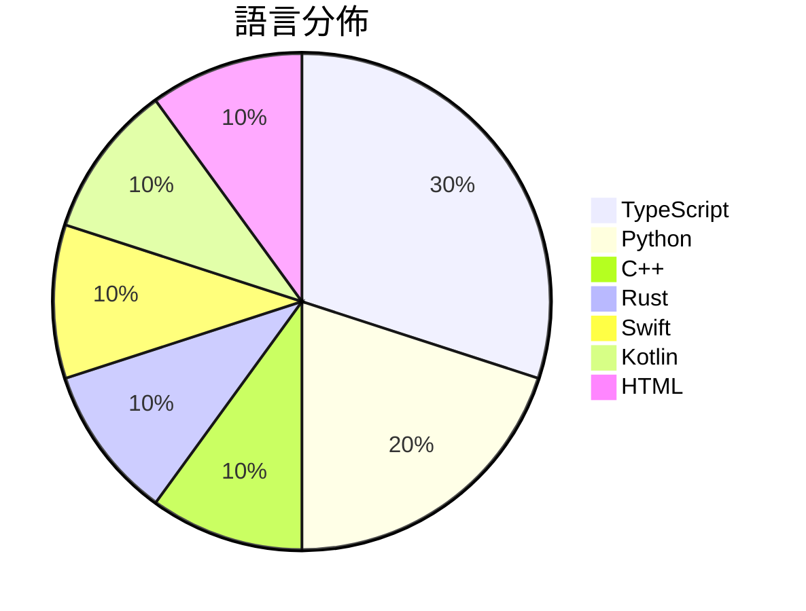

# GitHub Trending - 2026-10-01

> [!summary] 本日摘要
> 收錄 **10** 個新專案，合計 **21.5k** stars
> 語言分佈：TypeScript (3) · Python (2) · C++ (1) · Rust (1) · Swift (1) · Kotlin (1) · HTML (1)

> [!tip] 本週焦點
> **[[KKKKhazix--AIHOT|KKKKhazix/AIHOT]]** — 2 天內累積 4.2k stars（2.1k stars/天）
> 一个自己找热点、自己写日报的网站框架。把信源和精选标准换成你的，它就是你的行业热点站。



---

## 收錄列表

| # | 專案 | 分類 | Stars | 速度 | 安裝 | 語言 | 用途 |
| :--: | --- | --- | ---: | ---: | --- | --- | --- |
| 1 | [[KKKKhazix--AIHOT\|KKKKhazix/AIHOT]] |  | 4.2k | 2.1k/天 |  | TypeScript | 一个自己找热点、自己写日报的网站框架。把信源和精选标准换成你的，它就是你的行业热 |
| 2 | [[Niko1221--Strata\|Niko1221/Strata]] |  | 3.4k | 565/天 |  | C++ | Qwen3.8-Flash-Next on any consumer hardw |
| 3 | [[mexicat--pdoom-video\|mexicat/pdoom-video]] |  | 2.1k | 356/天 |  | TypeScript | Code-rendered music video for "I'm Uppin |
| 4 | [[tobi--disktree\|tobi/disktree]] |  | 2.0k | 340/天 |  | Rust | A treemap for finding and removing what  |
| 5 | [[feder-cr--dots\|feder-cr/dots]] |  | 2.0k | 2.0k/天 |  | Python | Open-source dots for the web: an AI agen |
| 6 | [[dzhng--jevgrep\|dzhng/jevgrep]] |  | 1.9k | 384/天 |  | TypeScript | Find code by asking what it does. A CLI  |
| 7 | [[Louis-CFM--coucou\|Louis-CFM/coucou]] |  | 1.7k | 575/天 |  | Swift | A tiny friend that lives in your notch ( |
| 8 | [[shihabal3amri--DiPlay\|shihabal3amri/DiPlay]] |  | 1.7k | 281/天 |  | Kotlin | Independent CarPlay receiver for compati |
| 9 | [[firelex--jeff\|firelex/jeff]] |  | 1.2k | 606/天 |  | Python | Fine-tunes of Qwen3.5 and Gemma 4 for ze |
| 10 | [[kaankiziltug--logo-design-skill\|kaankiziltug/logo-design-skill]] |  | 1.2k | 295/天 |  | HTML | A comprehensive logo-design skill for Cl |

---

## 重點摘要

### 1. [[KKKKhazix--AIHOT|KKKKhazix/AIHOT]]

**4.2k** stars · **2.1k** stars/天 · TypeScript

---

### 2. [[Niko1221--Strata|Niko1221/Strata]]

**3.4k** stars · **565** stars/天 · C++

---

### 3. [[mexicat--pdoom-video|mexicat/pdoom-video]]

**2.1k** stars · **356** stars/天 · TypeScript

---

### 4. [[tobi--disktree|tobi/disktree]]

**2.0k** stars · **340** stars/天 · Rust

---

### 5. [[feder-cr--dots|feder-cr/dots]]

**2.0k** stars · **2.0k** stars/天 · Python

---

### 6. [[dzhng--jevgrep|dzhng/jevgrep]]

**1.9k** stars · **384** stars/天 · TypeScript

---

### 7. [[Louis-CFM--coucou|Louis-CFM/coucou]]

**1.7k** stars · **575** stars/天 · Swift

---

### 8. [[shihabal3amri--DiPlay|shihabal3amri/DiPlay]]

**1.7k** stars · **281** stars/天 · Kotlin

---

### 9. [[firelex--jeff|firelex/jeff]]

**1.2k** stars · **606** stars/天 · Python

---

### 10. [[kaankiziltug--logo-design-skill|kaankiziltug/logo-design-skill]]

**1.2k** stars · **295** stars/天 · HTML

---

## 今日到期複習

> [!tip] 根據間隔複習排程，今天該回顧的專案

```dataview
TABLE
  stars_per_day AS "Stars/天",
  category AS "分類",
  engagement AS "參與度"
FROM "Repos"
WHERE next_review AND date(next_review) <= date("2026-10-01") AND status != "archived"
SORT priority DESC
```

## 待處理

```dataviewjs
const pending = dv.pages('"Repos"').where(p => p.status === "to-review").length;
const unrated = dv.pages('"Repos"').where(p => p.status !== "archived" && p.status !== "to-review" && (p.my_rating || 0) === 0).length;
const noVerdict = dv.pages('"Repos"').where(p => p.status !== "archived" && (p.my_rating || 0) > 0 && (!p.verdict || p.verdict === "")).length;
const items = [];
if (pending > 0) items.push(`**${pending}** 個待分流`);
if (unrated > 0) items.push(`**${unrated}** 個已讀但未評分`);
if (noVerdict > 0) items.push(`**${noVerdict}** 個已評分但無結論`);
if (items.length > 0) dv.paragraph(items.join(" / "));
else dv.paragraph("所有專案都已處理完畢！");
```
