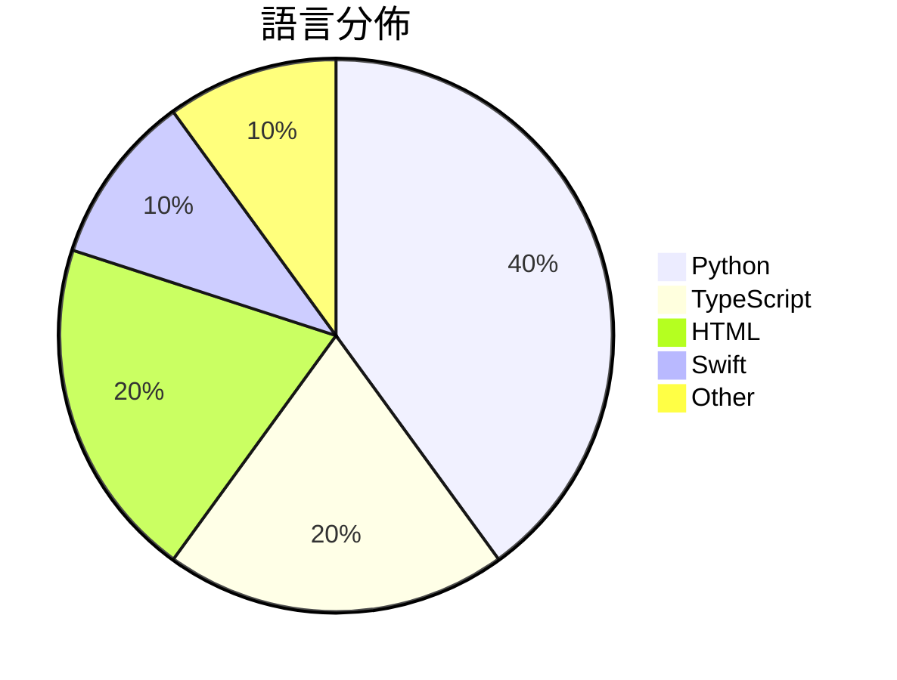

# GitHub Trending - 2026-10-02

> [!summary] 本日摘要
> 收錄 **10** 個新專案，合計 **19.8k** stars
> 語言分佈：Python (4) · TypeScript (2) · HTML (2) · Swift (1) · Other (1)

> [!tip] 本週焦點
> **[[KKKKhazix--AIHOT|KKKKhazix/AIHOT]]** — 3 天內累積 4.8k stars（1.6k stars/天）
> 一个自己找热点、自己写日报的网站框架。把信源和精选标准换成你的，它就是你的行业热点站。



---

## 收錄列表

| # | 專案 | 分類 | Stars | 速度 | 安裝 | 語言 | 用途 |
| :--: | --- | --- | ---: | ---: | --- | --- | --- |
| 1 | [[KKKKhazix--AIHOT\|KKKKhazix/AIHOT]] |  | 4.8k | 1.6k/天 |  | TypeScript | 一个自己找热点、自己写日报的网站框架。把信源和精选标准换成你的，它就是你的行业热 |
| 2 | [[Louis-CFM--coucou\|Louis-CFM/coucou]] |  | 2.6k | 643/天 |  | Swift | A tiny friend that lives in your notch ( |
| 3 | [[feder-cr--dots\|feder-cr/dots]] |  | 2.4k | 1.2k/天 |  | Python | Open-source dots for the web: an AI agen |
| 4 | [[dzhng--jevgrep\|dzhng/jevgrep]] |  | 2.0k | 336/天 |  | TypeScript | Find code by asking what it does. A CLI  |
| 5 | [[rehan-remade--universal-modder\|rehan-remade/universal-modder]] |  | 1.7k | 831/天 |  | Python | Point Claude at any game. Skills, tools  |
| 6 | [[kaankiziltug--logo-design-skill\|kaankiziltug/logo-design-skill]] |  | 1.4k | 276/天 |  | HTML | A comprehensive logo-design skill for Cl |
| 7 | [[yihui-dev--awesome-opus5-5-videos\|yihui-dev/awesome-opus5-5-videos]] |  | 1.3k | 260/天 |  | N/A | A growing collection of viral videos mad |
| 8 | [[firelex--jeff\|firelex/jeff]] |  | 1.3k | 428/天 |  | Python | Millisecond decisions, any domain: a 0.8 |
| 9 | [[wy51ai--floorplan-3d\|wy51ai/floorplan-3d]] |  | 1.2k | 401/天 |  | HTML |  |
| 10 | [[feitangyuan--onetake\|feitangyuan/onetake]] |  | 1.2k | 195/天 |  | Python | Motion films that never cut to the next  |

---

## 重點摘要

### 1. [[KKKKhazix--AIHOT|KKKKhazix/AIHOT]]

**4.8k** stars · **1.6k** stars/天 · TypeScript

---

### 2. [[Louis-CFM--coucou|Louis-CFM/coucou]]

**2.6k** stars · **643** stars/天 · Swift

---

### 3. [[feder-cr--dots|feder-cr/dots]]

**2.4k** stars · **1.2k** stars/天 · Python

---

### 4. [[dzhng--jevgrep|dzhng/jevgrep]]

**2.0k** stars · **336** stars/天 · TypeScript

---

### 5. [[rehan-remade--universal-modder|rehan-remade/universal-modder]]

**1.7k** stars · **831** stars/天 · Python

---

### 6. [[kaankiziltug--logo-design-skill|kaankiziltug/logo-design-skill]]

**1.4k** stars · **276** stars/天 · HTML

---

### 7. [[yihui-dev--awesome-opus5-5-videos|yihui-dev/awesome-opus5-5-videos]]

**1.3k** stars · **260** stars/天 · N/A

---

### 8. [[firelex--jeff|firelex/jeff]]

**1.3k** stars · **428** stars/天 · Python

---

### 9. [[wy51ai--floorplan-3d|wy51ai/floorplan-3d]]

**1.2k** stars · **401** stars/天 · HTML

---

### 10. [[feitangyuan--onetake|feitangyuan/onetake]]

**1.2k** stars · **195** stars/天 · Python

---

## 今日到期複習

> [!tip] 根據間隔複習排程，今天該回顧的專案

```dataview
TABLE
  stars_per_day AS "Stars/天",
  category AS "分類",
  engagement AS "參與度"
FROM "Repos"
WHERE next_review AND date(next_review) <= date("2026-10-02") AND status != "archived"
SORT priority DESC
```

## 待處理

```dataviewjs
const pending = dv.pages('"Repos"').where(p => p.status === "to-review").length;
const unrated = dv.pages('"Repos"').where(p => p.status !== "archived" && p.status !== "to-review" && (p.my_rating || 0) === 0).length;
const noVerdict = dv.pages('"Repos"').where(p => p.status !== "archived" && (p.my_rating || 0) > 0 && (!p.verdict || p.verdict === "")).length;
const items = [];
if (pending > 0) items.push(`**${pending}** 個待分流`);
if (unrated > 0) items.push(`**${unrated}** 個已讀但未評分`);
if (noVerdict > 0) items.push(`**${noVerdict}** 個已評分但無結論`);
if (items.length > 0) dv.paragraph(items.join(" / "));
else dv.paragraph("所有專案都已處理完畢！");
```
