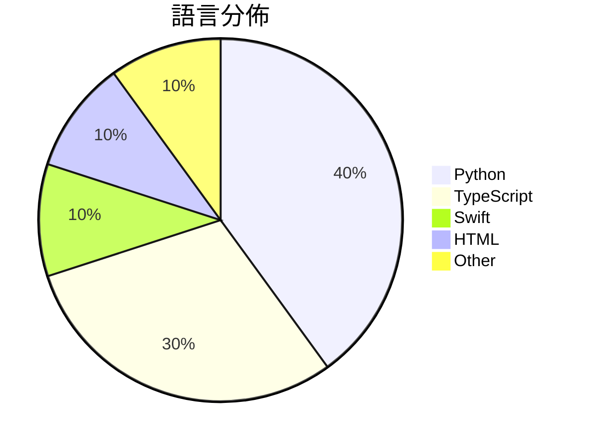

# GitHub Trending - 2026-10-03

> [!summary] 本日摘要
> 收錄 **10** 個新專案，合計 **22.2k** stars
> 語言分佈：Python (4) · TypeScript (3) · Swift (1) · HTML (1) · Other (1)

> [!tip] 本週焦點
> **[[KKKKhazix--AIHOT|KKKKhazix/AIHOT]]** — 4 天內累積 5.0k stars（1.3k stars/天）
> 一个自己找热点、自己写日报的网站框架。把信源和精选标准换成你的，它就是你的行业热点站。



---

## 收錄列表

| # | 專案 | 分類 | Stars | 速度 | 安裝 | 語言 | 用途 |
| :--: | --- | --- | ---: | ---: | --- | --- | --- |
| 1 | [[KKKKhazix--AIHOT\|KKKKhazix/AIHOT]] |  | 5.0k | 1.3k/天 |  | TypeScript | 一个自己找热点、自己写日报的网站框架。把信源和精选标准换成你的，它就是你的行业热 |
| 2 | [[Louis-CFM--coucou\|Louis-CFM/coucou]] |  | 3.0k | 607/天 |  | Swift | A tiny friend that lives in your notch ( |
| 3 | [[feder-cr--dots\|feder-cr/dots]] |  | 2.5k | 849/天 |  | Python | Open-source dots for the web: an AI agen |
| 4 | [[rehan-remade--universal-modder\|rehan-remade/universal-modder]] |  | 2.2k | 746/天 |  | Python | Point Claude at any game. Skills, tools  |
| 5 | [[dzhng--jevgrep\|dzhng/jevgrep]] |  | 2.1k | 296/天 |  | TypeScript | Find code by asking what it does. A CLI  |
| 6 | [[CopilotKit--OpenDots\|CopilotKit/OpenDots]] |  | 1.6k | 542/天 |  | TypeScript | Your always-on AI coworkers that move be |
| 7 | [[kaankiziltug--logo-design-skill\|kaankiziltug/logo-design-skill]] |  | 1.6k | 260/天 |  | HTML | A comprehensive logo-design skill for Cl |
| 8 | [[yihui-dev--awesome-opus5-5-videos\|yihui-dev/awesome-opus5-5-videos]] |  | 1.5k | 292/天 |  | N/A | A growing collection of viral videos mad |
| 9 | [[feitangyuan--onetake\|feitangyuan/onetake]] |  | 1.4k | 195/天 |  | Python | Motion films that never cut to the next  |
| 10 | [[firelex--jeff\|firelex/jeff]] |  | 1.3k | 333/天 |  | Python | Millisecond decisions, any domain: a 0.8 |

---

## 重點摘要

### 1. [[KKKKhazix--AIHOT|KKKKhazix/AIHOT]]

**5.0k** stars · **1.3k** stars/天 · TypeScript

---

### 2. [[Louis-CFM--coucou|Louis-CFM/coucou]]

**3.0k** stars · **607** stars/天 · Swift

---

### 3. [[feder-cr--dots|feder-cr/dots]]

**2.5k** stars · **849** stars/天 · Python

---

### 4. [[rehan-remade--universal-modder|rehan-remade/universal-modder]]

**2.2k** stars · **746** stars/天 · Python

---

### 5. [[dzhng--jevgrep|dzhng/jevgrep]]

**2.1k** stars · **296** stars/天 · TypeScript

---

### 6. [[CopilotKit--OpenDots|CopilotKit/OpenDots]]

**1.6k** stars · **542** stars/天 · TypeScript

---

### 7. [[kaankiziltug--logo-design-skill|kaankiziltug/logo-design-skill]]

**1.6k** stars · **260** stars/天 · HTML

---

### 8. [[yihui-dev--awesome-opus5-5-videos|yihui-dev/awesome-opus5-5-videos]]

**1.5k** stars · **292** stars/天 · N/A

---

### 9. [[feitangyuan--onetake|feitangyuan/onetake]]

**1.4k** stars · **195** stars/天 · Python

---

### 10. [[firelex--jeff|firelex/jeff]]

**1.3k** stars · **333** stars/天 · Python

---

## 今日到期複習

> [!tip] 根據間隔複習排程，今天該回顧的專案

```dataview
TABLE
  stars_per_day AS "Stars/天",
  category AS "分類",
  engagement AS "參與度"
FROM "Repos"
WHERE next_review AND date(next_review) <= date("2026-10-03") AND status != "archived"
SORT priority DESC
```

## 待處理

```dataviewjs
const pending = dv.pages('"Repos"').where(p => p.status === "to-review").length;
const unrated = dv.pages('"Repos"').where(p => p.status !== "archived" && p.status !== "to-review" && (p.my_rating || 0) === 0).length;
const noVerdict = dv.pages('"Repos"').where(p => p.status !== "archived" && (p.my_rating || 0) > 0 && (!p.verdict || p.verdict === "")).length;
const items = [];
if (pending > 0) items.push(`**${pending}** 個待分流`);
if (unrated > 0) items.push(`**${unrated}** 個已讀但未評分`);
if (noVerdict > 0) items.push(`**${noVerdict}** 個已評分但無結論`);
if (items.length > 0) dv.paragraph(items.join(" / "));
else dv.paragraph("所有專案都已處理完畢！");
```
