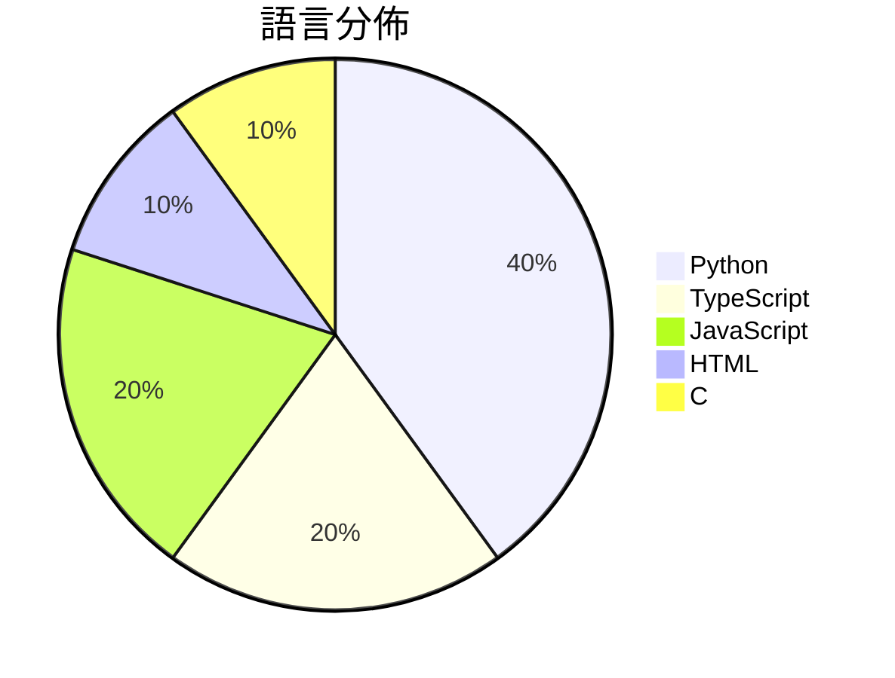

# GitHub Trending - 2026-10-05

> [!summary] 本日摘要
> 收錄 **10** 個新專案，合計 **23.0k** stars
> 語言分佈：Python (4) · TypeScript (2) · JavaScript (2) · HTML (1) · C (1)

> [!tip] 本週焦點
> **[[KKKKhazix--AIHOT|KKKKhazix/AIHOT]]** — 6 天內累積 5.8k stars（974 stars/天）
> 一个自己找热点、自己写日报的网站框架。把信源和精选标准换成你的，它就是你的行业热点站。



---

## 收錄列表

| # | 專案 | 分類 | Stars | 速度 | 安裝 | 語言 | 用途 |
| :--: | --- | --- | ---: | ---: | --- | --- | --- |
| 1 | [[KKKKhazix--AIHOT\|KKKKhazix/AIHOT]] |  | 5.8k | 974/天 |  | TypeScript | 一个自己找热点、自己写日报的网站框架。把信源和精选标准换成你的，它就是你的行业热 |
| 2 | [[rehan-remade--universal-modder\|rehan-remade/universal-modder]] |  | 3.4k | 672/天 |  | Python | Point Claude at any game. Skills, tools  |
| 3 | [[CopilotKit--OpenDots\|CopilotKit/OpenDots]] |  | 3.3k | 658/天 |  | TypeScript | Your always-on AI coworkers that move be |
| 4 | [[feder-cr--dots\|feder-cr/dots]] |  | 2.6k | 521/天 |  | Python | Open-source dots for the web: an AI agen |
| 5 | [[nanaism--yomiyasu\|nanaism/yomiyasu]] |  | 1.4k | 358/天 |  | Python | AI生成の日本語を自然な日本語へ推敲するAgent Skill / Agent  |
| 6 | [[wy51ai--floorplan-3d\|wy51ai/floorplan-3d]] |  | 1.4k | 234/天 |  | HTML |  |
| 7 | [[firelex--jeff\|firelex/jeff]] |  | 1.4k | 229/天 |  | Python | Millisecond decisions, any domain: a 0.8 |
| 8 | [[edenfunf--reelmimic\|edenfunf/reelmimic]] |  | 1.3k | 213/天 |  | JavaScript | Show it a video you love. Get a new vide |
| 9 | [[facebookincubator--muse-gadget-sdk\|facebookincubator/muse-gadget-sdk]] |  | 1.3k | 633/天 |  | C | Open source SDK to build Muse gadgets |
| 10 | [[QingYunA--answer-me-with-html\|QingYunA/answer-me-with-html]] |  | 1.2k | 585/天 |  | JavaScript | Answer me with HTML — an agent skill tha |

---

## 重點摘要

### 1. [[KKKKhazix--AIHOT|KKKKhazix/AIHOT]]

**5.8k** stars · **974** stars/天 · TypeScript

---

### 2. [[rehan-remade--universal-modder|rehan-remade/universal-modder]]

**3.4k** stars · **672** stars/天 · Python

---

### 3. [[CopilotKit--OpenDots|CopilotKit/OpenDots]]

**3.3k** stars · **658** stars/天 · TypeScript

---

### 4. [[feder-cr--dots|feder-cr/dots]]

**2.6k** stars · **521** stars/天 · Python

---

### 5. [[nanaism--yomiyasu|nanaism/yomiyasu]]

**1.4k** stars · **358** stars/天 · Python

---

### 6. [[wy51ai--floorplan-3d|wy51ai/floorplan-3d]]

**1.4k** stars · **234** stars/天 · HTML

---

### 7. [[firelex--jeff|firelex/jeff]]

**1.4k** stars · **229** stars/天 · Python

---

### 8. [[edenfunf--reelmimic|edenfunf/reelmimic]]

**1.3k** stars · **213** stars/天 · JavaScript

---

### 9. [[facebookincubator--muse-gadget-sdk|facebookincubator/muse-gadget-sdk]]

**1.3k** stars · **633** stars/天 · C

---

### 10. [[QingYunA--answer-me-with-html|QingYunA/answer-me-with-html]]

**1.2k** stars · **585** stars/天 · JavaScript

---

## 今日到期複習

> [!tip] 根據間隔複習排程，今天該回顧的專案

```dataview
TABLE
  stars_per_day AS "Stars/天",
  category AS "分類",
  engagement AS "參與度"
FROM "Repos"
WHERE next_review AND date(next_review) <= date("2026-10-05") AND status != "archived"
SORT priority DESC
```

## 待處理

```dataviewjs
const pending = dv.pages('"Repos"').where(p => p.status === "to-review").length;
const unrated = dv.pages('"Repos"').where(p => p.status !== "archived" && p.status !== "to-review" && (p.my_rating || 0) === 0).length;
const noVerdict = dv.pages('"Repos"').where(p => p.status !== "archived" && (p.my_rating || 0) > 0 && (!p.verdict || p.verdict === "")).length;
const items = [];
if (pending > 0) items.push(`**${pending}** 個待分流`);
if (unrated > 0) items.push(`**${unrated}** 個已讀但未評分`);
if (noVerdict > 0) items.push(`**${noVerdict}** 個已評分但無結論`);
if (items.length > 0) dv.paragraph(items.join(" / "));
else dv.paragraph("所有專案都已處理完畢！");
```
