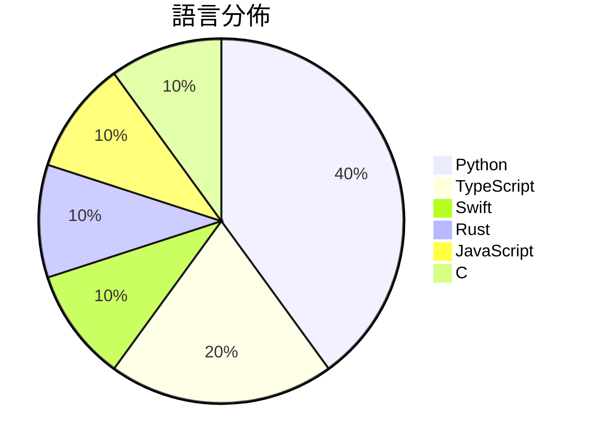

# GitHub Trending - 2026-10-06

> [!summary] 本日摘要
> 收錄 **10** 個新專案，合計 **23.0k** stars
> 語言分佈：Python (4) · TypeScript (2) · Swift (1) · Rust (1) · JavaScript (1) · C (1)

> [!tip] 本週焦點
> **[[rehan-remade--universal-modder|rehan-remade/universal-modder]]** — 6 天內累積 4.0k stars（664 stars/天）
> Point Claude at any game. Skills, tools and the fal MCP that let Claude Code mod almost any PC game you own: recon, reverse engineering, fal-generated art/3D/audio, in-game testing, showcase videos.



---

## 收錄列表

| # | 專案 | 分類 | Stars | 速度 | 安裝 | 語言 | 用途 |
| :--: | --- | --- | ---: | ---: | --- | --- | --- |
| 1 | [[rehan-remade--universal-modder\|rehan-remade/universal-modder]] |  | 4.0k | 664/天 |  | Python | Point Claude at any game. Skills, tools  |
| 2 | [[CopilotKit--OpenDots\|CopilotKit/OpenDots]] |  | 3.7k | 623/天 |  | TypeScript | Your always-on AI coworkers that move be |
| 3 | [[feder-cr--dots\|feder-cr/dots]] |  | 2.6k | 437/天 |  | Python | Open-source dots for the web: an AI agen |
| 4 | [[omlahore--RemoveMacAI\|omlahore/RemoveMacAI]] |  | 2.3k | 390/天 |  | Swift | Turn off Apple Intelligence on macOS 27  |
| 5 | [[storytold--photocraft\|storytold/photocraft]] |  | 2.3k | 459/天 |  | Rust | An open-source, clean-room reimplementat |
| 6 | [[nykooi1--vibe-wise\|nykooi1/vibe-wise]] |  | 1.9k | 277/天 |  | Python | A Claude Code plugin that helps you lear |
| 7 | [[nanaism--yomiyasu\|nanaism/yomiyasu]] |  | 1.5k | 310/天 |  | Python | AI生成の日本語を自然な日本語へ推敲するAgent Skill / Agent  |
| 8 | [[QingYunA--answer-me-with-html\|QingYunA/answer-me-with-html]] |  | 1.5k | 513/天 |  | JavaScript | Answer me with HTML — an agent skill tha |
| 9 | [[kargulstudio--sales-crm\|kargulstudio/sales-crm]] |  | 1.5k | 1.5k/天 |  | TypeScript |  |
| 10 | [[facebookincubator--muse-gadget-sdk\|facebookincubator/muse-gadget-sdk]] |  | 1.5k | 488/天 |  | C | Open source SDK to build Muse gadgets |

---

## 重點摘要

### 1. [[rehan-remade--universal-modder|rehan-remade/universal-modder]]

**4.0k** stars · **664** stars/天 · Python

---

### 2. [[CopilotKit--OpenDots|CopilotKit/OpenDots]]

**3.7k** stars · **623** stars/天 · TypeScript

---

### 3. [[feder-cr--dots|feder-cr/dots]]

**2.6k** stars · **437** stars/天 · Python

---

### 4. [[omlahore--RemoveMacAI|omlahore/RemoveMacAI]]

**2.3k** stars · **390** stars/天 · Swift

---

### 5. [[storytold--photocraft|storytold/photocraft]]

**2.3k** stars · **459** stars/天 · Rust

---

### 6. [[nykooi1--vibe-wise|nykooi1/vibe-wise]]

**1.9k** stars · **277** stars/天 · Python

---

### 7. [[nanaism--yomiyasu|nanaism/yomiyasu]]

**1.5k** stars · **310** stars/天 · Python

---

### 8. [[QingYunA--answer-me-with-html|QingYunA/answer-me-with-html]]

**1.5k** stars · **513** stars/天 · JavaScript

---

### 9. [[kargulstudio--sales-crm|kargulstudio/sales-crm]]

**1.5k** stars · **1.5k** stars/天 · TypeScript

---

### 10. [[facebookincubator--muse-gadget-sdk|facebookincubator/muse-gadget-sdk]]

**1.5k** stars · **488** stars/天 · C

---

## 今日到期複習

> [!tip] 根據間隔複習排程，今天該回顧的專案

```dataview
TABLE
  stars_per_day AS "Stars/天",
  category AS "分類",
  engagement AS "參與度"
FROM "Repos"
WHERE next_review AND date(next_review) <= date("2026-10-06") AND status != "archived"
SORT priority DESC
```

## 待處理

```dataviewjs
const pending = dv.pages('"Repos"').where(p => p.status === "to-review").length;
const unrated = dv.pages('"Repos"').where(p => p.status !== "archived" && p.status !== "to-review" && (p.my_rating || 0) === 0).length;
const noVerdict = dv.pages('"Repos"').where(p => p.status !== "archived" && (p.my_rating || 0) > 0 && (!p.verdict || p.verdict === "")).length;
const items = [];
if (pending > 0) items.push(`**${pending}** 個待分流`);
if (unrated > 0) items.push(`**${unrated}** 個已讀但未評分`);
if (noVerdict > 0) items.push(`**${noVerdict}** 個已評分但無結論`);
if (items.length > 0) dv.paragraph(items.join(" / "));
else dv.paragraph("所有專案都已處理完畢！");
```
