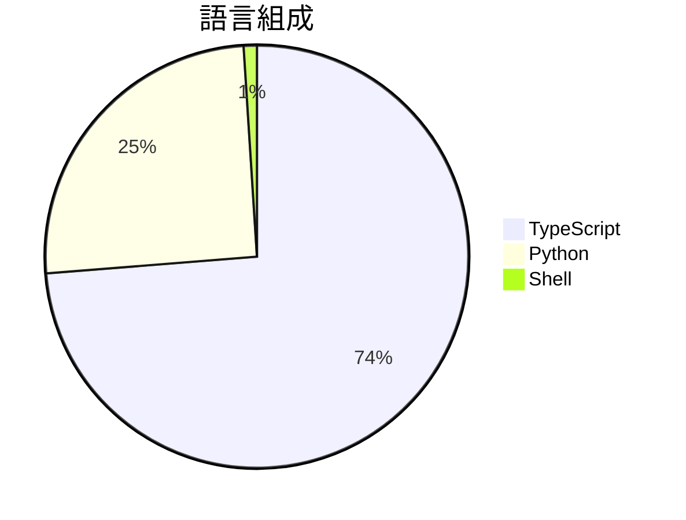

# Shadowbroker

> [!summary] 一句話摘要
> Shadowbroker 是一個開源的全球情報平台，整合多種開放資料來源。

## 專案簡介

Shadowbroker 提供一個即時的多領域開源情報儀表板，能夠聚合來自多個開放資料來源的實時數據，並在統一的界面上呈現。這個平台特別適合需要追蹤全球事件和威脅的用戶，讓他們能夠輕鬆獲取重要信息。

## 為什麼值得關注

> [!tip] 爆紅原因
> 隨著全球安全和情報需求的上升，越來越多的人希望能夠即時獲取和分析相關數據。

**1.3k** stars · **264** stars/天 · 建立 5 天前

## 適合誰使用

**目標受眾**：適合對全球情報和安全感興趣的研究人員和分析師。

> [!example] 使用場景
> - 追蹤全球的財富和資源流動。
> - 監控地震等自然災害的實時數據。
> - 分析企業和私人飛機的動態，了解商業活動。

## 技術細節

| 欄位 | 值 |
| --- | --- |
| 語言 | TypeScript |
| 授權 | N/A |
| Stars | 1.3k |
| Forks | 145 |
| Issues | 0 |
| 建立日期 | 2026-03-05 |

### 語言組成



### 主要貢獻者

| 貢獻者 | Commits |
| --- | --- |
| [@anoracleofra-code](https://github.com/anoracleofra-code) | 43 |
| [@BigBodyCobain](https://github.com/BigBodyCobain) | 21 |
| [@ttulttul](https://github.com/ttulttul) | 1 |

### 最新版本

**v0.5.0** — ShadowBroker v0.5.0 (2026-03-10)

## README 摘錄

> [!info]- 展開查看原文 README
> 🛰️ S H A D O W B R O K E R
>   Global Threat Intercept — Real-Time Geospatial Intelligence Platform
>   
> 
>   
> 
> ---
> 
> **ShadowBroker** is a real-time, multi-domain OSINT dashboard that aggregates live data from dozens of open-source intelligence feeds and renders them on a unified dark-ops map interface. It tracks aircraft, ships, satellites, earthquakes, conflict zones, CCTV networks, GPS jamming, and breaking geopolitical events — all updating in real time.
> 
> Built with **Next.js**, **MapLibre GL**, **FastAPI**, and **Python**, it's designed for analysts, researchers, and enthusiasts who want a single-pane-of-glass view of global activity.
> 
> ---
> 
> ## Interesting Use Cases
> 
> * Track private jets of billionaires
> * Monitor satellites passing overhead and see high-resolution satellite imagery
> * Nose around local emergency scanners
> * Watch naval traffic worldwide
> * Detect GPS jamming zones
> * Follow earthquakes and disasters in real time
> 
> ---
> 
> ## ⚡ Quick Start (Docker or Podman)
> 
> ```bash
> git clone https://github.com/BigBodyCobain/Shadowbroker.git
> cd Shadowbroker
> ./compose.sh up -d
> ```
> 
> Open `http://localhost:3000` to view the dashboard! *(Requires Docker or Podman)*
> 
> `compose.sh` auto-detects `d

## 相關概念

[[開源情報]] · [[地理空間數據]] · [[實時數據分析]]

---

> [!question] 個人筆記
> _在此寫下你的想法、使用心得..._

## 出現記錄

- [[2026-03-10|2026-03-10]] — 首次收錄，1.3k stars
